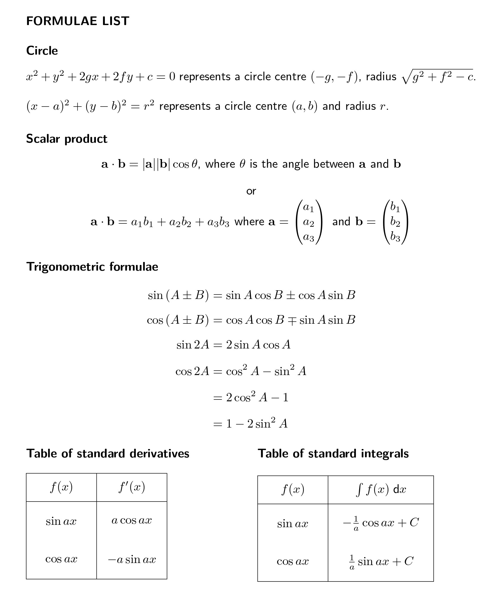

```{r setup, include = FALSE}
knitr::opts_chunk$set(echo = FALSE)
library(webexercises)
```


```{r, echo = FALSE, results='asis'}
# Uncomment to change widget colours:
#style_widgets(incorrect = "goldenrod", correct = "purple")
```

`r hide("Formula List")`



`r unhide()`

<hr>

## Q1


`r hide("Hints")`

Hints here.

`r unhide()`

`r hide("Answer")`

Answer here.

`r unhide()`

`r hide("Full Solution")`


`r unhide()`

`r hide("More Practice")`

For more practice try **[these three questions](practice/hmaths2025p1s01.pdf)**.

`r unhide()`
