# 2025 Paper 2 {-}

**Calculator.**  
65 marks.  
1 hour 30 minutes.

## Question 1 {-}

{width=100%}

(3 marks)

`r hide("Hint 1")`

Hint 1.

`r unhide()`

`r hide("Hint 2")`

Hint 2.

`r unhide()`

`r hide("Hint 3")`

Hint 3.

`r unhide()`

`r hide("Answer")`

Answer here.

`r unhide()`

`r hide("Solution")`

`r unhide()`

`r hide("More Practice")`

Practice link here.

`r unhide()`

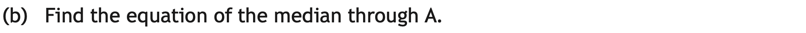{width=100%}

(3 marks)

`r hide("Hint 1")`

Hint 1.

`r unhide()`

`r hide("Hint 2")`

Hint 2.

`r unhide()`

`r hide("Hint 3")`

Hint 3.

`r unhide()`

`r hide("Answer")`

Answer here.

`r unhide()`

`r hide("Solution")`

`r unhide()`

`r hide("More Practice")`

Practice link here.

`r unhide()`

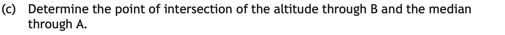{width=100%}

(2 marks)

`r hide("Hint 1")`

Hint 1.

`r unhide()`

`r hide("Hint 2")`

Hint 2.

`r unhide()`

`r hide("Hint 3")`

Hint 3.

`r unhide()`

`r hide("Answer")`

Answer here.

`r unhide()`

`r hide("Solution")`

`r unhide()`

`r hide("More Practice")`

Practice link here.

`r unhide()`

## Question 2 {-}

{width=100%}

(3 marks)

`r hide("Hint 1")`

Hint 1.

`r unhide()`

`r hide("Hint 2")`

Hint 2.

`r unhide()`

`r hide("Hint 3")`

Hint 3.

`r unhide()`

`r hide("Answer")`

Answer here.

`r unhide()`

`r hide("Solution")`

`r unhide()`

`r hide("More Practice")`

Practice link here.

`r unhide()`

## Question 3 {-}

{width=100%}

(4 marks)

`r hide("Hint 1")`

Hint 1.

`r unhide()`

`r hide("Hint 2")`

Hint 2.

`r unhide()`

`r hide("Hint 3")`

Hint 3.

`r unhide()`

`r hide("Answer")`

Answer here.

`r unhide()`

`r hide("Solution")`

`r unhide()`

`r hide("More Practice")`

Practice link here.

`r unhide()`

## Question 4 {-}

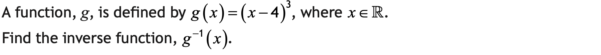{width=100%}

(3 marks)

`r hide("Hint 1")`

Hint 1.

`r unhide()`

`r hide("Hint 2")`

Hint 2.

`r unhide()`

`r hide("Hint 3")`

Hint 3.

`r unhide()`

`r hide("Answer")`

Answer here.

`r unhide()`

`r hide("Solution")`

`r unhide()`

`r hide("More Practice")`

Practice link here.

`r unhide()`

## Question 5 {-}

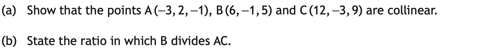{width=100%}

(4 marks)

`r hide("Hint 1")`

Hint 1.

`r unhide()`

`r hide("Hint 2")`

Hint 2.

`r unhide()`

`r hide("Hint 3")`

Hint 3.

`r unhide()`

`r hide("Answer")`

Answer here.

`r unhide()`

`r hide("Solution")`

`r unhide()`

`r hide("More Practice")`

Practice link here.

`r unhide()`

## Question 6 {-}

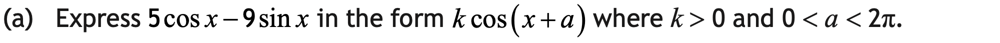{width=100%}

(4 marks)

`r hide("Hint 1")`

Hint 1.

`r unhide()`

`r hide("Hint 2")`

Hint 2.

`r unhide()`

`r hide("Hint 3")`

Hint 3.

`r unhide()`

`r hide("Answer")`

Answer here.

`r unhide()`

`r hide("Solution")`

`r unhide()`

`r hide("More Practice")`

Practice link here.

`r unhide()`

{width=100%}

(4 marks)

`r hide("Hint 1")`

Hint 1.

`r unhide()`

`r hide("Hint 2")`

Hint 2.

`r unhide()`

`r hide("Hint 3")`

Hint 3.

`r unhide()`

`r hide("Answer")`

Answer here.

`r unhide()`

`r hide("Solution")`

`r unhide()`

`r hide("More Practice")`

Practice link here.

`r unhide()`

## Question 7 {-}

{width=100%}

(2 marks)

`r hide("Hint 1")`

Hint 1.

`r unhide()`

`r hide("Hint 2")`

Hint 2.

`r unhide()`

`r hide("Hint 3")`

Hint 3.

`r unhide()`

`r hide("Answer")`

Answer here.

`r unhide()`

`r hide("Solution")`

`r unhide()`

`r hide("More Practice")`

Practice link here.

`r unhide()`

## Question 8 {-}

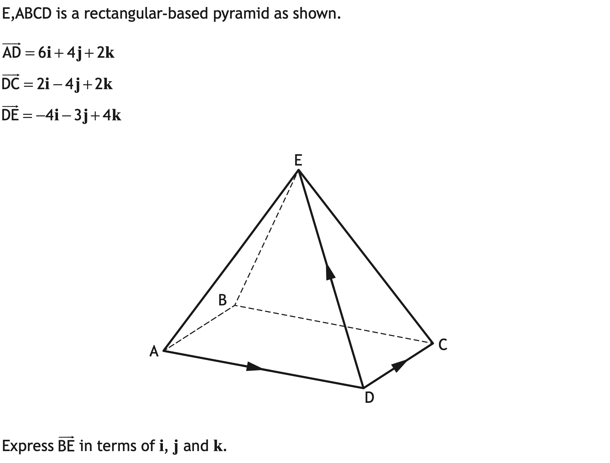{width=100%}
(2 marks)

`r hide("Hint 1")`

Hint 1.

`r unhide()`

`r hide("Hint 2")`

Hint 2.

`r unhide()`

`r hide("Hint 3")`

Hint 3.

`r unhide()`

`r hide("Answer")`

Answer here.

`r unhide()`

`r hide("Solution")`

`r unhide()`

`r hide("More Practice")`

Practice link here.

`r unhide()`

## Question 9 {-}

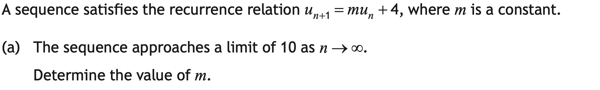{width=100%}

(2 marks)

`r hide("Hint 1")`

Hint 1.

`r unhide()`

`r hide("Hint 2")`

Hint 2.

`r unhide()`

`r hide("Hint 3")`

Hint 3.

`r unhide()`

`r hide("Answer")`

Answer here.

`r unhide()`

`r hide("Solution")`

`r unhide()`

`r hide("More Practice")`

Practice link here.

`r unhide()`

{width=100%}

(1 mark)

`r hide("Hint 1")`

Hint 1.

`r unhide()`

`r hide("Hint 2")`

Hint 2.

`r unhide()`

`r hide("Hint 3")`

Hint 3.

`r unhide()`

`r hide("Answer")`

Answer here.

`r unhide()`

`r hide("Solution")`

`r unhide()`

`r hide("More Practice")`

Practice link here.

`r unhide()`

## Question 10 {-}

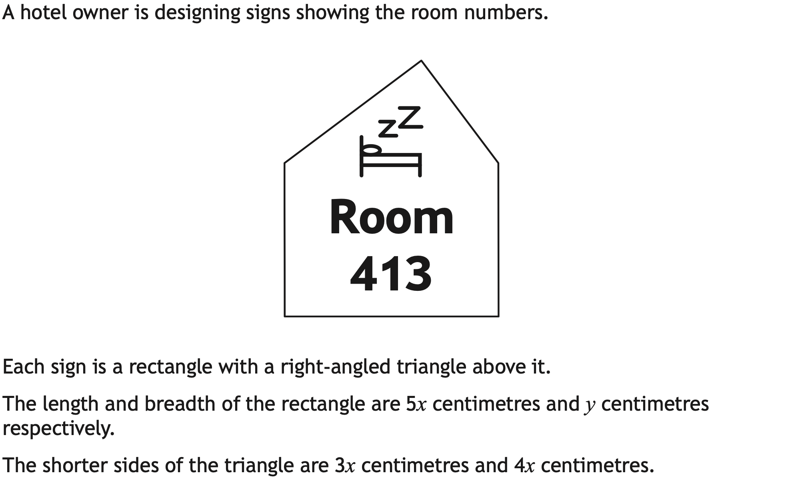{width=100%}
{width=100%}

(3 marks)

`r hide("Hint 1")`

Hint 1.

`r unhide()`

`r hide("Hint 2")`

Hint 2.

`r unhide()`

`r hide("Hint 3")`

Hint 3.

`r unhide()`

`r hide("Answer")`

Answer here.

`r unhide()`

`r hide("Solution")`

`r unhide()`

`r hide("More Practice")`

Practice link here.

`r unhide()`

{width=100%}

(6 marks)

`r hide("Hint 1")`

Hint 1.

`r unhide()`

`r hide("Hint 2")`

Hint 2.

`r unhide()`

`r hide("Hint 3")`

Hint 3.

`r unhide()`

`r hide("Answer")`

Answer here.

`r unhide()`

`r hide("Solution")`

`r unhide()`

`r hide("More Practice")`

Practice link here.

`r unhide()`

## Question 11 {-}

{width=100%}

(4 marks)

`r hide("Hint 1")`

Hint 1.

`r unhide()`

`r hide("Hint 2")`

Hint 2.

`r unhide()`

`r hide("Hint 3")`

Hint 3.

`r unhide()`

`r hide("Answer")`

Answer here.

`r unhide()`

`r hide("Solution")`

`r unhide()`

`r hide("More Practice")`

Practice link here.

`r unhide()`

## Question 12 {-}

{width=100%}

(2 marks)

`r hide("Hint 1")`

Hint 1.

`r unhide()`

`r hide("Hint 2")`

Hint 2.

`r unhide()`

`r hide("Hint 3")`

Hint 3.

`r unhide()`

`r hide("Answer")`

Answer here.

`r unhide()`

`r hide("Solution")`

`r unhide()`

`r hide("More Practice")`

Practice link here.

`r unhide()`

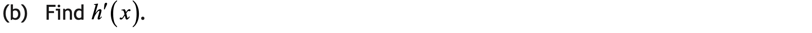{width=100%}

(2 marks)

`r hide("Hint 1")`

Hint 1.

`r unhide()`

`r hide("Hint 2")`

Hint 2.

`r unhide()`

`r hide("Hint 3")`

Hint 3.

`r unhide()`

`r hide("Answer")`

Answer here.

`r unhide()`

`r hide("Solution")`

`r unhide()`

`r hide("More Practice")`

Practice link here.

`r unhide()`

## Question 13 {-}

{width=100%}

(5 marks)

`r hide("Hint 1")`

Hint 1.

`r unhide()`

`r hide("Hint 2")`

Hint 2.

`r unhide()`

`r hide("Hint 3")`

Hint 3.

`r unhide()`

`r hide("Answer")`

Answer here.

`r unhide()`

`r hide("Solution")`

`r unhide()`

`r hide("More Practice")`

Practice link here.

`r unhide()`

## Question 14 {-}

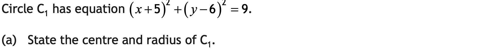{width=100%}

(2 marks)

`r hide("Hint 1")`

Hint 1.

`r unhide()`

`r hide("Hint 2")`

Hint 2.

`r unhide()`

`r hide("Hint 3")`

Hint 3.

`r unhide()`

`r hide("Answer")`

Answer here.

`r unhide()`

`r hide("Solution")`

`r unhide()`

`r hide("More Practice")`

Practice link here.

`r unhide()`

{width=100%}

(2 marks)

`r hide("Hint 1")`

Hint 1.

`r unhide()`

`r hide("Hint 2")`

Hint 2.

`r unhide()`

`r hide("Hint 3")`

Hint 3.

`r unhide()`

`r hide("Answer")`

Answer here.

`r unhide()`

`r hide("Solution")`

`r unhide()`

`r hide("More Practice")`

Practice link here.

`r unhide()`

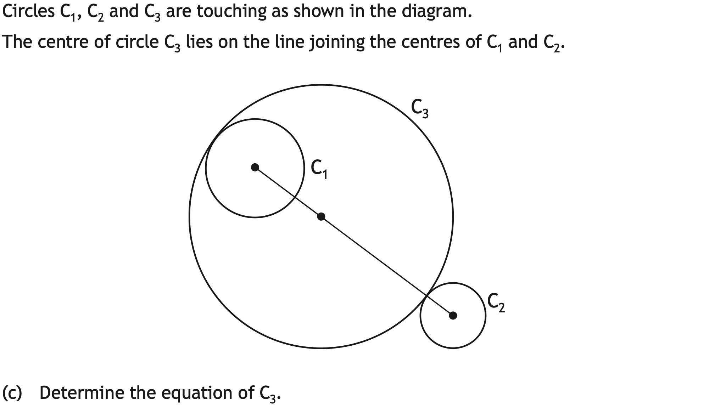{width=100%}

(3 marks)

`r hide("Hint 1")`

Hint 1.

`r unhide()`

`r hide("Hint 2")`

Hint 2.

`r unhide()`

`r hide("Hint 3")`

Hint 3.

`r unhide()`

`r hide("Answer")`

Answer here.

`r unhide()`

`r hide("Solution")`

`r unhide()`

`r hide("More Practice")`

Practice link here.

`r unhide()`

