```{r setup, include = FALSE}
knitr::opts_chunk$set(echo = FALSE)
library(webexercises)
```


```{r, echo = FALSE, results='asis'}
# Uncomment to change widget colours:
#style_widgets(incorrect = "goldenrod", correct = "purple")
```

`r hide("Higher Formula Sheet")`


`r unhide()`

<hr>

## 1 Straight Line

<hr>

`r hide("Hint")`

Perpendicular bisectors pass through the *midpoint* of a line segment, and run *perpendicular* to them.

`r unhide()`

`r hide("Answer")`

$4y=-3x+29$ or $y=-\frac{3}{4}x+\frac{29}{2}$

*For more practice, try:* **Zeta Higher Textbook, Page 15, Exercise 1.8, Questions 1(a), 1(b) and 1(c)**

`r unhide()`

`r hide("Solution")`

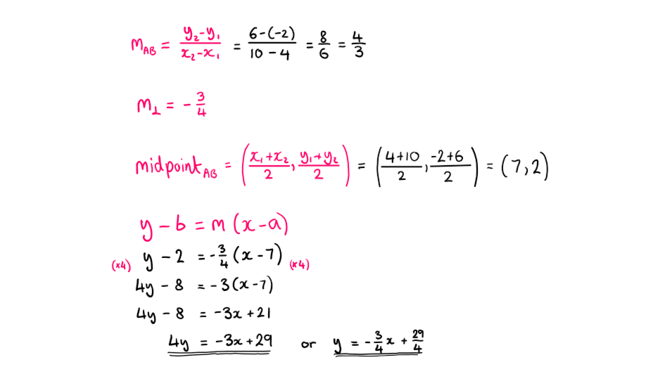

`r unhide()`

<hr>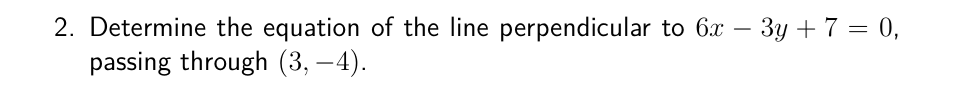

`r hide("Hint")`

A straight line equation must be rearranged to make $y$ the subject ($y=\dots$) before its gradient can be determined.

`r unhide()`

`r hide("Answer")`

$2y=-x-5$ or $y=-\frac{1}{2}x-\frac{5}{2}$

*For more practice, try:* **Zeta Higher Textbook, Page 13, Exercise 1.6, Questions 3, 4 and 5**

`r unhide()`

`r hide("Solution")`

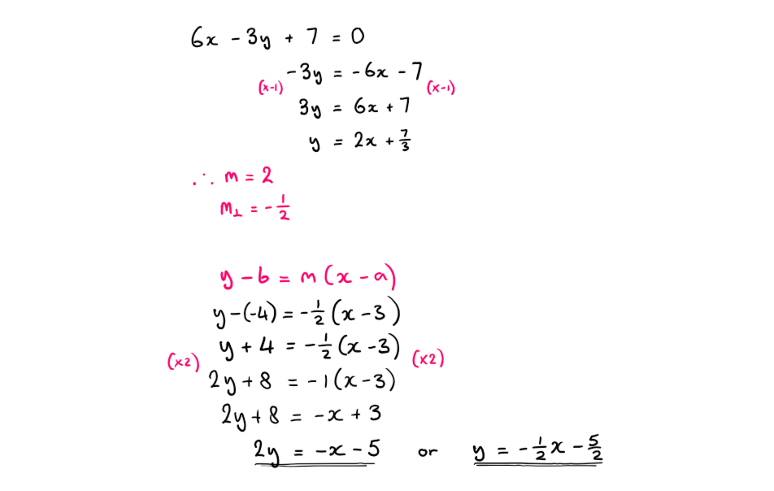

`r unhide()`

<hr>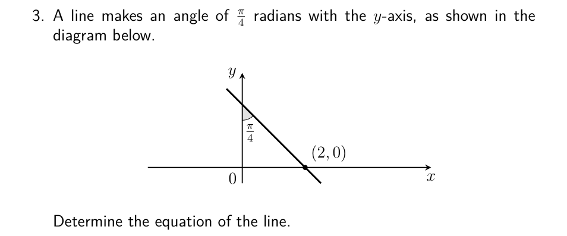

`r hide("Hint")`

The formula $m=\tan{\theta}$ links a line's gradient to the angle it makes *with the positive direction of the *$x$*-axis*.

`r unhide()`

`r hide("Answer")`

$y=-x+2$

*For more practice, try:* **Zeta Higher Textbook, Page 9, Exercise 1.4A, Questions 1, 2 and 3**

`r unhide()`

`r hide("Solution")`

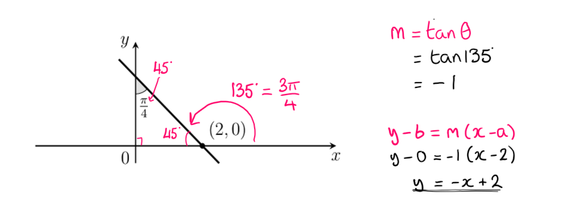

`r unhide()`

<hr>

`r hide("Hint")`

Calculate the gradients of PQ and QR first. The conclusion to a collinearity problem needs to be learned *carefully*.

`r unhide()`

`r hide("Answer")`

$m_{PQ}=m_{QR}=-3$, valid statement *(see solution)*.

*For more practice, try:* **Zeta Higher Textbook, Page 12, Exercise 1.5, Questions 1(a), 1(b) and 1(c)**

`r unhide()`

`r hide("Solution")`

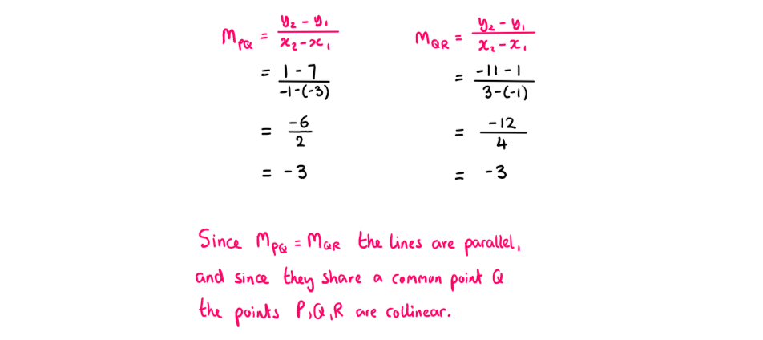

`r unhide()`

<hr>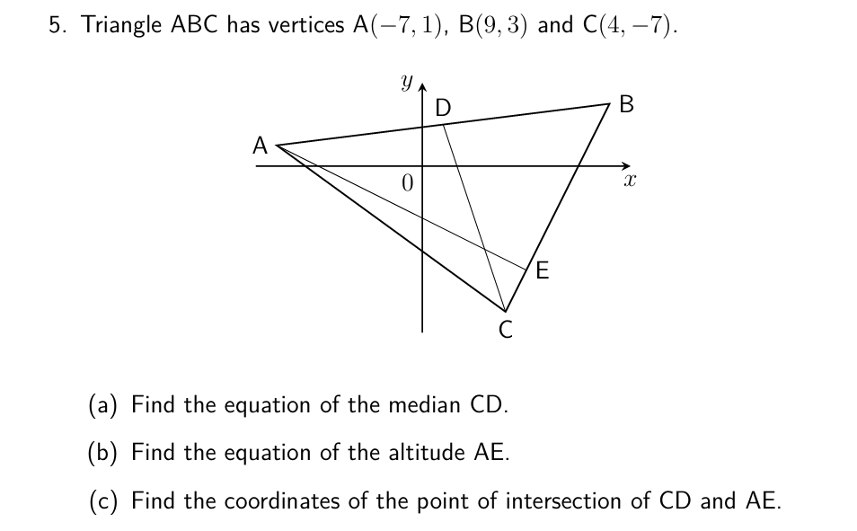

`r hide("Hint")`

a) *Medians* meet opposite sides at the *midpoint*.

b) *Altitudes* meet opposite sides at an angle of *90 degrees*.

c) You can use $y=y$ as a first step to finding points of intersection.

`r unhide()`

`r hide("Answer")`

(a) $y=-3x+5$ 

(b) $2y=-x-5$ or $y=-\frac{1}{2}x-\frac{5}{2}$ 

(c) $(3,-4)$

*For more practice, try:* **Zeta Higher Textbook, Page 21, Exercise 1.11B, Questions 1, 2 and 3**

`r unhide()`

`r hide("Solution (a)")`

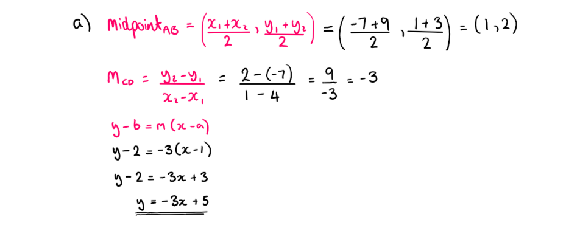

`r unhide()`

`r hide("Solution (b)")`

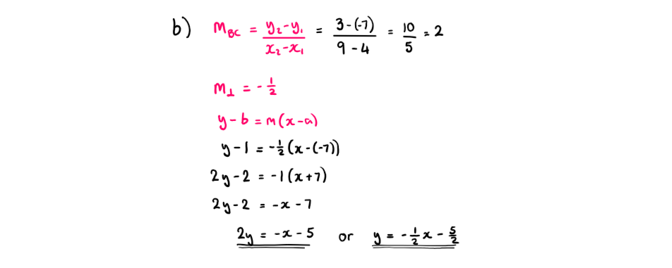

`r unhide()`

`r hide("Solution (c)")`

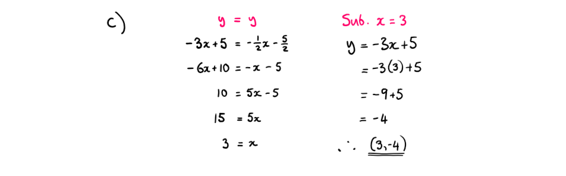

`r unhide()`

<hr>

## 2 Recurrence Relations

<hr><hr>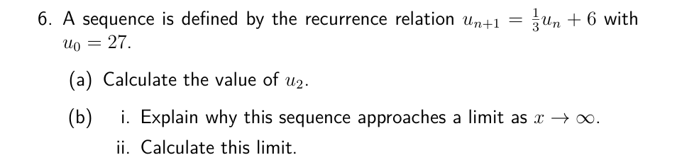

`r hide("Hint")`

(a) Calculate $u_1$ first using the value of $u_0$ as a starting point.

(b) 
(i) What is the value of $a$? 
(ii) What is the formula for the *limit* of a recurrence relation?

`r unhide()`

`r hide("Answer")`

(a) $15$

(b) 
(i) $-1<a<1$, valid statement *(see solution)*.
(ii) $9$

*For more practice, try:* **Zeta Higher Textbook, Page 90, Exercise 6.1, Questions 1(a), 1(b) and 1(c)**

`r unhide()`

`r hide("Solution (a)")`


`r unhide()`

`r hide("Solution (b)")`


`r unhide()`

<hr>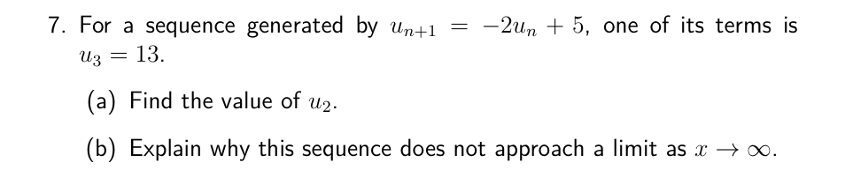

`r hide("Hint")`

(a) Can you put both $u_2$ and $u_3$ into the recurrence relation? Where does each one go?

(b) What is the value of $a$?

`r unhide()`

`r hide("Answer")`

(a) $-4$

(b) $a>1$, valid statement *(see solution)*.

*For more practice, try:* **Zeta Higher Textbook, Page 93, Exercise 6.3, Questions 1(f), 1(i) and 1(l)**

`r unhide()`

`r hide("Solution (a)")`


`r unhide()`

`r hide("Solution (b)")`


`r unhide()`

<hr>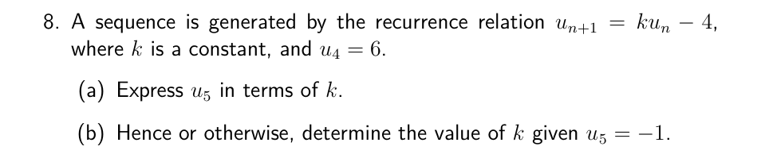

`r hide("Hint")`

(a) Substitute the value of $u_4$ into the recurrence relation.

(b) Use your expression from part (a), and the new information that $u_5=-1$.

`r unhide()`

`r hide("Answer")`

(a) $6k-4$

(b) $k=\frac{1}{2}$

*For more practice, try:* **Zeta Higher Textbook, Page 15, Exercise 1.8, Questions 1(a), 1(b) and 1(c)**

`r unhide()`

`r hide("Solution (a)")`


`r unhide()`

`r hide("Solution (b)")`


`r unhide()`

<hr>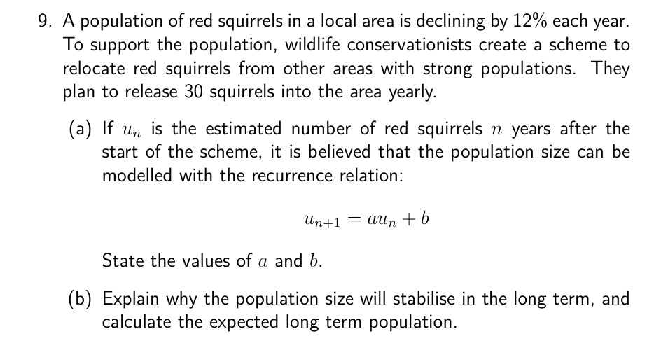

`r hide("Hint")`

(a) What *"12% is subtracted (from the original 100%)* as a decimal?

(b) Since dividing by $0.12$ is tricky, multiply both parts of the fraction by $100$ and work from there.

`r unhide()`

`r hide("Answer")`

(a) $a=0.88,b-30$

(b) 250 squirrels

*For more practice, try:* **Zeta Higher Textbook, Page 96, Exercise 6.5B, Questions 1, 2 and 3**

`r unhide()`

`r hide("Solution (a)")`


`r unhide()`

`r hide("Solution (b)")`


`r unhide()`

<hr>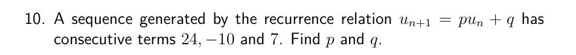

`r hide("Hint")`

Create *two* equations: one linking the first two terms, and a second linking the second term and the third term. Solve *simultaneously*.

`r unhide()`

`r hide("Answer")`

$p=-\frac{1}{2},q=2$

*For more practice, try:* **Zeta Higher Textbook, Page 91, Exercise 6.2, Questions 1(a), 1(b) and 1(c)**

`r unhide()`

`r hide("Solution")`

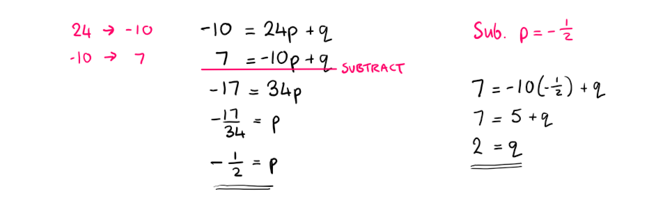

`r unhide()`

<hr>

## 3 Differentiation I

<hr>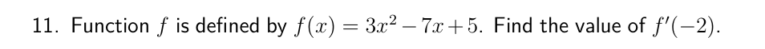

`r hide("Hint")`

To differentiate, *multiply by the power and then reduce the power by 1...*

`r unhide()`

`r hide("Answer")`

$-19$

`r unhide()`

`r hide("Solution")`


`r unhide()`

<hr>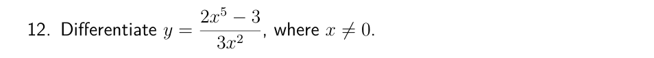

`r hide("Hint")`

Start by *splitting the fraction into two fractions*, each with a denominator of $3x^2$, and prepare each part for differentiation.

`r unhide()`

`r hide("Answer")`

$2x^2+2x^{-3}$

`r unhide()`

`r hide("Solution")`


`r unhide()`


<hr>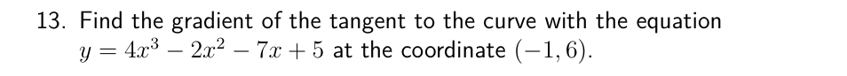

`r hide("Hint")`

The gradient of a tangent to a curve is described by its *derivative*, $\dfrac{dy}{dx}$.

`r unhide()`

`r hide("Answer")`

$9$

`r unhide()`

`r hide("Solution")`


`r unhide()`

<hr>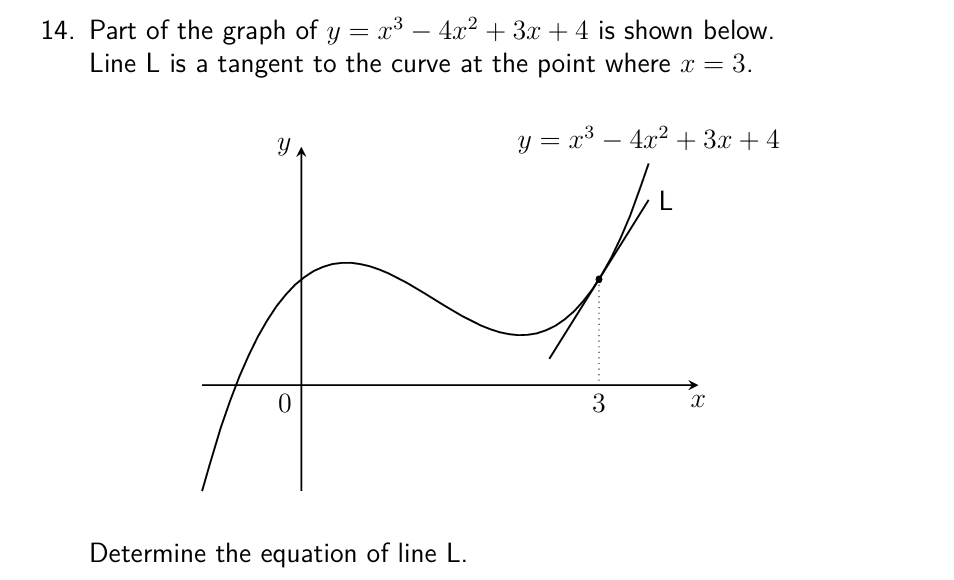

`r hide("Hint")`

The *gradient* of a tangent was found in the last question. To find its *equation*, we also need to know a coordinate the tangent passes through.

`r unhide()`

`r hide("Answer")`

$y=6x-14$

`r unhide()`

`r hide("Solution")`

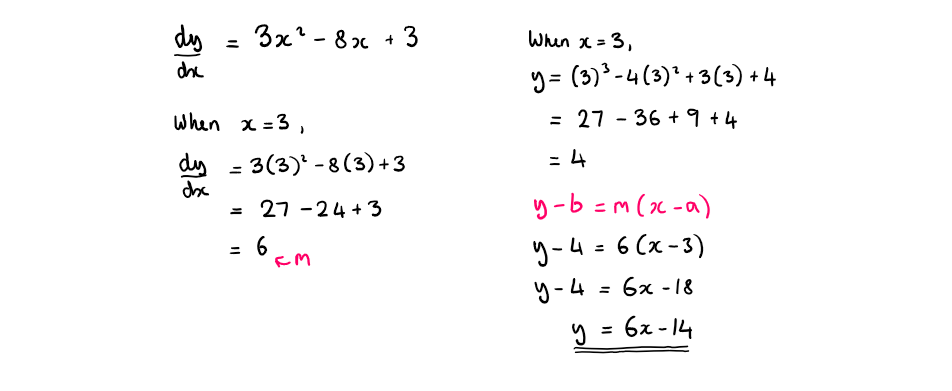

`r unhide()`

<hr>

`r hide("Hint")`

The *rate of change* of a function is described by its *derivative*, $h'(t)$. A square root $\sqrt{x}$ can also be written in index as $x^{\frac{1}{2}}$.

`r unhide()`

`r hide("Answer")`

$2$

`r unhide()`

`r hide("Solution")`


`r unhide()`

<hr>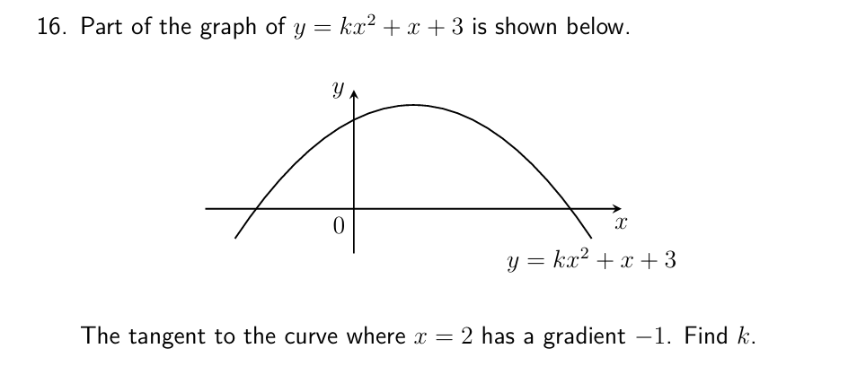

`r hide("Hint")`

Find the *derivative*, $\dfrac{dy}{dx}$, first.

If a value of $x$ is substituted into the derivative, the result will be the gradient. Here, when $x=2$ is substituted in, what value would the output be equal to?

`r unhide()`

`r hide("Answer")`

$k=-\frac{1}{2}$

`r unhide()`

`r hide("Solution")`


`r unhide()`

<hr>

## 4 Quadratic Theory

<hr>

`r hide("Hint")`

A few methods may be used.

One begins by fully expanding $p(x+q)^2+r$.

`r unhide()`

`r hide("Answer")`

$3(x-4)^2+9$

`r unhide()`

`r hide("Solution")`

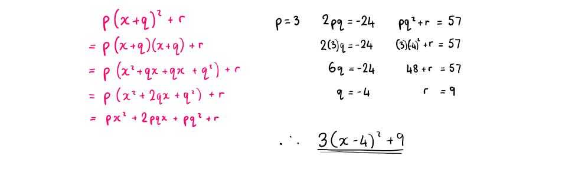

`r unhide()`

<hr>

`r hide("Hint")`

A few methods may be used.

One begins by fully expanding $a(x+b)^2+c$.

`r unhide()`

`r hide("Answer")`

$-(x-2)^2+7$

`r unhide()`

`r hide("Solution")`

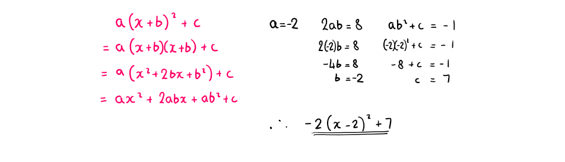

`r unhide()`


<hr>

`r hide("Hint")`

Start by considering the *roots* of the equation $2x^2+8x-10$. Notice the *common factor*.

*You need to draw a sketch.*

`r unhide()`

`r hide("Answer")`

$x<-5,x>1$

`r unhide()`

`r hide("Solution")`

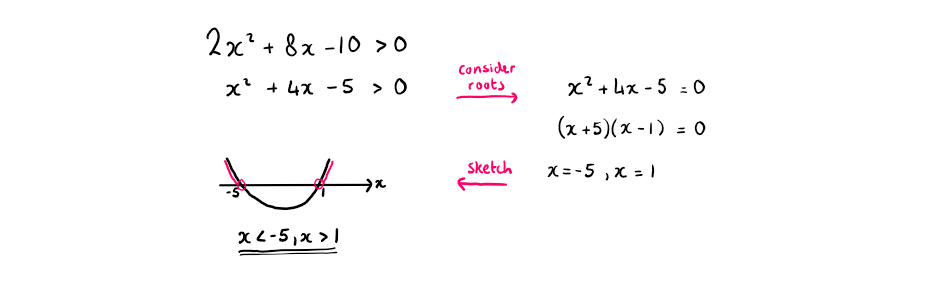

`r unhide()`

<hr>

`r hide("Hint")`

Start by considering the *roots* of the equation $m^2-m-20$.

*You need to draw a sketch.*

Since $m$ is the variable, your answer *must be in terms of *$m$.

`r unhide()`

`r hide("Answer")`

$-4\leqslant m\leqslant5$

`r unhide()`

`r hide("Solution")`


`r unhide()`

<hr>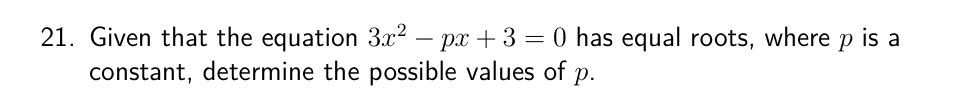

`r hide("Hint")`

An equation has *(real) equal roots* when $b^2-4ac=0$.

`r unhide()`

`r hide("Answer")`

$p=\pm6$

`r unhide()`

`r hide("Solution")`

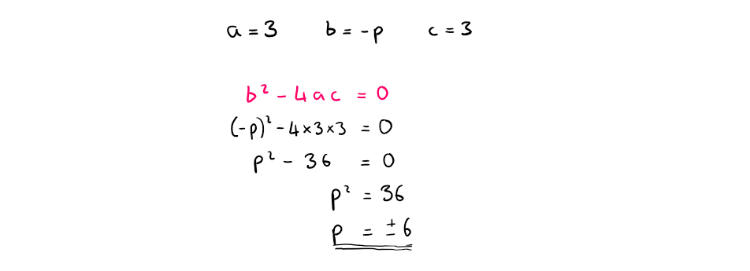

`r unhide()`

<hr>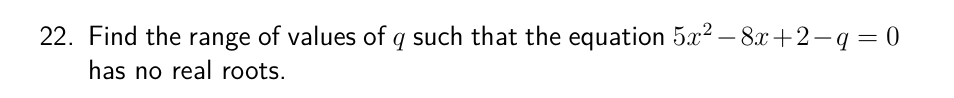

`r hide("Hint")`

An equation has *no real roots* when $b^2-4ac<0$.

`r unhide()`

`r hide("Answer")`

$q<-\frac{6}{5}$

`r unhide()`

`r hide("Solution")`

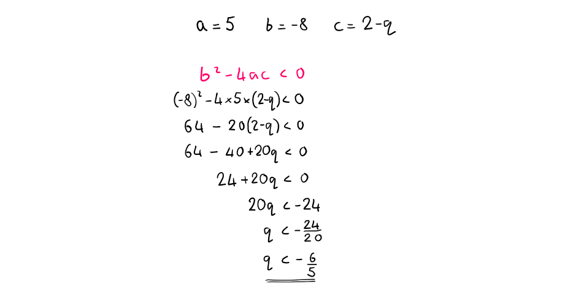

`r unhide()`

<hr>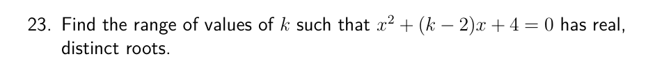

`r hide("Hint")`

An equation has *real, distinct roots* when $b^2-4ac>0$.

`r unhide()`

`r hide("Answer")`

$k<-2,k>6$

`r unhide()`

`r hide("Solution")`

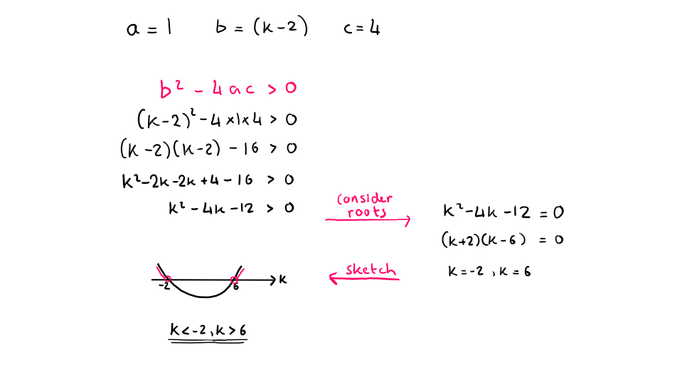

`r unhide()`

<hr>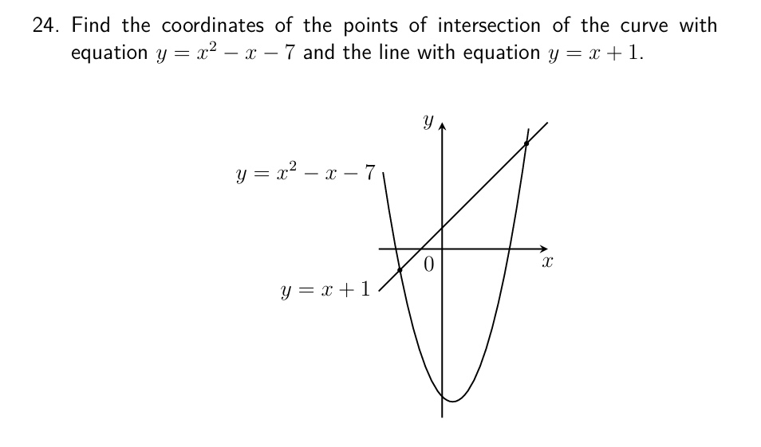

`r hide("Hint")`

Points of intersection can be found by solving $y=y$...

`r unhide()`

`r hide("Answer")`

$(-2,1)$ and $(4,5)$

`r unhide()`

`r hide("Solution")`


`r unhide()`

<hr>

`r hide("Hint")`

Tangency can be explored by solving $y=y$ are for generally finding points of intersection, then considering how the resulting equation can be *factorised* or $b^2-4ac$.

`r unhide()`

`r hide("Answer")`

$(2,5)$

`r unhide()`

`r hide("Solution")`

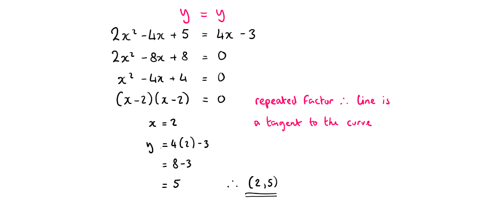

`r unhide()`

<hr>

## 5 Sets and Functions

<hr>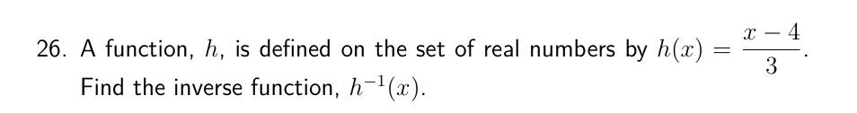

`r hide("Hint")`

Start by writing it in the form $y=...$ and then rearrange to make $x$ the subject.

`r unhide()`

`r hide("Answer")`

$h^{-1}(x)=3x+4$

`r unhide()`

`r hide("Solution")`


`r unhide()`

<hr>

`r hide("Hint")`

Start by writing it in the form $y=...$ and then rearrange to make $x$ the subject.

`r unhide()`

`r hide("Answer")`

$f^{-1}(x)=\left(\dfrac{x+3}{2}\right)^2$
`r unhide()`

`r hide("Solution")`

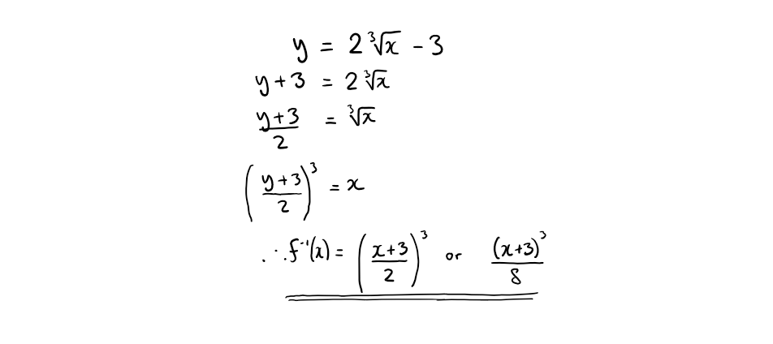

`r unhide()`

<hr>

`r hide("Hint")`

*Division by zero* is undefined.

`r unhide()`

`r hide("Answer")`

$x\ne \frac{1}{2}$

`r unhide()`

`r hide("Solution")`


`r unhide()`

<hr>

`r hide("Hint")`

The *square root of a negative* is undefined.

`r unhide()`

`r hide("Answer")`

$x<3$

`r unhide()`

`r hide("Solution")`


`r unhide()`


<hr>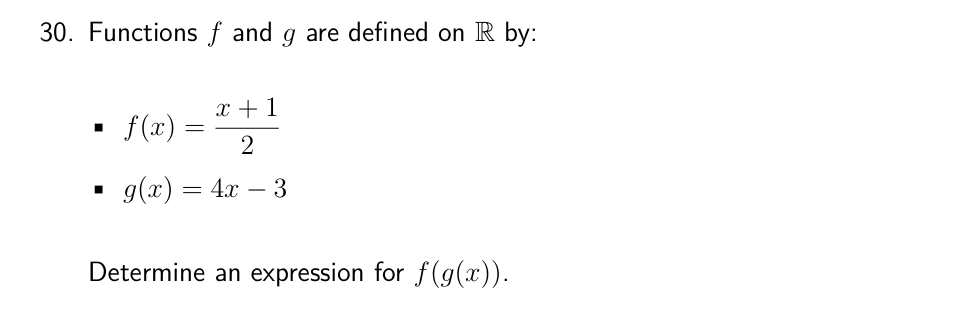

`r hide("Hint")`

The expression for $g(x)$ needs to be substituted *into* the expression for $f(x)$.

`r unhide()`

`r hide("Answer")`

$f(g(x))=2x-1$
`r unhide()`

`r hide("Solution")`

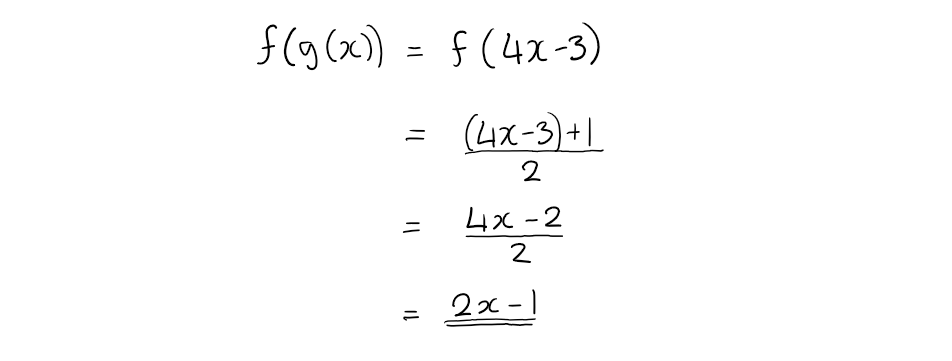

`r unhide()`

<hr>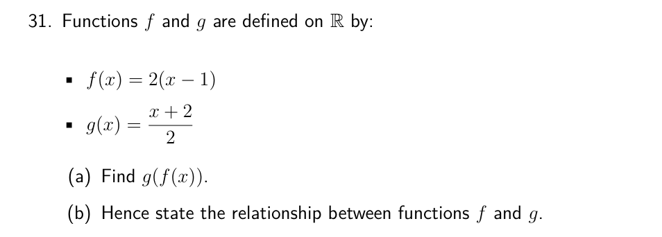

`r hide("Hint")`

(a)

The expression for $f(x)$ needs to be substituted *into* the expression for $g(x)$.

Simplify it fully.

(b) Applying $f$ to $x$ and then applying $g$ to the result leads *back* to $x$. What is happening here?

`r unhide()`

`r hide("Answer")`

(a) $g(f(x))=x$

(b) $f$ and $g$ are inverse to each other.

`r unhide()`

`r hide("Solution")`

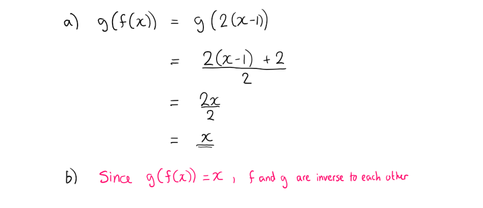

`r unhide()`

<hr>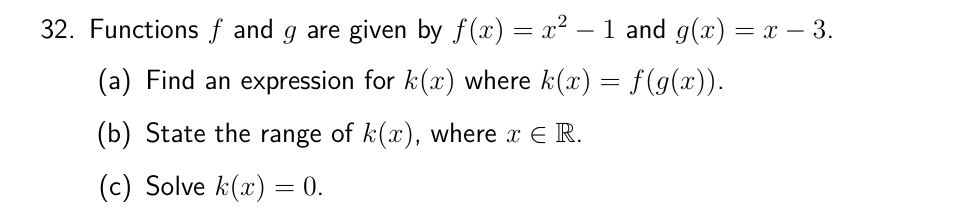

`r hide("Hint")`

(a) Substitute $g(x)$ into $f(x)$ and simplify.

(b) Observe the results from part (a) *before* simplifying, when it when written in completed square form, $(x-a)^2+b$. What is the lowest possible value of $k(x)$?

(c) Begin by factorising $k(x)$.

`r unhide()`

`r hide("Answer")`

(a) $k(x)=x^2-6x+8$

(b) $k(x)\geqslant-1$.

`r unhide()`

`r hide("Solution")`

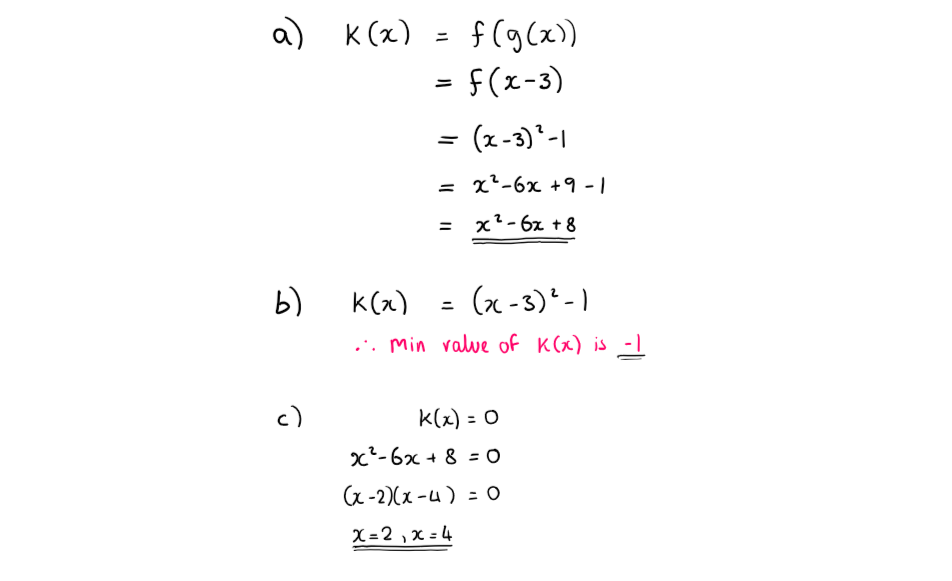

`r unhide()`

<hr>

## 6 Trigonometry

<hr>

`r hide("Hint")`

Rearrange to make $\sin x$ the subject. Give your final answer in *radians*.

`r unhide()`

`r hide("Answer")`

$x=\frac{\pi}{6},\frac{5\pi}{6}$

`r unhide()`

`r hide("Solution")`

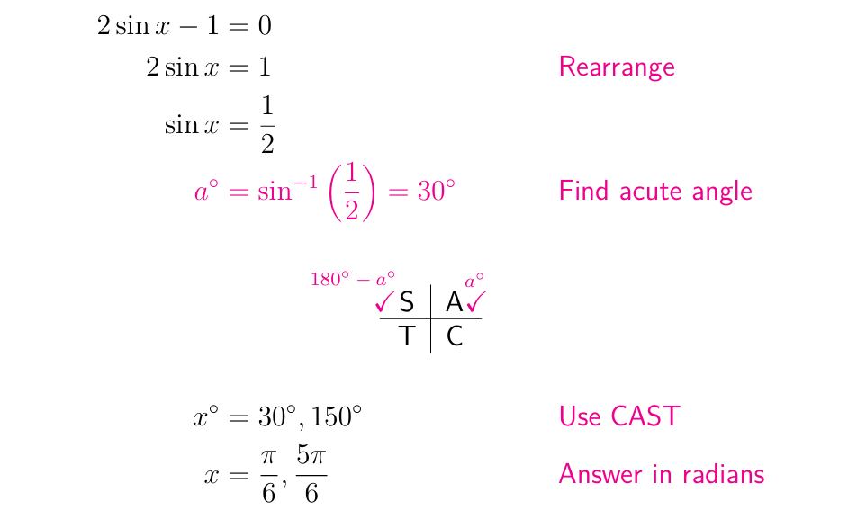

`r unhide()`

<hr>

`r hide("Hint")`

Use a CAST diagram carefully to identify quadrants in which $\tan x$ is *negative*.

`r unhide()`

`r hide("Answer")`

$x=\frac{5\pi}{12},\frac{11\pi}{12}$

`r unhide()`

`r hide("Solution")`

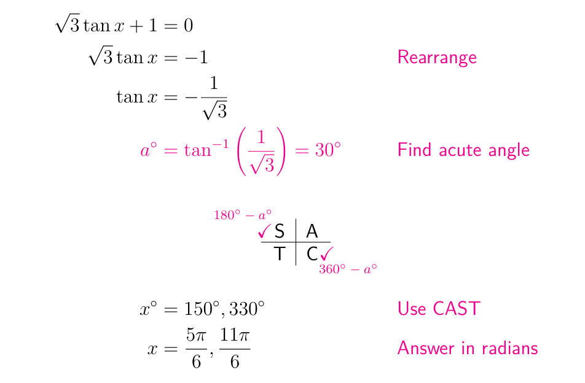

`r unhide()`

<hr>

`r hide("Hint")`

(a) At which angle is $y=4\cos x$ at its minimum, and how low does it go? Answer in *radians*.

(b) The *points of intersection* Q and R can be obtained by solving the set of equations $y=4\cos x$ and $y=2$ simultaneously.

`r unhide()`

`r hide("Answer")`

(a) P$(\pi,-4)$

(b) Q$\left(\frac{\pi}{3},2\right)$, R$\left(\frac{5\pi}{3},2\right)$

`r unhide()`

`r hide("Solution")`

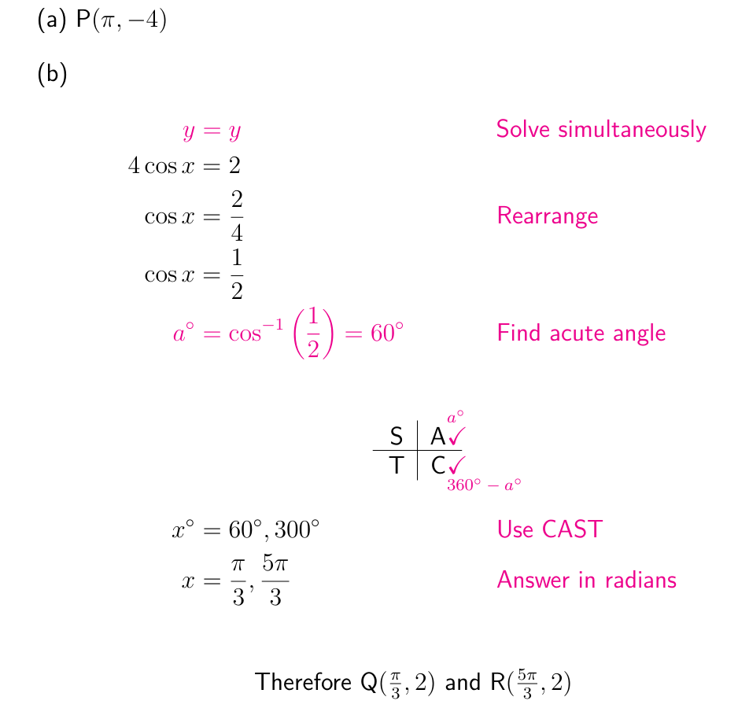

`r unhide()`

<hr>

`r hide("Hint")`

For a $2x$ trig equation from 0 to 360 degrees, *expect 4 solutions*.

`r unhide()`

`r hide("Answer")`

$x=30,150,210,330$

`r unhide()`

`r hide("Solution")`

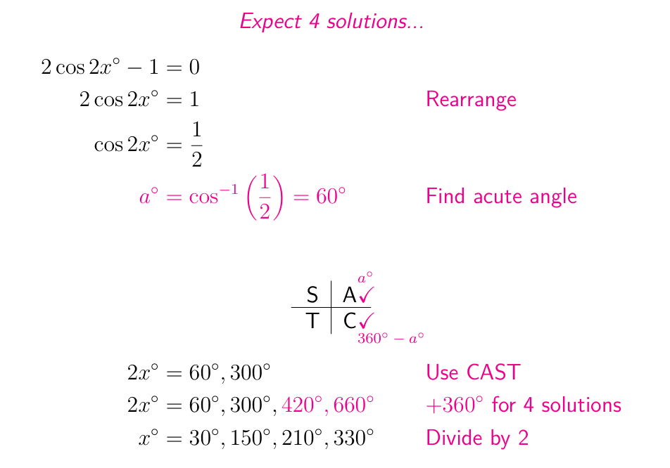

`r unhide()`

<hr>

`r hide("Hint")`

For a $2x$ trig equation from 0 to 360 degrees, *expect 4 solutions*.

`r unhide()`

`r hide("Answer")`

$x=120,150,300,330$

`r unhide()`

`r hide("Solution")`

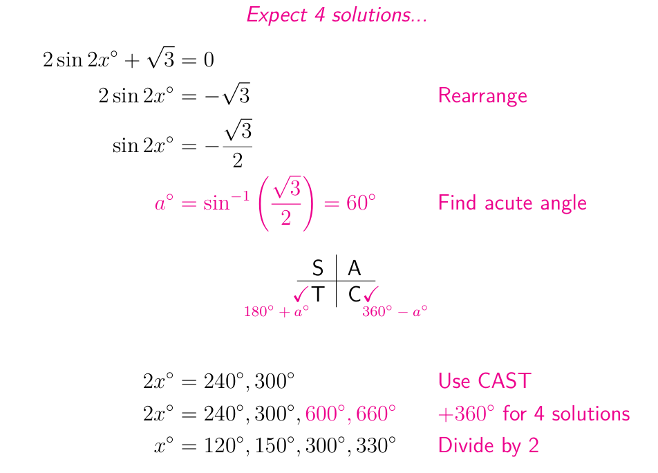

`r unhide()`

<hr>

`r hide("Hint")`

Remember that $\frac{\pi}{6}$ radians is equal to $30\degree$.

Find $x\degree-30\degree$ solutions then add $30\degree$ to solve for $x$.

`r unhide()`

`r hide("Answer")`

$x=\frac{11\pi}{12},\frac{23\pi}{12}$

`r unhide()`

`r hide("Solution")`

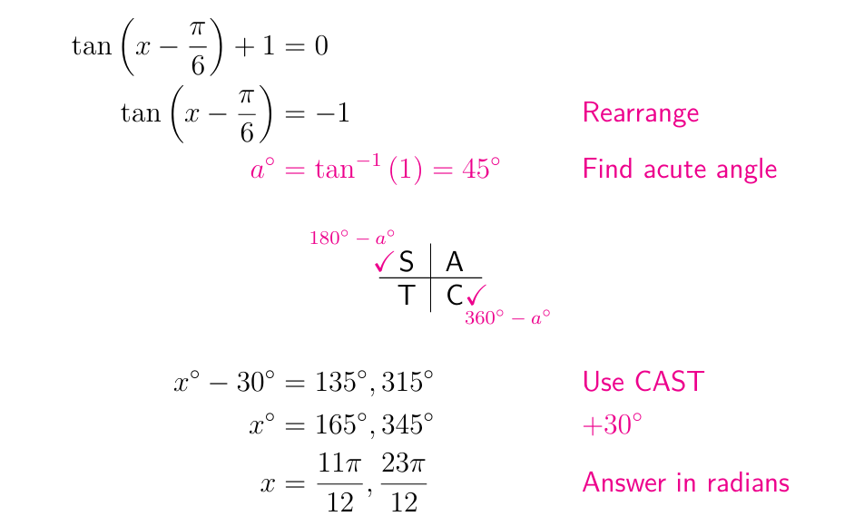

`r unhide()`

<hr>

`r hide("Hint")`

*Expect 4 solutions...* Use a combination of skills from the previous questions.

`r unhide()`

`r hide("Answer")`

$x=\frac{\pi}{4},\frac{5\pi}{12}.\frac{5\pi}{4}.\frac{17\pi}{12}$

`r unhide()`

`r hide("Solution")`

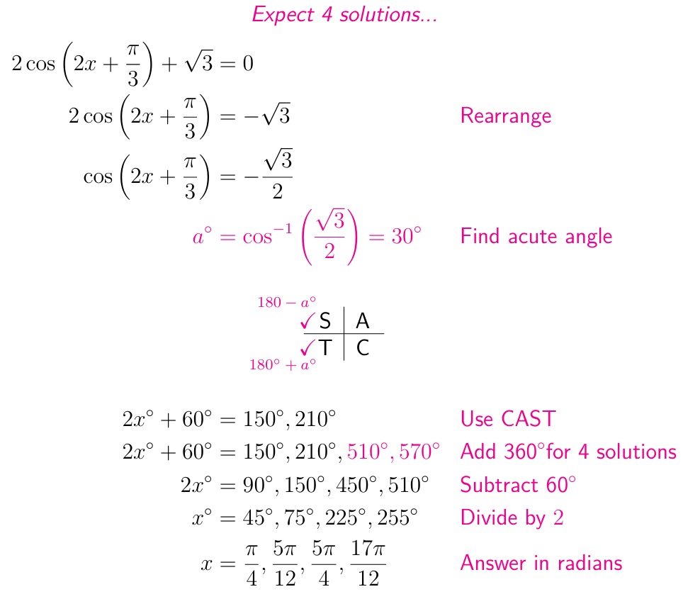

`r unhide()`

<hr>

## 7 Graph Transformations

<hr>

`r hide("Hint")`

Make a list of all coordinates on the *original* graph (here there are 3).

Everything *outside* the $(x)$ bracket affects $y$-coordinates.
These transformations are usually seen as *intuitive*.

Everything *inside* the $(x)$ bracket affects $x$-coordinates.
These transformations are usually seen as *counterintuitive*.

Make sure your final graph has *all* the transformed *images* of the original coordinates clearly shown.

`r unhide()`

`r hide("Answer")`

See full solution below for the graph and coordinates.

`r unhide()`

`r hide("Solution")`

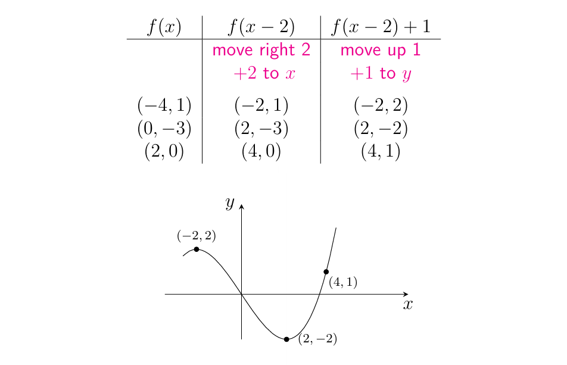

`r unhide()`

<hr>

`r hide("Hint")`

Remember to apply the two transformations following the rules of operation: $\times(-1)$ *then* $-1$

As well as changing the coordinates, think about how the transformations will change the *shape* and *position* of the graph. Here, $-f(x)$ will *flip the graph upside down*.

`r unhide()`

`r hide("Answer")`

See full solution below for the graph and coordinates.

`r unhide()`

`r hide("Solution")`

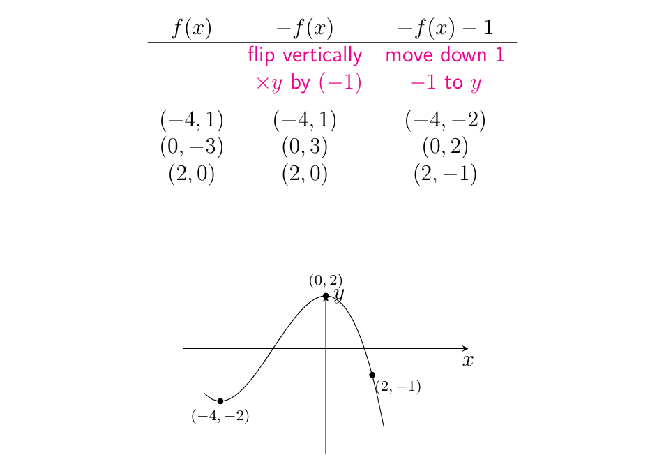

`r unhide()`

<hr>

`r hide("Hint")`

If $-f(x)$ is a *vertical* flip, what is $f(-x)$?

`r unhide()`

`r hide("Answer")`

See full solution below for the graph and coordinates.

`r unhide()`

`r hide("Solution")`


`r unhide()`

<hr>

`r hide("Hint")`

Don't ignore the coordinate of $(0,0)$ on the original graph.

`r unhide()`

`r hide("Answer")`

See full solution below for the graph and coordinates.

`r unhide()`

`r hide("Solution")`


`r unhide()`

<hr>

`r hide("Hint")`

$2-g(x)$ can be rewritten as $-g(x)+2$.

`r unhide()`

`r hide("Answer")`

See full solution below for the graph and coordinates.

`r unhide()`

`r hide("Solution")`


`r unhide()`

<hr>

`r hide("Hint")`

$\frac{1}{2}g(x)$ is a *vertical compression* by factor 2.

`r unhide()`

`r hide("Answer")`

See full solution below for the graph and coordinates.

`r unhide()`

`r hide("Solution")`


`r unhide()`

<hr>

## 8 Vectors

<hr>

`r hide("Hint")`

Find the components of vectors $\overrightarrow{PQ}$ and $\overrightarrow{QR}$.

Make sure your collinearity statement is *carefully and fully worded*.

Draw a *sketch* to make (b) easier to see.

`r unhide()`

`r hide("Answer")`

(a) $2\overrightarrow{PQ}=\overrightarrow{QR}$, valid statement *(see solution)*.

(b) $1:2$

`r unhide()`

`r hide("Solution (a)")`


`r unhide()`

`r hide("Solution (b)")`


`r unhide()`

<hr>

`r hide("Hint")`

Check which method your teacher taught you to use. One option is the *section formula*.

`r unhide()`

`r hide("Answer")`

E$(5,-1,4)$

`r unhide()`

`r hide("Solution")`


`r unhide()`

<hr>

`r hide("Hint")`

(a) Use $\overrightarrow{AB}=\mathbf{b}-\mathbf{a}$

(b) The formula sheet reminds you how to do this.

(c) Use the formula $\mathbf{a}\cdot\mathbf{b}=|\mathbf{a}||\mathbf{b}|\cos{\theta}$, rearranged and in terms of $\overrightarrow{EM}$ and $\overrightarrow{ER}$.

`r unhide()`

`r hide("Answer")`

(a) $\overrightarrow{EM}$=\begin{pmatrix}
            \phantom{-}2\\
            -6\\
            -1
        \end{pmatrix}
         and $\overrightarrow{ER}=$
        \begin{pmatrix}
            -3\\
            -2\\
            \phantom{-}3
        \end{pmatrix}

(b) 3

(c) $84.3^{\circ}$

`r unhide()`

`r hide("Solution (a)")`


`r unhide()`

`r hide("Solution (b)")`


`r unhide()`

`r hide("Solution (c)")`


`r unhide()`

<hr>

`r hide("Hint")`

If a vector has a magnitude of $k$, multiplying that vector by $\frac{1}{k}$ will create a parallel vector with a length of $1$ (a unit vector).

`r unhide()`

`r hide("Answer")`

$\begin{pmatrix}
\frac{1}{3}\\
-\frac{2}{3}\\
\frac{2}{3}
\end{pmatrix}$


`r unhide()`

`r hide("Solution")`


`r unhide()`


<hr>

`r hide("Hint")`

(a) Start by expressing vector BF as BA$+$AC$+$CF.

(b) Start similar to the above hint.

(c) The following approaches will help:

- For all vectors, $\mathbf{a}\cdot\mathbf{a}=|\mathbf{a}|^2$

- If $\mathbf{a}$ and $\mathbf{b}$ are *perpendicular* then $\mathbf{a}\cdot\mathbf{b}=0$

- If the angle $\theta$ between two vectors and their magnitudes are known, then $\mathbf{a}\cdot\mathbf{b}=|\mathbf{a}||\mathbf{b}|\cos{\theta}$ can be used.

`r unhide()`

`r hide("Answer")`

(a) $-\mathbf{u}+\mathbf{v}+\mathbf{w}$

(b) $-\frac{2}{3}\mathbf{w}-\mathbf{v}+\mathbf{w}$

(c) (i) $\frac{9}{2}$ (ii) $\frac{9}{2}$

`r unhide()`

`r hide("Solution (a)")`


`r unhide()`

`r hide("Solution (b)")`


`r unhide()`

`r hide("Solution (c)")`


`r unhide()`

<hr>

## 9 Differentiation II

<hr>

`r hide("Hint")`

A function is *increasing* when its derivative is *positive*.

`r unhide()`

`r hide("Answer")`

$x>-2$

`r unhide()`

`r hide("Solution")`


`r unhide()`


<hr>

`r hide("Hint")`

A function is *decreasing* when its derivative is *negative*.

Remember to *draw a sketch* to solve a quadratic inequation!

`r unhide()`

`r hide("Answer")`

$-2<x<4$

`r unhide()`

`r hide("Solution")`


`r unhide()`

<hr>

`r hide("Hint")`

Stationary points occur when the *derivative is zero*.

`r unhide()`

`r hide("Answer")`

$x=-5,x=3$

`r unhide()`

`r hide("Solution")`


`r unhide()`

<hr>

`r hide("Hint")`

The *second derivative* can be used to determine the *nature* of a stationary point.

`r unhide()`

`r hide("Answer")`

Maximum turning point at $(-2,49)$

Minimum turning point at $(3,-76)$

`r unhide()`

`r hide("Solution")`


`r unhide()`


<hr>

`r hide("Hint")`

A function that is *strictly increasing* across an interval will "begin" at its lowest value and increase towards its highest value as $x$ increases.

`r unhide()`

`r hide("Answer")`

Min value is $-5$

Max value is $7$

`r unhide()`

`r hide("Solution")`


`r unhide()`

<hr>

`r hide("Hint")`

Finding a value of $x$ which *minimises* a function is very similar in process to finding a *stationary point*.

In its most convenient form, we might hope to find only *one* stationary point within the domain, and for that stationary point to be a *minimum turning point*.

`r unhide()`

`r hide("Answer")`

The function is minimised when $x=3$, with justification *(see solution)*.

`r unhide()`

`r hide("Solution")`


`r unhide()`


<hr>

`r hide("Hint")`

The hint to Q52 applies here, but this time we are looking to *maximise* the function.

`r unhide()`

`r hide("Answer")`

Max value of $R(x)$ when $x=\frac{9}{2}$.

`r unhide()`

`r hide("Solution")`


`r unhide()`

<hr>

`r hide("Hint")`

When sketching the derivative, *stationary points* on $f(x)$ translate to $roots$ on $f'(x)$.

Remember that the derivative of a *cubic* ($\dots x^3\dots$) is a *quadratic* ($\dots x^2\dots$).

`r unhide()`

`r hide("Answer")`

See the solution.

`r unhide()`

`r hide("Solution")`


`r unhide()`

<hr>

## 10 Polynomials

<hr>

`r hide("Hint")`

*Synthetic division* may be used to calculate a remainder from a polynomial division.

`r unhide()`

`r hide("Answer")`

$7$

`r unhide()`

`r hide("Solution")`


`r unhide()`


<hr>

`r hide("Hint")`

The numbers along the bottom row of a synthetic division, to the left of the *remainder*, form the coefficients of the *quotient*. This is needed to fully factorise a polynomial.

`r unhide()`

`r hide("Answer")`

$(x+1)(x+2)(x-4)$

`r unhide()`

`r hide("Solution")`


`r unhide()`

<hr>

`r hide("Hint")`

To *solve* a polynomial equation, aim to *factorise*.

`r unhide()`

`r hide("Answer")`

$x=2,x=-\frac{3}{2},x=-1$

`r unhide()`

`r hide("Solution")`


`r unhide()`

<hr>

`r hide("Hint")`

To find the $x$-intercepts (or *roots*) of a polynomial, set $y=0$ and solve. Note that we can already *see* one solution on the graph, which may be used to begin a synthetic division.

`r unhide()`

`r hide("Answer")`

A$(-2,0)$ and B$(-1,0)$

`r unhide()`

`r hide("Solution")`


`r unhide()`

<hr>

`r hide("Hint")`

Synthetic division can be performed even if one or more coefficients is unknown. The remainder will contain $k$, here... but we know what the remainder should *be*.

`r unhide()`

`r hide("Answer")`

$k=-5$

`r unhide()`

`r hide("Solution")`


`r unhide()`

<hr>

`r hide("Hint")`

The *roots* on the graph give the *factors* of the function.

Note that one of the roots is a *repeated root*.

The $y$-intercept can be used to determine the value of $k$.

`r unhide()`

`r hide("Answer")`

$k=2,a=-1,b=3$

`r unhide()`

`r hide("Solution")`


`r unhide()`

<hr>

## 11 Integration

<hr>

`r hide("Hint")`

To integrate, *increase the power by 1* and then *divide by the new power*.

`r unhide()`

`r hide("Answer")`

$\frac{x^4}{4}-2x^3+5x^2-7x+C$

`r unhide()`

`r hide("Solution")`


`r unhide()`

<hr>

`r hide("Hint")`

Writing roots in *index form* is an important skill that should be practising until it becomes fluid.

Where factions lead to arithmetic that can't confidently be done without working... *use the side of your page for working!*

`r unhide()`

`r hide("Answer")`

$3x^4+4x^\frac{3}{2}+C$

`r unhide()`

`r hide("Solution")`


`r unhide()`

<hr>

`r hide("Hint")`

Coming soon.

`r unhide()`

`r hide("Answer")`

Coming soon.

`r unhide()`

`r hide("Solution")`


`r unhide()`

<hr>

`r hide("Hint")`

Coming soon.

`r unhide()`

`r hide("Answer")`

Coming soon.

`r unhide()`

`r hide("Solution")`


`r unhide()`

<hr>

`r hide("Hint")`

Coming soon.

`r unhide()`

`r hide("Answer")`

Coming soon.

`r unhide()`

`r hide("Solution")`


`r unhide()`

<hr>

`r hide("Hint")`

Coming soon.

`r unhide()`

`r hide("Answer")`

Coming soon.

`r unhide()`

`r hide("Solution")`


`r unhide()`

<hr>

## 12 Addition Formulae

<hr>

`r hide("Hint")`

Coming soon.

`r unhide()`

`r hide("Answer")`

Coming soon.

`r unhide()`

`r hide("Solution (a)")`


`r unhide()`

`r hide("Solution (b)(i)")`


`r unhide()`

`r hide("Solution (b)(ii)")`


`r unhide()`


<hr>

`r hide("Hint")`

TComing soon.

`r unhide()`

`r hide("Answer")`

Coming soon.

`r unhide()`

`r hide("Solution")`


`r unhide()`

<hr>

`r hide("Hint")`

Coming soon.

`r unhide()`

`r hide("Answer")`

Coming soon.

`r unhide()`

`r hide("Solution")`


`r unhide()`

<hr>

`r hide("Hint")`

Coming soon.

`r unhide()`

`r hide("Answer")`

Coming soon.

`r unhide()`

`r hide("Solution")`


`r unhide()`


<hr>

`r hide("Hint")`

Coming soon.

`r unhide()`

`r hide("Answer")`

Coming soon.

`r unhide()`

`r hide("Solution")`


`r unhide()`

<hr>

## 13 The Circle

<hr>

`r hide("Hint")`

Coming soon.

`r unhide()`

`r hide("Answer")`

Coming soon.

`r unhide()`

`r hide("Solution")`


`r unhide()`

<hr>

`r hide("Hint")`

Coming soon.

`r unhide()`

`r hide("Answer")`

Coming soon.

`r unhide()`

`r hide("Solution")`


`r unhide()`


<hr>

`r hide("Hint")`

Coming soon.

`r unhide()`

`r hide("Answer")`

Coming soon.

`r unhide()`

`r hide("Solution")`


`r unhide()`

