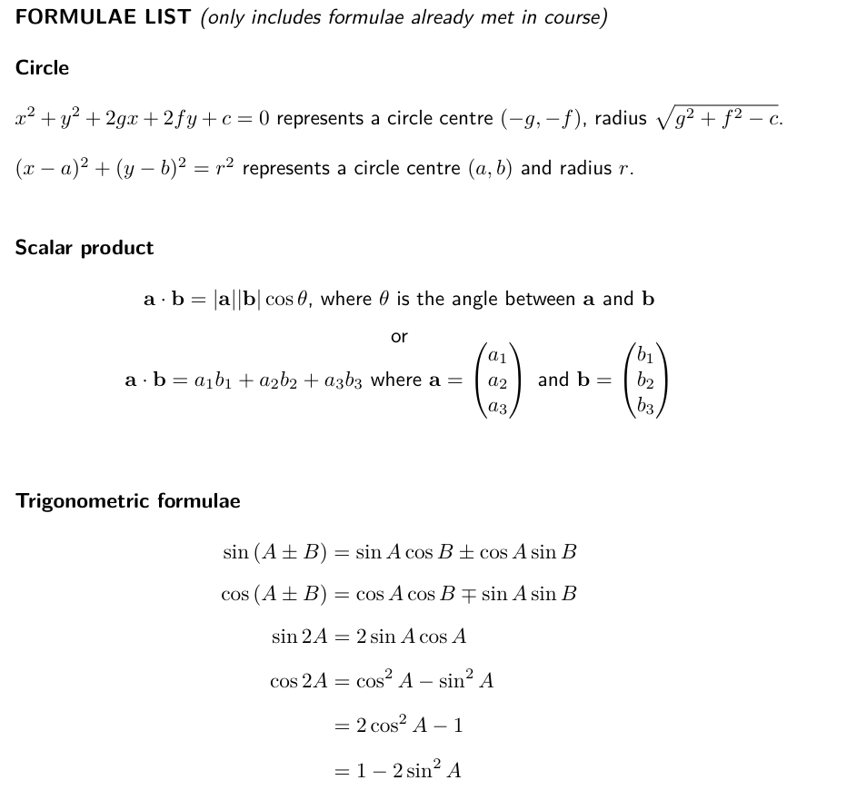
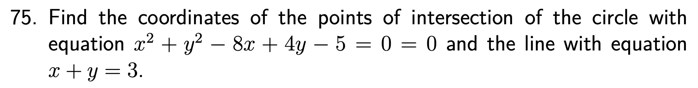

```{r setup, include = FALSE}
knitr::opts_chunk$set(echo = FALSE)
library(webexercises)
```


```{r, echo = FALSE, results='asis'}
# Uncomment to change widget colours:
#style_widgets(incorrect = "goldenrod", correct = "purple")
```

`r hide("Higher Formula Sheet")`



`r unhide()`

<hr>

## 13 Straight Line

<hr>

`r hide("Hint")`

Perpendicular bisectors pass through the *midpoint* of a line segment, and run *perpendicular* to them.

`r unhide()`

`r hide("Answer")`

$4y=-3x+29$ or $y=-\frac{3}{4}x+\frac{29}{2}$

*For more practice, try:* **[Zeta Higher Textbook](https://ebooks.zetapress.co.uk/yyrtww), Page 15, Exercise 1.8, Questions 1(a), 1(b) and 1(c)**

`r unhide()`

`r hide("Solution")`


`r unhide()`


