```{r setup, include = FALSE}
knitr::opts_chunk$set(echo = FALSE)
library(webexercises)
```


```{r, echo = FALSE, results='asis'}
# Uncomment to change widget colours:
#style_widgets(incorrect = "goldenrod", correct = "purple")
```

`r hide("Higher Formula Sheet")`

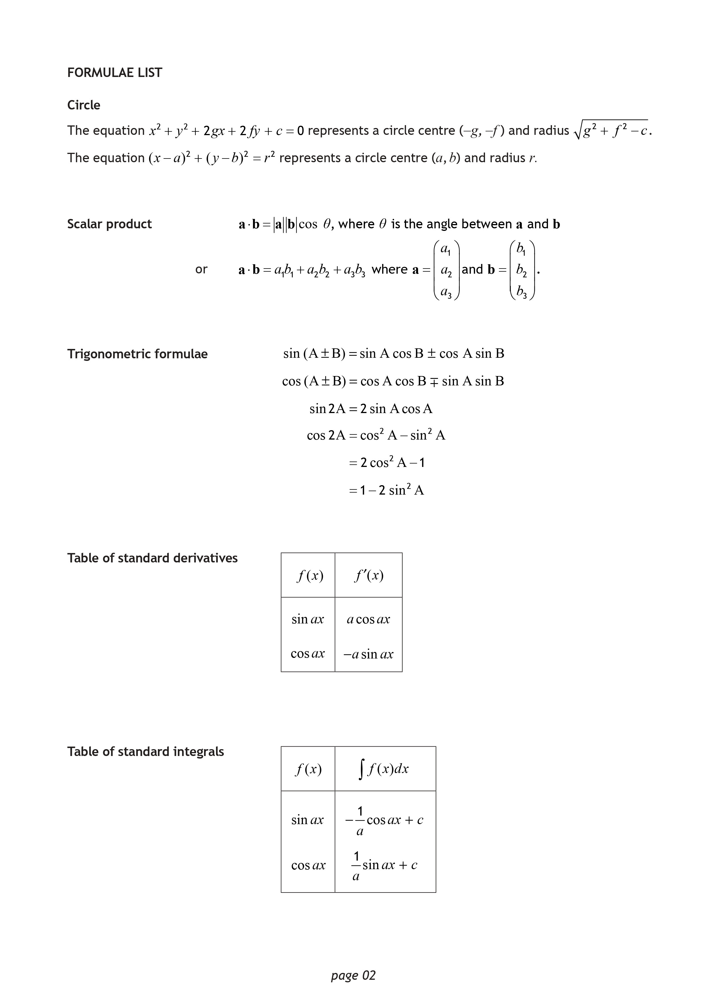

`r unhide()`

<hr>

## 13 The Circle

<hr>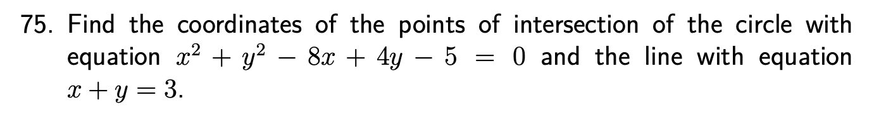

`r hide("Hint")`

Points of intersection can be found by solving simultaneous equations. For a line intersecting a circle, first get the line's equation in a suitable form then solve through *substitution*.

`r unhide()`

`r hide("Answer")`

$(1,2)$ and $(8,-5)$

*For more practice, try:* **[1, 3 and 5 from these past exam questions.](https://www.dynamicmaths.co.uk/QuestionBank/get_questions_handler.php?levelQ=6&otherlevellist=empty&how=A&topics%5B%5D=213&orderR=dateA&calc=CN&noQ=500&minmarks=0&maxmarks=999&NR=RO&interleaved=NA&MC=MCA)**

`r unhide()`

`r hide("Solution")`


`r unhide()`

<hr>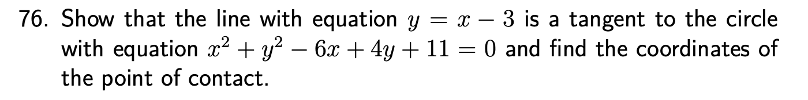

`r hide("Hint")`

Finding points of contact for a line tangent to a circle, or showing that a line is a tangent to a circle, can be approached just as a special case of finding *points of intersection*. Follow the approach of the previous question, and look at how the resulting quadratic factorises to *show tangency*.

`r unhide()`

`r hide("Answer")`

$(2,-1)$ and *repeated factors therefore the line is a tangent to the circle*.

*For more practice, try:* **[2, 4 and 6 from these past exam questions.](https://www.dynamicmaths.co.uk/QuestionBank/get_questions_handler.php?levelQ=6&otherlevellist=empty&how=A&topics%5B%5D=213&orderR=dateA&calc=CN&noQ=500&minmarks=0&maxmarks=999&NR=RO&interleaved=NA&MC=MCA)**

`r unhide()`

`r hide("Solution")`


`r unhide()`

<hr>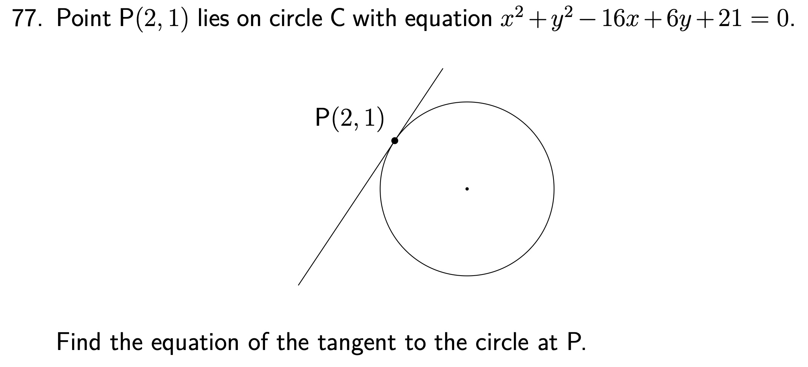

`r hide("Hint")`

Unlike finding a tangent to other curves earlier in the course, finding the gradient of a tangent to a circle will *not involve differentiation*. Instead, start by finding the gradient of the **radius** which meets the tangent at the point of contact, and consider its gradient might lead to the gradient of the *tangent*.

`r unhide()`

`r hide("Answer")`

$y=\frac{3}{2}x-2$ or $2y=3x-4$

*For more practice, try:* **[these past exam questions.](https://www.dynamicmaths.co.uk/QuestionBank/get_questions_handler.php?levelQ=6&otherlevellist=empty&how=A&topics%5B%5D=212&orderR=dateA&calc=CN&noQ=500&minmarks=0&maxmarks=999&NR=RO&interleaved=NA&MC=MCA)**

`r unhide()`

`r hide("Solution")`


`r unhide()`

<hr>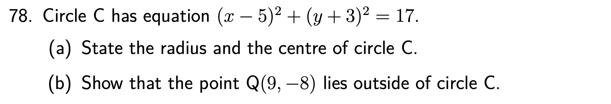

`r hide("Hint")`

For (a) remember that the formula sheet states the connection between the equation of a circle and its radius and centre.

For (b) it would help to know *the* **distance** *the point is from the centre of the circle*.

`r unhide()`

`r hide("Answer")`

(a) Centre $(5,-3)$ and radius $\sqrt{17}$.

(b) $\sqrt{41}>\sqrt{17}$ so the point lies outside the circle (or other valid approach).

*For more practice, try:* **[Zeta Higher Tetbook](https://ebooks.zetapress.co.uk/yyrtww/books), Page 50, Exercise 3.4, Q1 parts (a), (b) and (c).**

`r unhide()`

`r hide("Solution")`


`r unhide()`

<hr>

`r hide("Hint")`

Using the *distance formula* to find the answer to part (a) will be needed for part (b). Consider the radii of each circle. What is their *sum*? 

For part (c), the radii of the circle have already been found. The ratio of the radii is the *ratio in which the point P divides the line between the centres*. This skill was previously introduced in the *Vectors* topic.

`r unhide()`

`r hide("Answer")`

(a) $\sqrt{125}$ or $4\sqrt{5}$

(b) $3\sqrt{5}+2\sqrt{5}=5\sqrt{5}$ and conclusion, or other valid approach.

(c) $(1,-3)$

*For more practice of these problem-solving style questions, try:* **[Zeta Higher Tetbook](https://ebooks.zetapress.co.uk/yyrtww/books), Page 60, Exercise 3.9b, Q1(a).**

`r unhide()`

`r hide("Solution")`


`r unhide()`

<hr>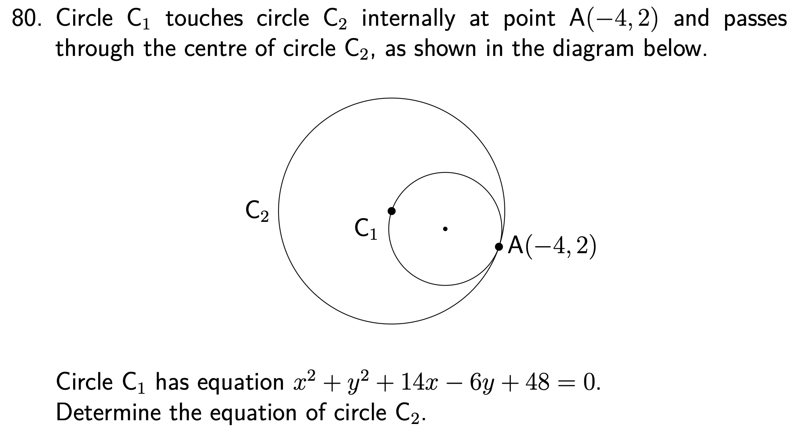

`r hide("Hint")`

For any problem-solving circle question, if an equation of a circle is given then a good starting point is to find its centre and radius.

To find the equation of a circle, both its *centre* and *radius* is needed. How do the sizes of the two circles compare?

`r unhide()`

`r hide("Answer")`

$(x+10)^2+(y-4)^2=40$

*For more practice of these problem-solving style questions, try:* **[1, 2, 6 and 8 from these past exam questions.](https://www.dynamicmaths.co.uk/QuestionBank/get_questions_handler.php?levelQ=6&otherlevellist=empty&how=A&topics%5B%5D=214&orderR=dateA&calc=CN&noQ=500&minmarks=0&maxmarks=999&NR=RN&interleaved=NA&MC=MCA)**

`r unhide()`

`r hide("Solution")`


`r unhide()`

<hr>

## 14 Wave Function

<hr>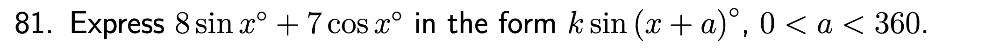

`r hide("Hint")`

Start by *expanding* $k\sin{(x+a)^{\circ}}$, using the formula sheet to help, and hence find the values of $k\sin{a}^{\circ}$ and $k\cos{a^{\circ}}$.

How can $k$ and $a$ be then found?

`r unhide()`

`r hide("Answer")`

$\sqrt{113}\sin{(x+41.2)^{\circ}}$

*For more practice of these problem-solving style questions, try:* **[11, 25, and 29 from these past exam questions.](https://www.dynamicmaths.co.uk/QuestionBank/get_questions_handler.php?levelQ=6&otherlevellist=3&how=A&topics%5B%5D=237&orderR=dateA&calc=CN&noQ=500&minmarks=0&maxmarks=999&NR=RN&interleaved=NA&MC=MCA)**

`r unhide()`

`r hide("Solution")`


`r unhide()`

<hr>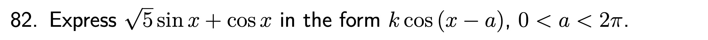

`r hide("Hint")`

Take care with *negatives* when finding $k\sin{a}$ and $k\cos{a}$. 

What does $0<a<2\pi$ tell you about the final answer?

`r unhide()`

`r hide("Answer")`

$\sqrt{6}\cos{(x-1.15)}$

*For more practice of these problem-solving style questions, try:* **[14, 18a, and 19a from these past exam questions.](https://www.dynamicmaths.co.uk/QuestionBank/get_questions_handler.php?levelQ=6&otherlevellist=3&how=A&topics%5B%5D=237&orderR=dateA&calc=CN&noQ=500&minmarks=0&maxmarks=999&NR=RN&interleaved=NA&MC=MCA)**

`r unhide()`

`r hide("Solution")`


`r unhide()`

<hr>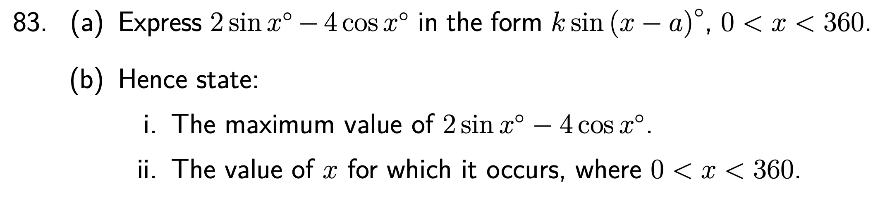

`r hide("Hint")`

Take care with part (a), as mistakes here can make part (b) more difficult.

For part (b), use your answer for part (a). What is the maximum value on the graph of $y=\sin{x}^{\circ}$, and for what value of $x$ does it occur? If you can work out the answer to that, think about how the graph of $y=k\sin{(x-a)^{\circ}}$ has been *transformed*.

`r unhide()`

`r hide("Answer")`

(a) $2\sqrt{5}\sin{(x-63.4)^{\circ}}$

(b) Max value of $2\sqrt{5}$ occurs when $x=153.4$

*For more practice of these problem-solving style questions, try:* **[3, 5 and 8 from these past exam questions.](https://www.dynamicmaths.co.uk/QuestionBank/get_questions_handler.php?levelQ=6&otherlevellist=3&how=A&topics%5B%5D=237&orderR=dateA&calc=CN&noQ=500&minmarks=0&maxmarks=999&NR=RN&interleaved=NA&MC=MCA)**

`r unhide()`

`r hide("Solution")`


`r unhide()`

<hr>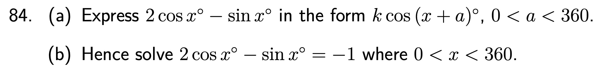

`r hide("Hint")`

Once part (a) has been carefully completed, the answer should be used to solve the equation in part (b).

`r unhide()`

`r hide("Answer")`

(a) $\sqrt{5}\cos{(x+26.6)^{\circ}}$

(b) $x=90,216.9$

*For more practice of these problem-solving style questions, try:* **[1, 4, and 6 from these past exam questions.](https://www.dynamicmaths.co.uk/QuestionBank/get_questions_handler.php?levelQ=6&otherlevellist=3&how=A&topics%5B%5D=237&orderR=dateA&calc=CN&noQ=500&minmarks=0&maxmarks=999&NR=RN&interleaved=NA&MC=MCA)**

`r unhide()`

`r hide("Solution")`


`r unhide()`

<hr>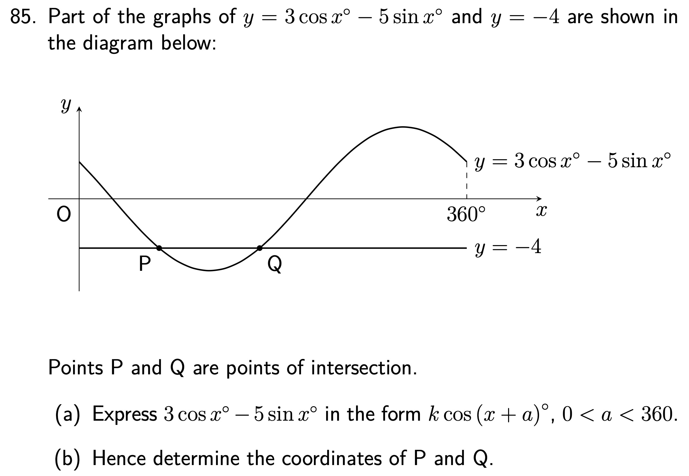

`r hide("Hint")`

Finding *points of intersection* P and Q requires solving *simulaneous equations*. Note that here, both equations are written in the form $y=\dots$

Remember to state your answers as *full coordinates*, labelled P and Q.

`r unhide()`

`r hide("Answer")`

(a) $\sqrt{34}\cos{(x+59.0)^{\circ}}$

(b) P$(74.3,-4)$ and Q$(167.7,-4)$

*For more practice of these problem-solving style questions, try:* **[7 from these past exam questions.](https://www.dynamicmaths.co.uk/QuestionBank/get_questions_handler.php?levelQ=6&otherlevellist=3&how=A&topics%5B%5D=237&orderR=dateA&calc=CN&noQ=500&minmarks=0&maxmarks=999&NR=RN&interleaved=NA&MC=MCA)**

`r unhide()`

`r hide("Solution")`


`r unhide()`

<hr>

## 15 Logs and Exponentials

<hr>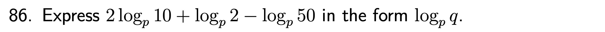

`r hide("Hint")`

Paying attention to the *order of operations*, remember the following log laws:

Product law: $\log_{a}{x}+\log_{a}{y}=\log_{a}{xy}$

Quotient law: $\log_{a}{x}-\log_{a}{y}=\log_{a}{\left(\frac{x}{y}\right)}$

Power law: $y\log_{a}{x}=\log_{a}{x^y}$

`r unhide()`

`r hide("Answer")`

$\log_{p}4$

`r unhide()`

`r hide("Solution")`


`r unhide()`

<hr>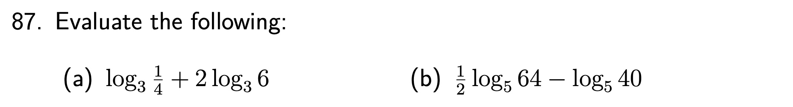

`r hide("Hint")`

First use the laws as in the previous question before evaluating.

Remember that $\log_{a}x$ can be interpreted as $a$ to *which power* gives an answer of $x$.

`r unhide()`

`r hide("Answer")`

(a) $2$

(b) $-1$

`r unhide()`

`r hide("Solution")`


`r unhide()`

<hr>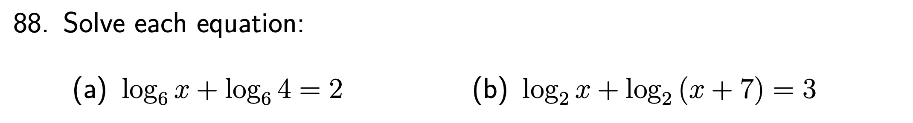

`r hide("Hint")`

Remember that if $\log_ax=\log_ay$ then $x=y$.

To help contain each side of the equation within $\log_6$ before "cancelling", remember that $2$ can be multiplied by $log_66$ (which itself is equal to $1$).

Remember that any solutions should be checked against the original logs, since a log can only be taken of *positive numbers*.

`r unhide()`

`r hide("Answer")`

(a) $x=9$

(b) $x=1$

`r unhide()`

`r hide("Solution")`


`r unhide()`

<hr>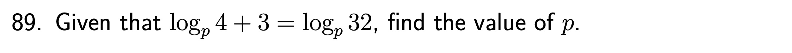

`r hide("Hint")`

Multiplying $3$ by $\log_pp$ will help here.

`r unhide()`

`r hide("Answer")`

$p=2$

`r unhide()`

`r hide("Solution")`


`r unhide()`

<hr>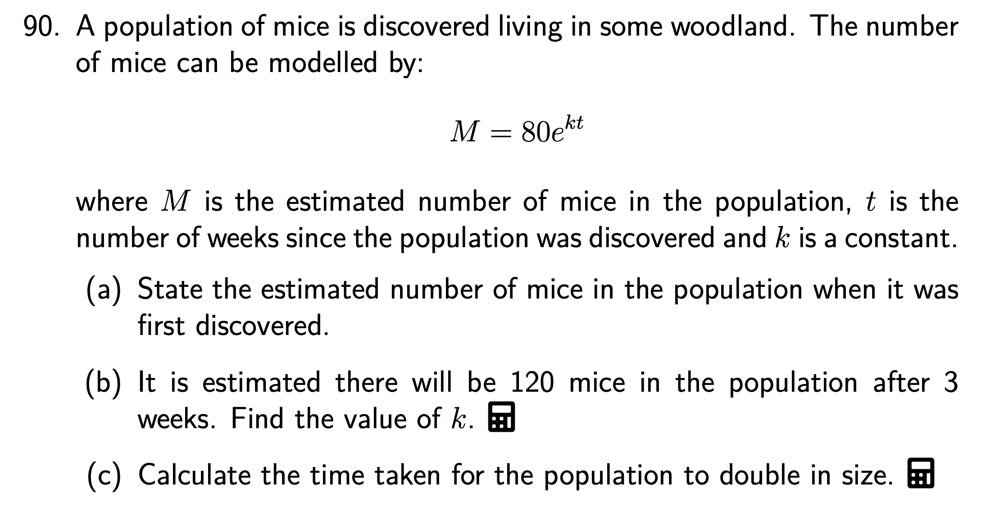

`r hide("Hint")`

(a) You may either recognised which part of $M=80e^{kt}$ is the *initial value*, or set $t=0$ and calculate.

(b) Substitute the required information into the equation and solve for $k$. Remember that if $y=e^x$ then $\ln{y}=x$.

(c) Since the *initial value* is $80$... The steps involved in solving for $t$ will be similar to those taken in part (b).

`r unhide()`

`r hide("Answer")`

(a) $80$

(b) $k=0.135$

(c) $5.13$ weeks

`r unhide()`

`r hide("Solution")`


`r unhide()`

<hr>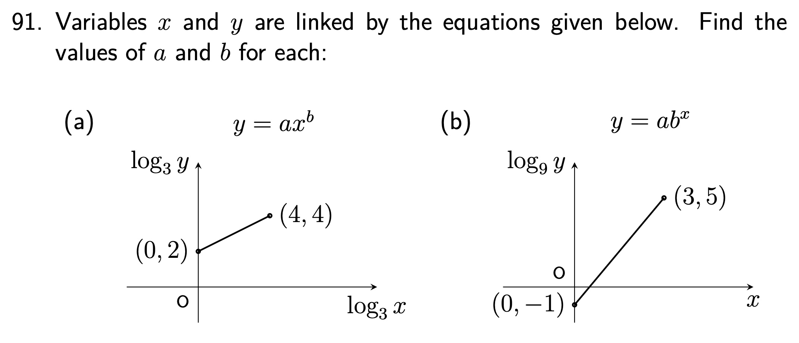

`r hide("Hint")`

A number of methods may have been taught, so refer to your own notes and examples for *"experimental data"* questions.

`r unhide()`

`r hide("Answer")`

(a) $a=9$ and $b=\frac{1}{2}$

(b) $a=\frac{1}{9}$ and $b=81$

`r unhide()`

`r hide("Solution")`


`r unhide()`

<hr>

## 16 Further Calculus

<hr>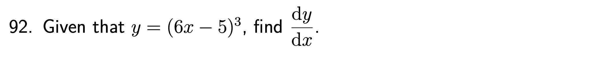

`r hide("Hint")`

As well a multiplying by the power and reducing the power by one, *what else should you multiply by?*

`r unhide()`

`r hide("Answer")`

$\frac{\mathrm{d}y}{\mathrm{d}x}=18(6x-5)^2$

`r unhide()`

`r hide("Solution")`


`r unhide()`

<hr>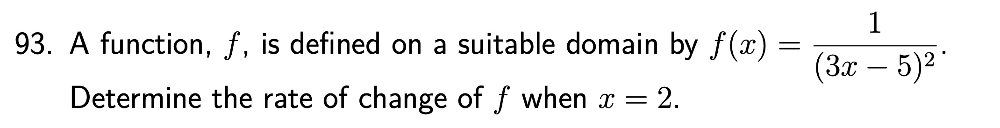

`r hide("Hint")`

How can this be rewritten in the form $(3x-5)^k$, where $k$ is a (negative in this case) constant.

`r unhide()`

`r hide("Answer")`

$-6$

`r unhide()`

`r hide("Solution")`


`r unhide()`

<hr>

`r hide("Hint")`

The *formula sheet* contains reminders of how to differentiate trig functions.

`r unhide()`

`r hide("Answer")`

$8$

`r unhide()`

`r hide("Solution")`


`r unhide()`

<hr>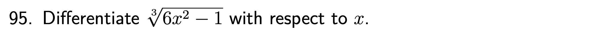

`r hide("Hint")`

How can this be rewritten in the form $(6x^2-1)^k$, where $k$ is a (fractional in this case) constant.

`r unhide()`

`r hide("Answer")`

$4x(6x^2-1)^{-\frac{2}{3}}$

`r unhide()`

`r hide("Solution")`


`r unhide()`

<hr>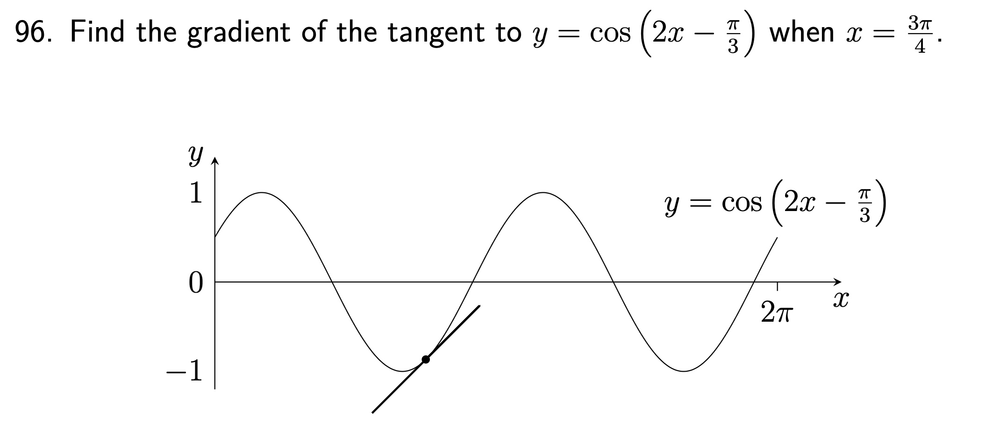

`r hide("Hint")`

Remember that finding the *gradient of a tangent to a curve* is tackled by first *differentiating*.

`r unhide()`

`r hide("Answer")`

$1$

`r unhide()`

`r hide("Solution")`


`r unhide()`

<hr>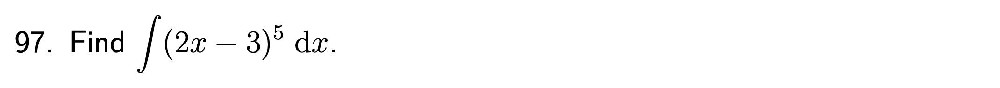

`r hide("Hint")`

As well as increasing the power by one and dividing by the new power, *what else should you divide by?*

What else should your answer contain, which is easily forgotten?

`r unhide()`

`r hide("Answer")`

$\frac{(2x-3)^6}{12}+\mathrm{C}$

`r unhide()`

`r hide("Solution")`


`r unhide()`

<hr>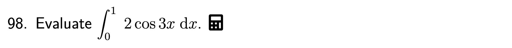

`r hide("Hint")`

The *formula sheet* gives reminders on integrating trig functions.

Take care with the calculation. Since we are performing *calculus* with *trig functions*, we are working in **radians**.

Put your calculator in a suitable *mode* before the calculation (*and change it straight back afterwards!*).

`r unhide()`

`r hide("Answer")`

$0.0941$

`r unhide()`

`r hide("Solution")`


`r unhide()`

<hr>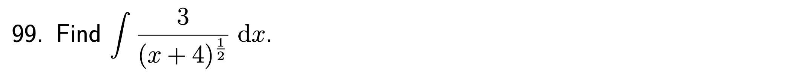

`r hide("Hint")`

First write this in the form $3(x+4)^k$, where $k$ is a constant.

`r unhide()`

`r hide("Answer")`

$6(x+4)^{\frac{1}{2}}+\mathrm{C}$

`r unhide()`

`r hide("Solution")`


`r unhide()`

<hr>

`r hide("Hint")`

Make sure you can tackle this *without* a calculator.

`r unhide()`

`r hide("Answer")`

$\frac{\sqrt{3}}{2}$

`r unhide()`

`r hide("Solution")`


`r unhide()`


