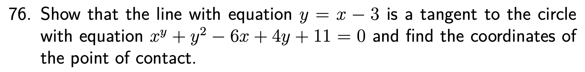
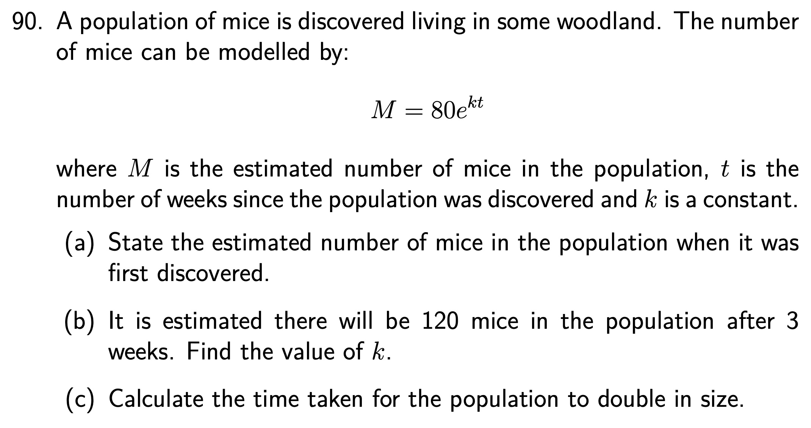

```{r setup, include = FALSE}
knitr::opts_chunk$set(echo = FALSE)
library(webexercises)
```


```{r, echo = FALSE, results='asis'}
# Uncomment to change widget colours:
#style_widgets(incorrect = "goldenrod", correct = "purple")
```

`r hide("Higher Formula Sheet")`


`r unhide()`

<hr>

## 13 Straight Line

<hr>

`r hide("Hint")`

Hint here.

`r unhide()`

`r hide("Answer")`

`r unhide()`

`r hide("Solution")`


`r unhide()`

<hr>

`r hide("Hint")`

Hint here.

`r unhide()`

`r hide("Answer")`

`r unhide()`

`r hide("Solution")`


`r unhide()`

<hr>

`r hide("Hint")`

Hint here.

`r unhide()`

`r hide("Answer")`

`r unhide()`

`r hide("Solution")`


`r unhide()`

<hr>

`r hide("Hint")`

Hint here.

`r unhide()`

`r hide("Answer")`

`r unhide()`

`r hide("Solution")`


`r unhide()`

<hr>

`r hide("Hint")`

Hint here.

`r unhide()`

`r hide("Answer")`

`r unhide()`

`r hide("Solution")`


`r unhide()`

<hr>

`r hide("Hint")`

Hint here.

`r unhide()`

`r hide("Answer")`

`r unhide()`

`r hide("Solution")`


`r unhide()`

<hr>

`r hide("Hint")`

Hint here.

`r unhide()`

`r hide("Answer")`

`r unhide()`

`r hide("Solution")`


`r unhide()`

<hr>

`r hide("Hint")`

Hint here.

`r unhide()`

`r hide("Answer")`

`r unhide()`

`r hide("Solution")`


`r unhide()`

<hr>

`r hide("Hint")`

Hint here.

`r unhide()`

`r hide("Answer")`

`r unhide()`

`r hide("Solution")`


`r unhide()`

<hr>

`r hide("Hint")`

Hint here.

`r unhide()`

`r hide("Answer")`

`r unhide()`

`r hide("Solution")`


`r unhide()`

<hr>

`r hide("Hint")`

Hint here.

`r unhide()`

`r hide("Answer")`

`r unhide()`

`r hide("Solution")`


`r unhide()`

<hr>

`r hide("Hint")`

Hint here.

`r unhide()`

`r hide("Answer")`

`r unhide()`

`r hide("Solution")`


`r unhide()`

<hr>

`r hide("Hint")`

Hint here.

`r unhide()`

`r hide("Answer")`

`r unhide()`

`r hide("Solution")`


`r unhide()`

<hr>

`r hide("Hint")`

Hint here.

`r unhide()`

`r hide("Answer")`

`r unhide()`

`r hide("Solution")`


`r unhide()`

<hr>

`r hide("Hint")`

Hint here.

`r unhide()`

`r hide("Answer")`

`r unhide()`

`r hide("Solution")`


`r unhide()`

<hr>

`r hide("Hint")`

Hint here.

`r unhide()`

`r hide("Answer")`

`r unhide()`

`r hide("Solution")`


`r unhide()`

<hr>

`r hide("Hint")`

Hint here.

`r unhide()`

`r hide("Answer")`

`r unhide()`

`r hide("Solution")`


`r unhide()`

<hr>

`r hide("Hint")`

Hint here.

`r unhide()`

`r hide("Answer")`

`r unhide()`

`r hide("Solution")`


`r unhide()`

<hr>

`r hide("Hint")`

Hint here.

`r unhide()`

`r hide("Answer")`

`r unhide()`

`r hide("Solution")`


`r unhide()`

<hr>

`r hide("Hint")`

Hint here.

`r unhide()`

`r hide("Answer")`

`r unhide()`

`r hide("Solution")`


`r unhide()`

<hr>

`r hide("Hint")`

Hint here.

`r unhide()`

`r hide("Answer")`

`r unhide()`

`r hide("Solution")`


`r unhide()`

<hr>

`r hide("Hint")`

Hint here.

`r unhide()`

`r hide("Answer")`

`r unhide()`

`r hide("Solution")`


`r unhide()`

<hr>

`r hide("Hint")`

Hint here.

`r unhide()`

`r hide("Answer")`

`r unhide()`

`r hide("Solution")`


`r unhide()`

<hr>

`r hide("Hint")`

Hint here.

`r unhide()`

`r hide("Answer")`

`r unhide()`

`r hide("Solution")`


`r unhide()`

<hr>

`r hide("Hint")`

Hint here.

`r unhide()`

`r hide("Answer")`

`r unhide()`

`r hide("Solution")`


`r unhide()`

<hr>

`r hide("Hint")`

Hint here.

`r unhide()`

`r hide("Answer")`

`r unhide()`

`r hide("Solution")`


`r unhide()`


