```{r setup, include = FALSE}
knitr::opts_chunk$set(echo = FALSE)
library(webexercises)
```


```{r, echo = FALSE, results='asis'}
# Uncomment to change widget colours:
#style_widgets(incorrect = "goldenrod", correct = "purple")
```

`r hide("N5 Formula Sheet")`

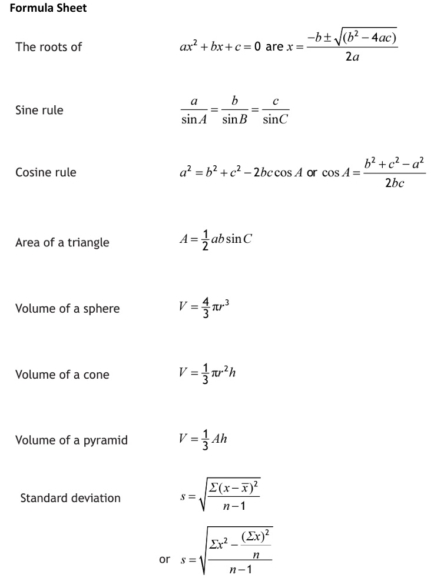

`r unhide()`

<hr>

## Volume

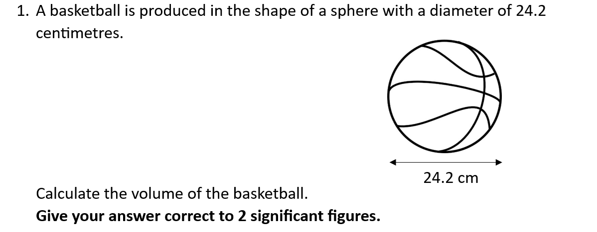

`r hide("Get a hint")`

The formula sheet shows how to calculate the volume of a sphere.

`r unhide()`

`r hide("Check the answer")`

$7400\text{ cm}^3$

`r unhide()`

`r hide("Solution - check your notes first, if stuck!")`

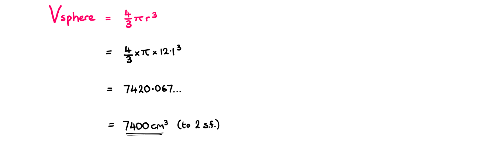

`r unhide()`

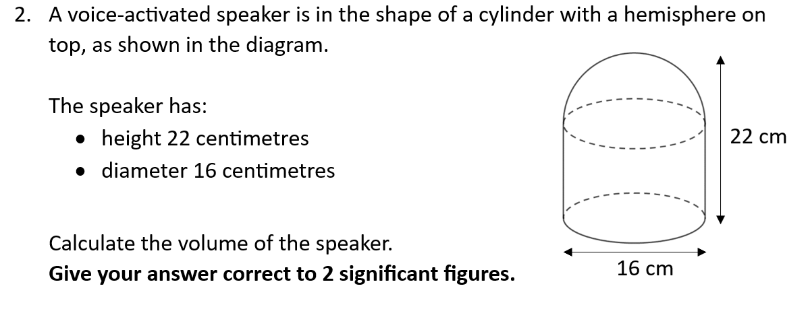

`r hide("Get a hint")`

What is the height of the cylinder itself, without the hemisphere on top?

`r unhide()`

`r hide("Check the answer")`

$3900\text{ cm}^3$

`r unhide()`

`r hide("Solution - check your notes first, if stuck!")`

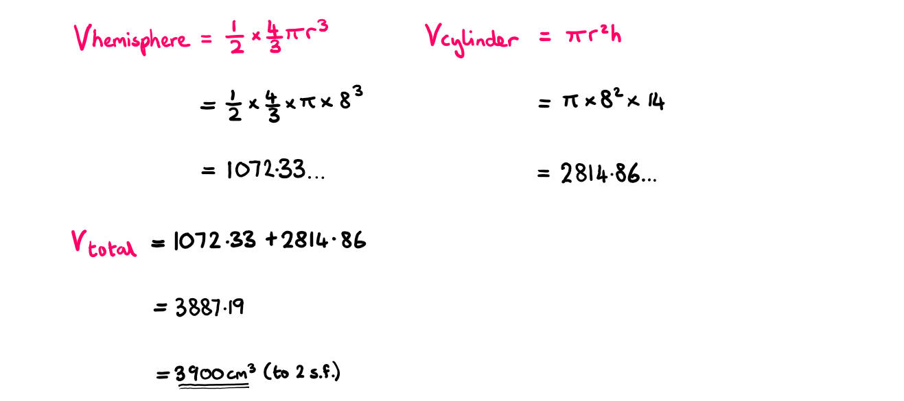

`r unhide()`

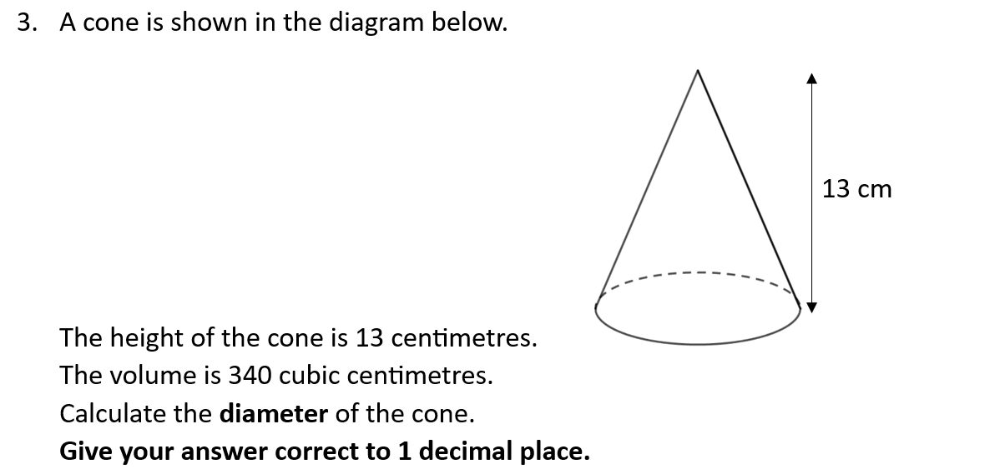

`r hide("Get a hint")`

Substitute the values you know into the formula provided on the formula sheet.

`r unhide()`

`r hide("Check the answer")`

$10.0\text{ cm}$

`r unhide()`

`r hide("Solution - check your notes first, if stuck!")`

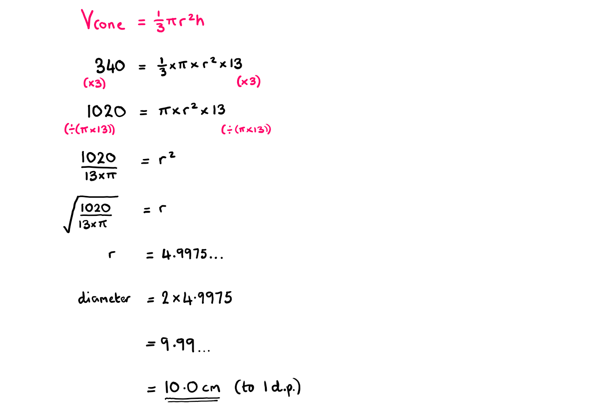

`r unhide()`

<hr>

## Equations and Inequations

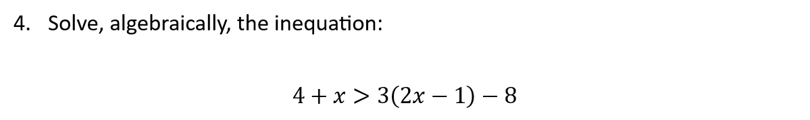

`r hide("Get a hint")`

Be very careful if you find yourself dividing *by a negative number*. It is usually best to avoid it.

`r unhide()`

`r hide("Check the answer")`

$3>x$ or $x<3$

`r unhide()`

`r hide("Solution - check your notes first, if stuck!")`

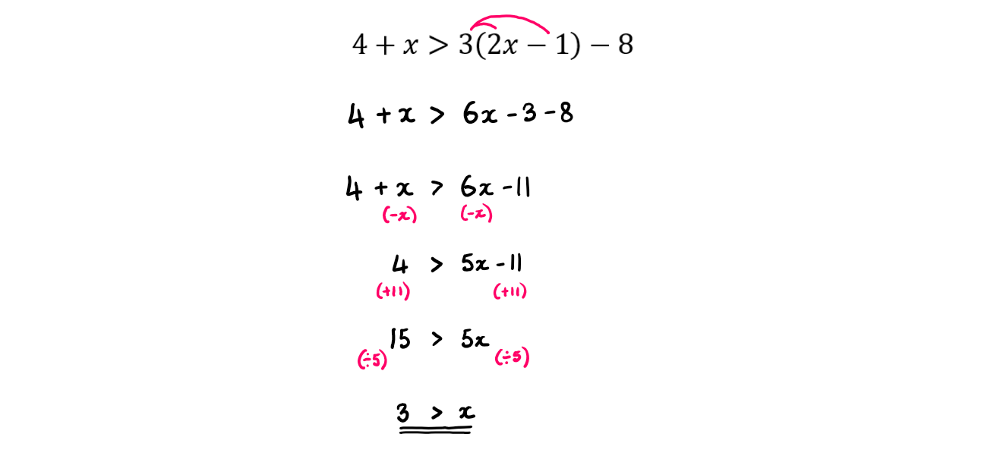

`r unhide()`

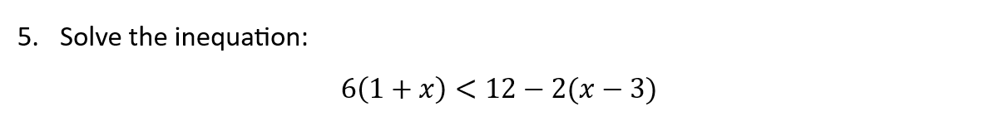

`r hide("Get a hint")`

The bracket in the first line is being multiplied by *negative* 2.

`r unhide()`

`r hide("Check the answer")`

$x<\frac{3}{2}$ or $\frac{3}{2}>x$

`r unhide()`

`r hide("Solution - check your notes first, if stuck!")`

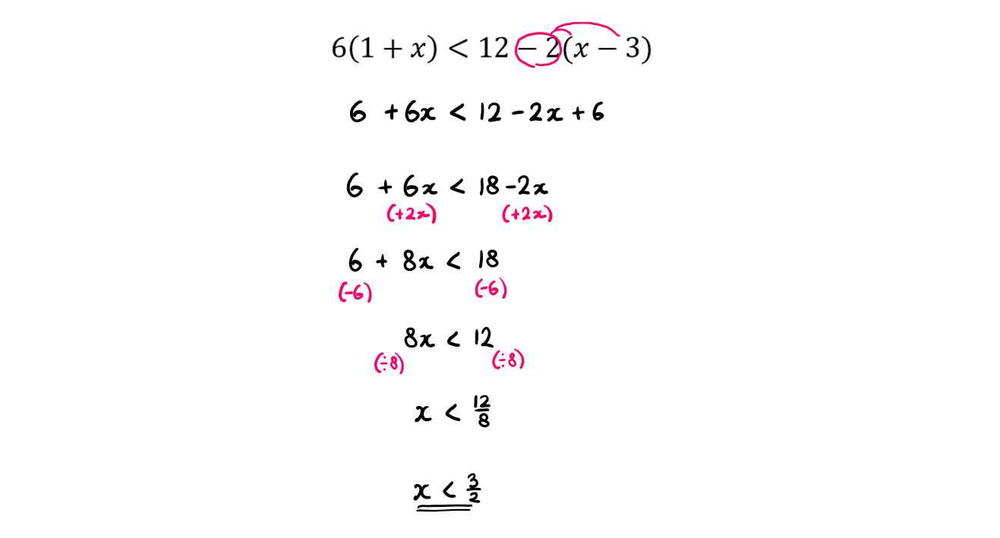

`r unhide()`

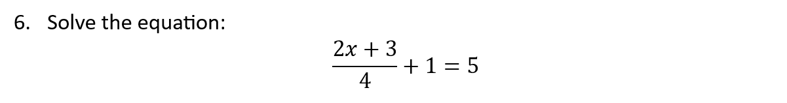

`r hide("Get a hint")`

*Multiplying* through carefully by the *denominator* will deal with the fraction.

`r unhide()`

`r hide("Check the answer")`

$x=\frac{13}{2}$

`r unhide()`

`r hide("Solution - check your notes first, if stuck!")`

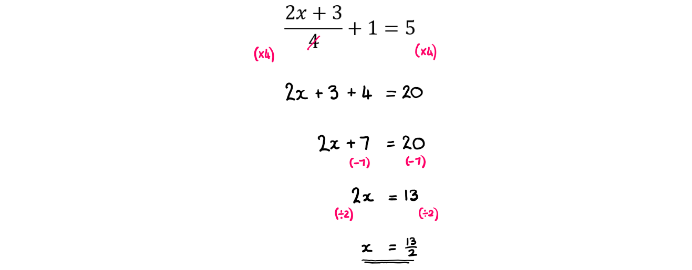

`r unhide()`

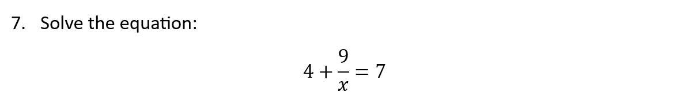

`r hide("Get a hint")`

Multiplying by the denominator is a good strategy even when the denominator contains a letter.

`r unhide()`

`r hide("Check the answer")`

$x=3$

`r unhide()`

`r hide("Solution - check your notes first, if stuck!")`


`r unhide()`

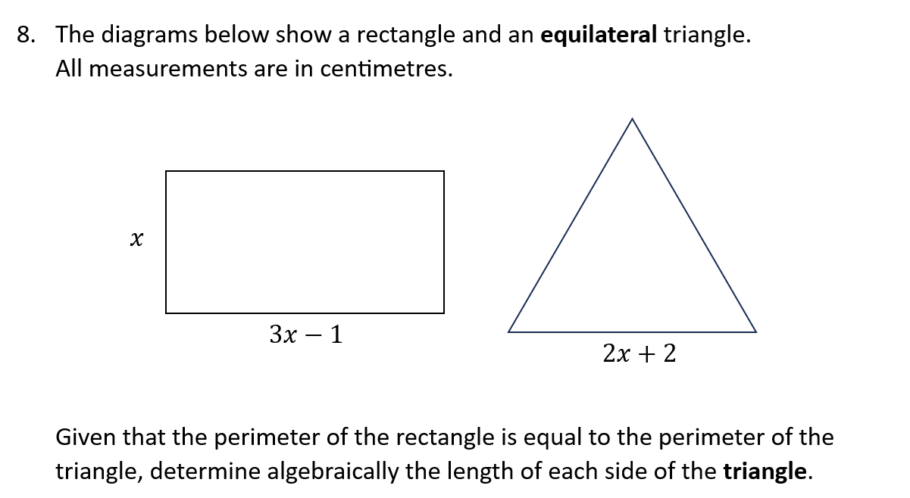

`r hide("Get a hint")`

Find an expression for the *perimeter* of each shape first. You are told they have *equal* perimeter...

`r unhide()`

`r hide("Check the answer")`

$10\text{ cm}$

`r unhide()`

`r hide("Solution - check your notes first, if stuck!")`

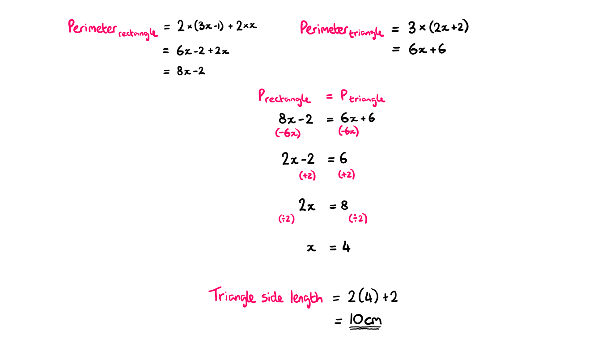

`r unhide()`

<hr>

## Circle Geometry

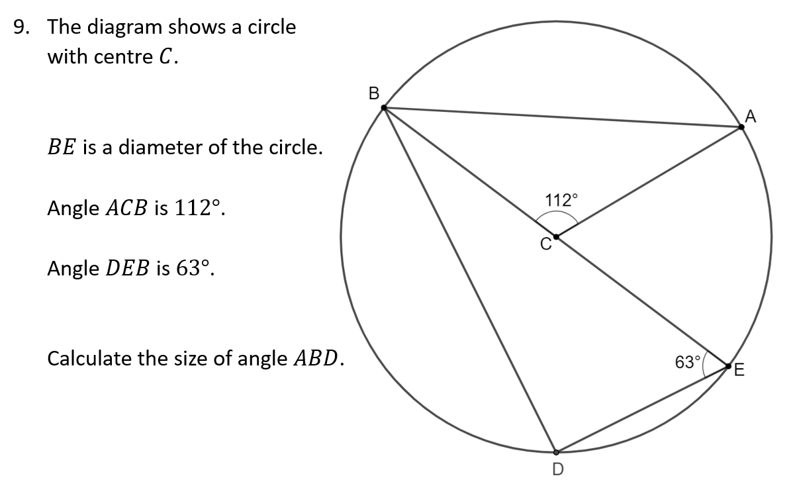

`r hide("Get a hint")`

Look for right-angles, and isosceles triangles.

`r unhide()`

`r hide("Check the answer")`

$\angle ABD=61^{\circ}$

`r unhide()`

`r hide("Solution - check your notes first, if stuck!")`

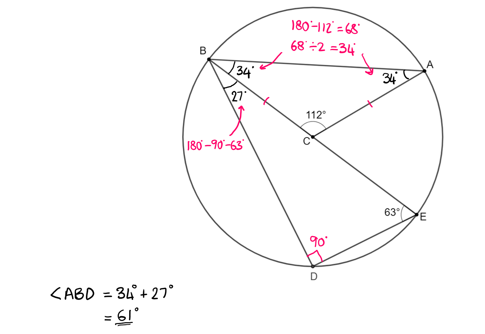

`r unhide()`

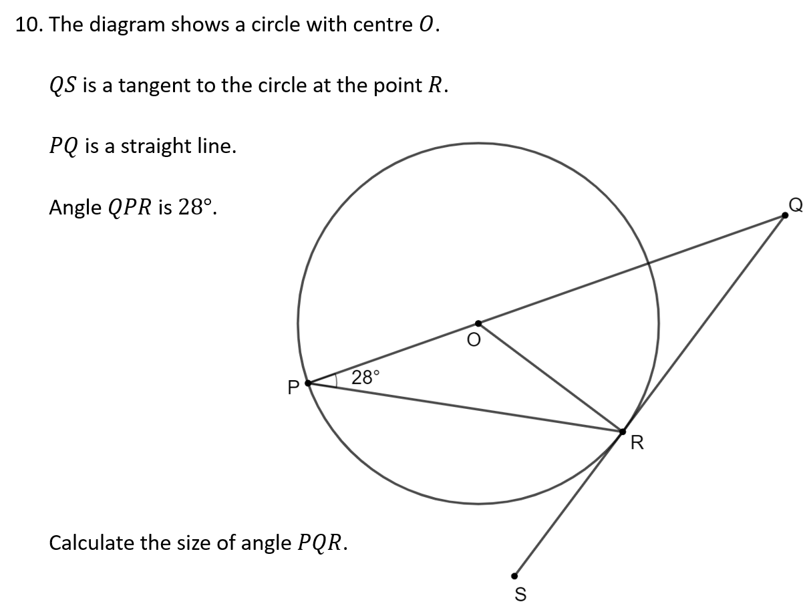

`r hide("Get a hint")`

Look for right-angles, and isosceles triangles.

`r unhide()`

`r hide("Check the answer")`

$\angle PQR = 34^{\circ}$

`r unhide()`

`r hide("Solution - check your notes first, if stuck!")`

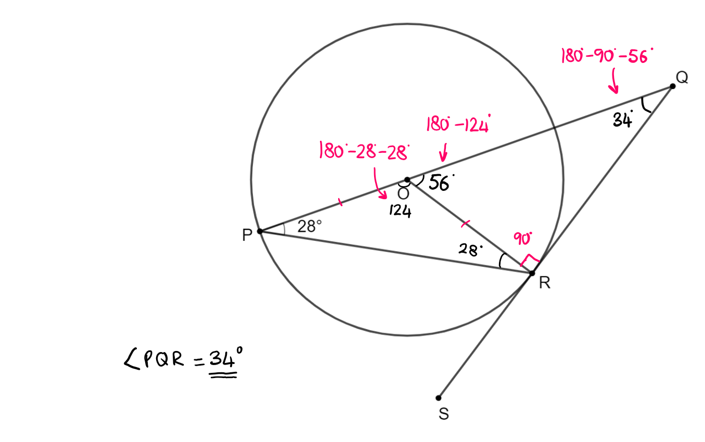

`r unhide()`

<hr>

## Scientific Notation

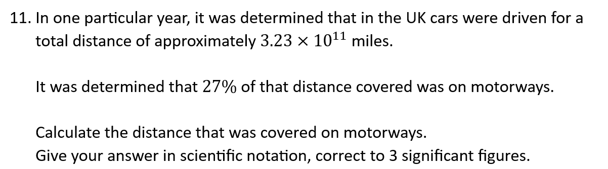

`r hide("Get a hint")`

Make sure you can enter numbers in scientific notation *into your calculator* to perform calculations.

`r unhide()`

`r hide("Check the answer")`

$8.72\times10^{10}\text{ miles}$

`r unhide()`

`r hide("Solution - check your notes first, if stuck!")`

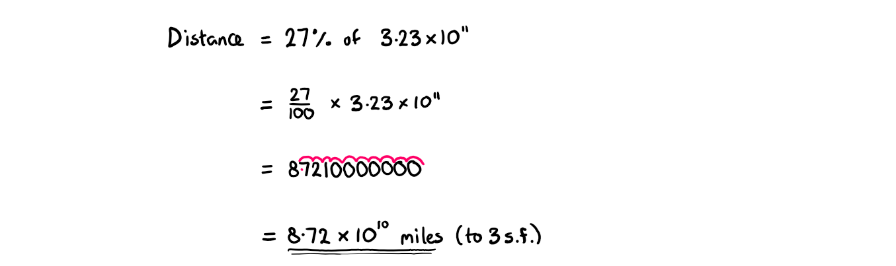

`r unhide()`

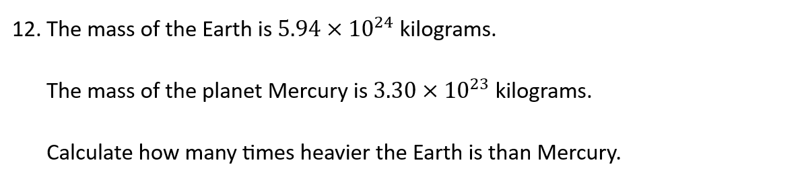

`r hide("Get a hint")`

Make sure you can enter numbers in scientific notation into your calculator, and consider whether they should be put them in *brackets* when performing calculators. 

`r unhide()`

`r hide("Check the answer")`

$18$

`r unhide()`

`r hide("Solution - check your notes first, if stuck!")`


`r unhide()`

<hr>

## Expanding Brackets

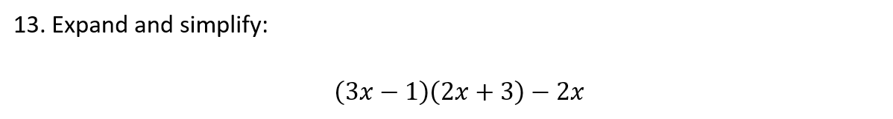

`r hide("Get a hint")`

Take care with *negatives* when expanding brackets.

`r unhide()`

`r hide("Check the answer")`

$6x^2+5x-3$

`r unhide()`

`r hide("Solution - check your notes first, if stuck!")`


`r unhide()`

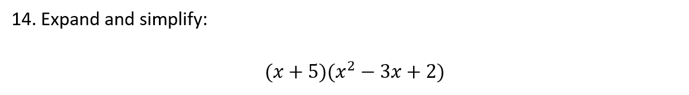

`r hide("Get a hint")`

Check the *six terms* obtained from expanding these brackets are correct carefully before you collect like terms.

`r unhide()`

`r hide("Check the answer")`

$x^3+2x^2-13x+10$

`r unhide()`

`r hide("Solution - check your notes first, if stuck!")`


`r unhide()`

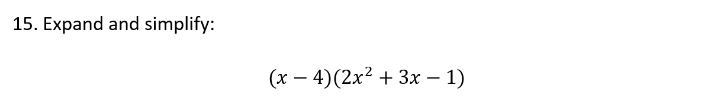

`r hide("Get a hint")`

Take care with *multiplying a negative by a negative*.

`r unhide()`

`r hide("Check the answer")`

$2x^3-5x^2-13x+4$

`r unhide()`

`r hide("Solution - check your notes first, if stuck!")`


`r unhide()`


`r hide("Get a hint")`

Tackle the expansion of $(x-3)(x+1)$ then consider the "$-$" that lies in front of it.

`r unhide()`

`r hide("Check the answer")`

$-x+3$

`r unhide()`

`r hide("Solution - check your notes first, if stuck!")`

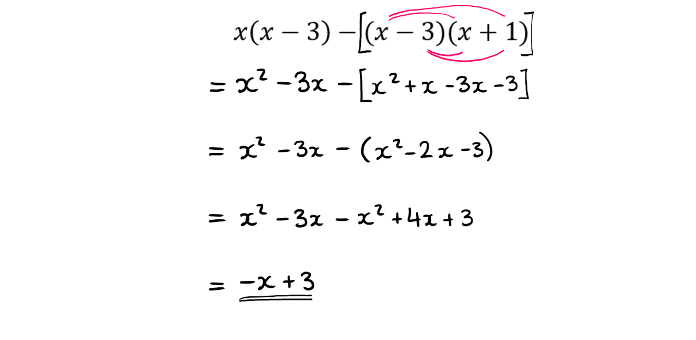

`r unhide()`


`r hide("Get a hint")`

$(x+2)^3$ can be written as $(x+2)(x+2)(x+2)$.

`r unhide()`

`r hide("Check the answer")`

$x^3+6x^2+12x+8$

`r unhide()`

`r hide("Solution - check your notes first, if stuck!")`

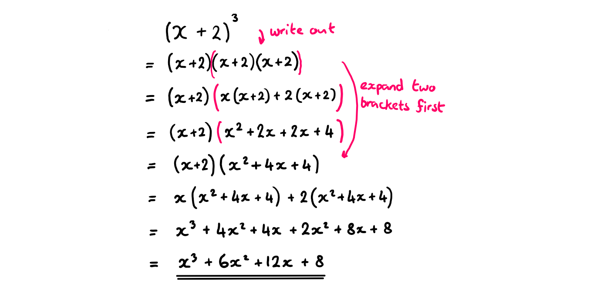

`r unhide()`

<hr>

## Similar Shapes

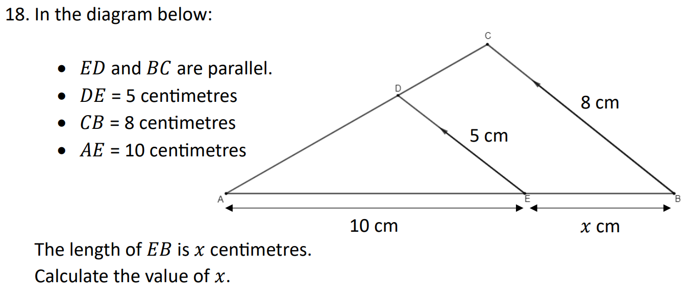

`r hide("Get a hint")`

Draw the *two triangles separately*.

`r unhide()`

`r hide("Check the answer")`

$x=6$

`r unhide()`

`r hide("Solution - check your notes first, if stuck!")`

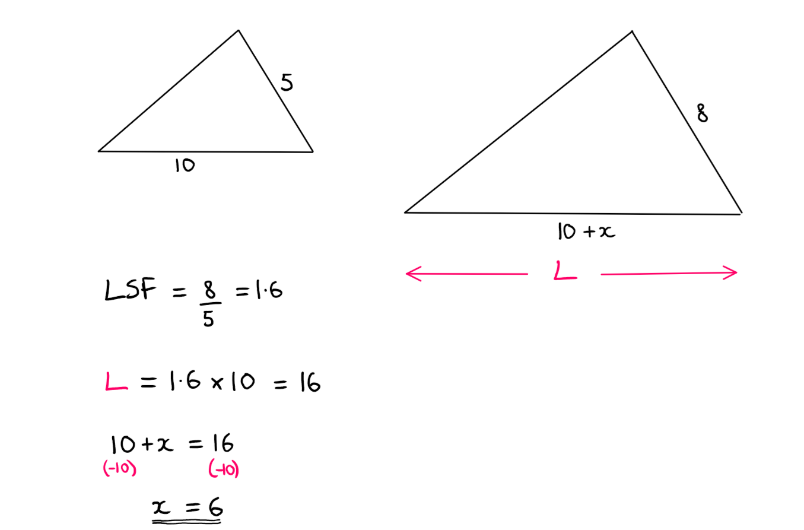

`r unhide()`


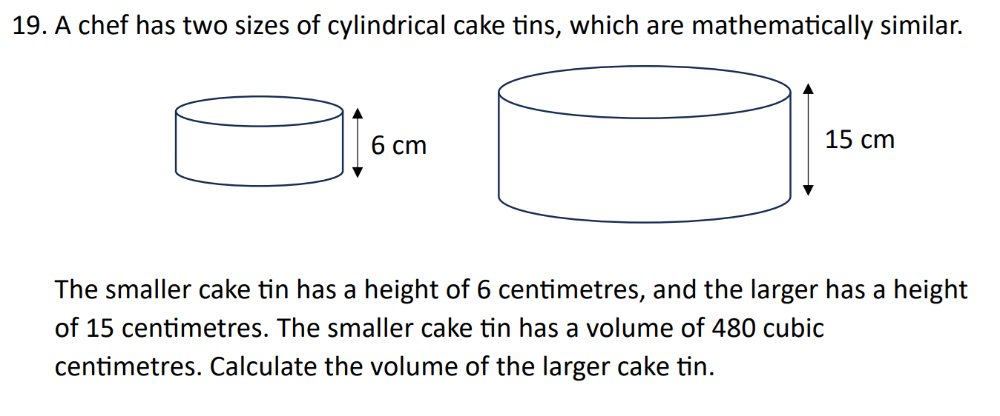

`r hide("Get a hint")`

Obtain the LSF *first*, and then think about which scale factor is *needed*.

`r unhide()`

`r hide("Check the answer")`

$7500\text{ cm}^3$


`r unhide()`

`r hide("Solution - check your notes first, if stuck!")`


`r unhide()`

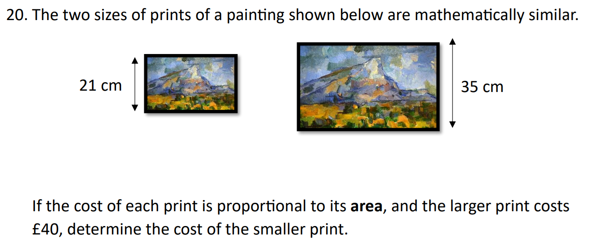

`r hide("Get a hint")`

Since cost is proportional to area, the **area scale factor** is needed. First, find the *length scale factor*.

`r unhide()`

`r hide("Check the answer")`

£14.40

`r unhide()`

`r hide("Solution - check your notes first, if stuck!")`


`r unhide()`

<hr>

## Percentages

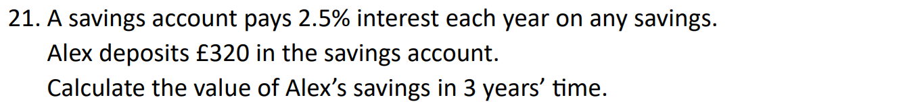

`r hide("Get a hint")`

*"100\% + 2.5\%"*

`r unhide()`

`r hide("Check the answer")`

$£344.61$

`r unhide()`

`r hide("Solution - check your notes first, if stuck!")`


`r unhide()`

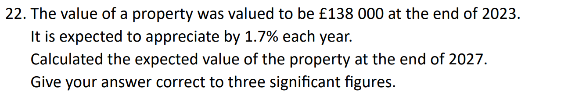

`r hide("Get a hint")`

*"100\% + 1.7\%"*

`r unhide()`

`r hide("Check the answer")`

$£148,000$

`r unhide()`

`r hide("Solution - check your notes first, if stuck!")`


`r unhide()`


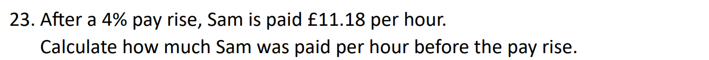

`r hide("Get a hint")`

What percentage *of their original pay* is £11.18?

`r unhide()`

`r hide("Check the answer")`

$£10.75$

`r unhide()`

`r hide("Solution - check your notes first, if stuck!")`

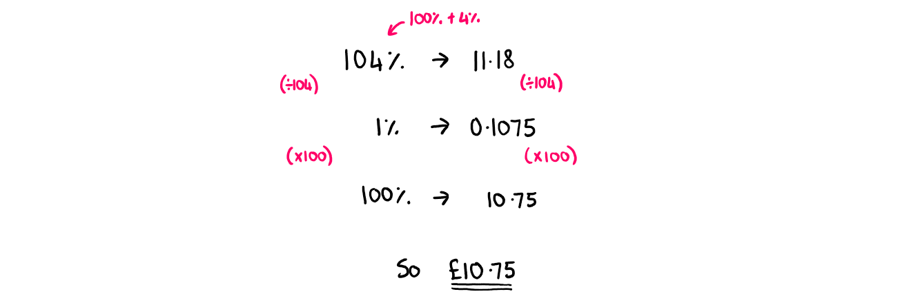

`r unhide()`

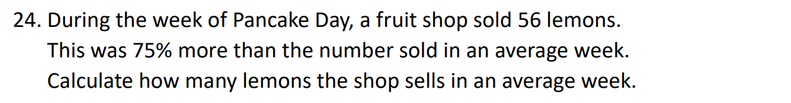

`r hide("Get a hint")`

Without a calculator, finding 1\% will be awkward. What *other percentage* could be reached, which would let you then find 100\% quickly?

`r unhide()`

`r hide("Check the answer")`

$32$

`r unhide()`

`r hide("Solution - check your notes first, if stuck!")`

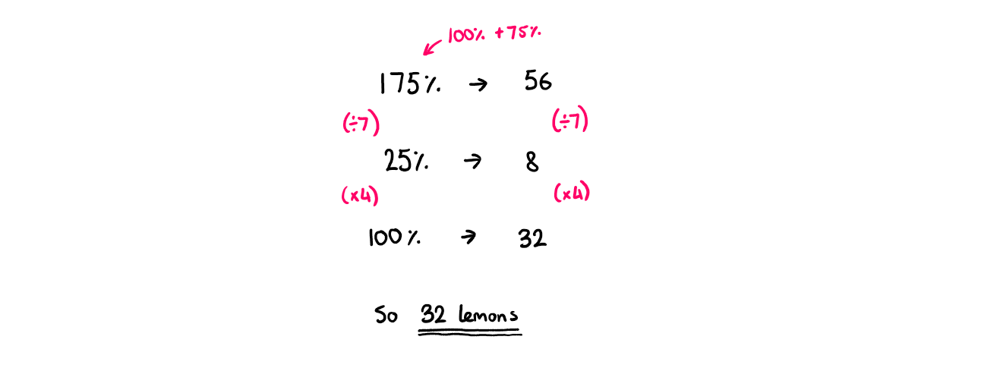

`r unhide()`

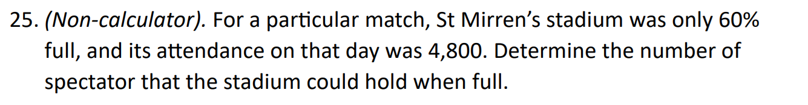

`r hide("Get a hint")`

It can be tempting to assume you need to *add* or *subtract* 60% **from 100%**. But that it not needed here: 4800 corresponds to 60% of the total number of spectators when full.

`r unhide()`

`r hide("Check the answer")`

8,000

`r unhide()`

`r hide("Solution - check your notes first, if stuck!")`


`r unhide()`

<hr>

## Numerical Fractions

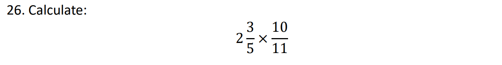

`r hide("Get a hint")`

When multiplying (or dividing) factions, the denominators *don't need to be the same*. However, you don't want either to be a *mixed fraction*.

`r unhide()`

`r hide("Check the answer")`

$\dfrac{26}{11}$ or $2\dfrac{4}{11}$

`r unhide()`

`r hide("Solution - check your notes first, if stuck!")`


`r unhide()`

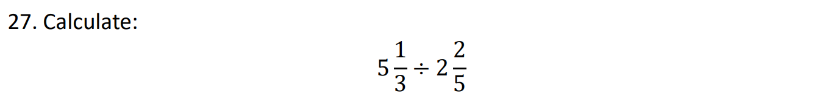

`r hide("Get a hint")`

How can a division by a fraction be rewritten as a *multiplication*?

`r unhide()`

`r hide("Check the answer")`

$\dfrac{20}{9}$ or $2\dfrac{2}{9}$

`r unhide()`

`r hide("Solution - check your notes first, if stuck!")`

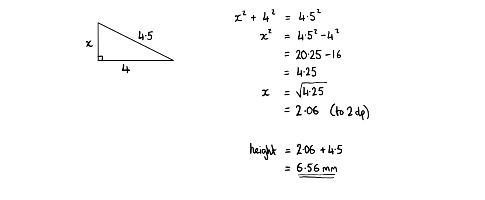

`r unhide()`

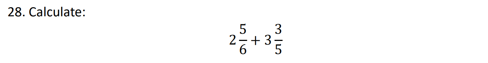

`r hide("Get a hint")`

When adding (or subtracting) fractions, the *denominators need to be equal*.

`r unhide()`

`r hide("Check the answer")`

$\dfrac{193}{30}$ or $6\dfrac{13}{30}$

`r unhide()`

`r hide("Solution - check your notes first, if stuck!")`


`r unhide()`

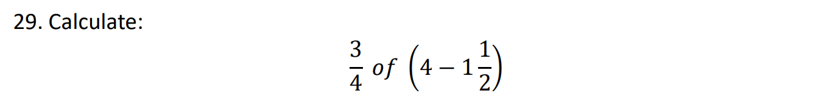

`r hide("Get a hint")`

"$\dfrac{3}{4}$ *of...*" is the same as "$\dfrac{3}{4}\times$..."

`r unhide()`

`r hide("Check the answer")`

$\dfrac{15}{8}$ or $1\dfrac{7}{8}$

`r unhide()`

`r hide("Solution - check your notes first, if stuck!")`

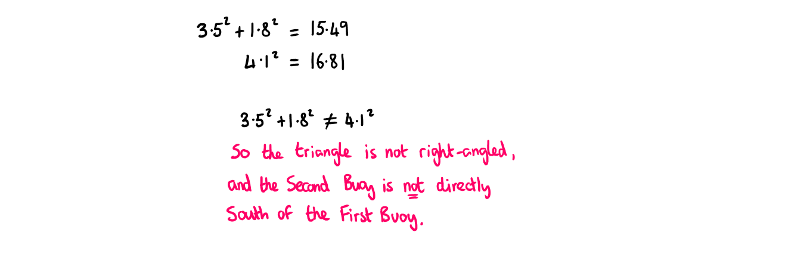

`r unhide()`

<hr>

## Pythagoras

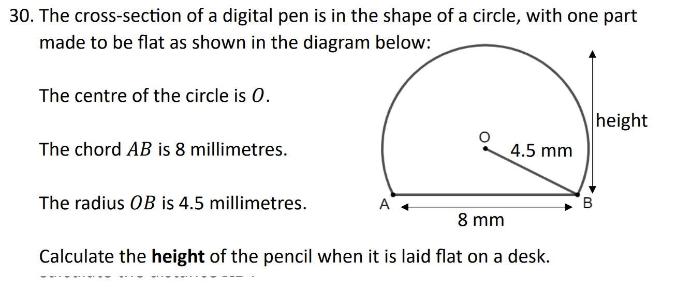

`r hide("Get a hint")`

Isolate a *right-angled triangle* within the diagram to focus on.

`r unhide()`

`r hide("Check the answer")`

$6.56\text{ mm}$

`r unhide()`

`r hide("Solution - check your notes first, if stuck!")`


`r unhide()`

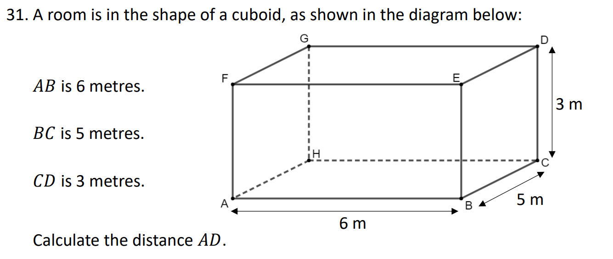

`r hide("Get a hint")`

Start by calculating the length of line *AC*, which lies *beneath* line AD.

`r unhide()`

`r hide("Check the answer")`

$8.37\text{ m}$

`r unhide()`

`r hide("Solution - check your notes first, if stuck!")`

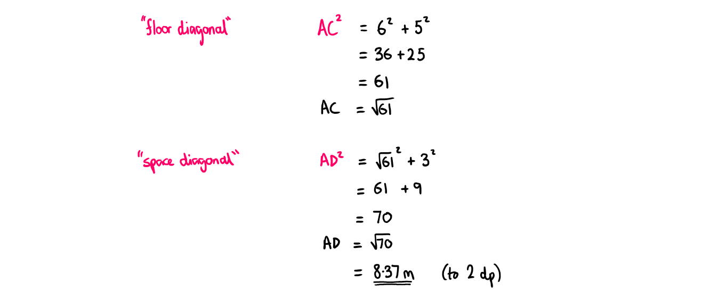

`r unhide()`

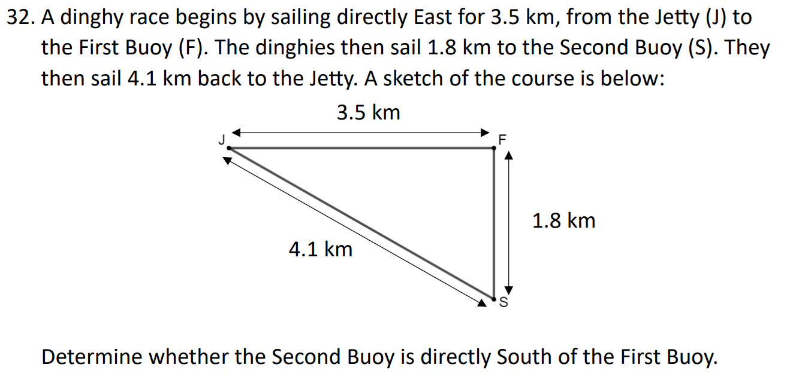

`r hide("Get a hint")`

Since line JF lies East-West, the question is asking whether line FS makes a *right-angle* with JF.

`r unhide()`

`r hide("Check the answer")`

No, the Second Buoy is not directly South of the First Buoy (with justification).

`r unhide()`

`r hide("Solution - check your notes first, if stuck!")`


`r unhide()`

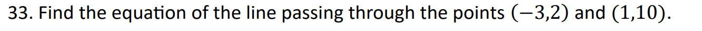

`r hide("Get a hint")`

Start by using a formula to find the *gradient* between the points.

`r unhide()`

`r hide("Check the answer")`

$y=2x+8$

`r unhide()`

`r hide("Solution - check your notes first, if stuck!")`

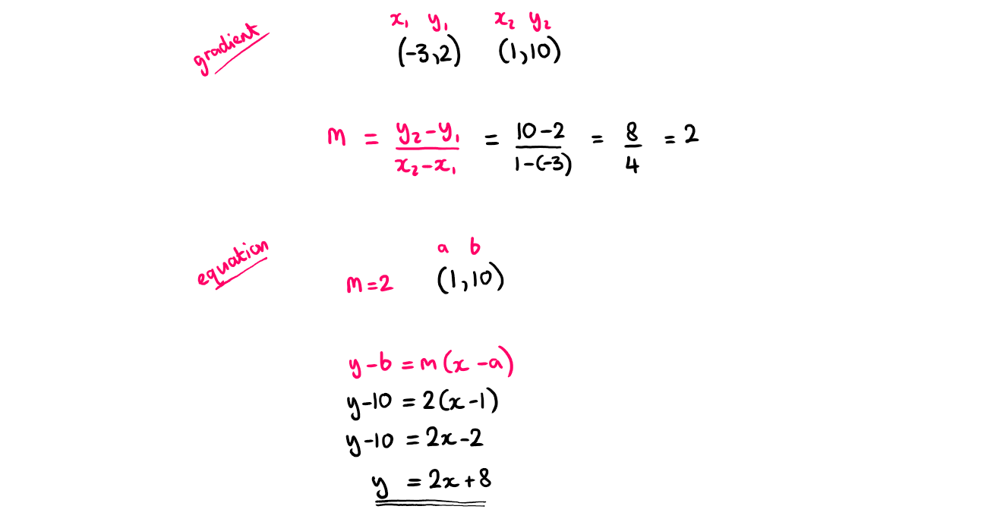

`r unhide()`

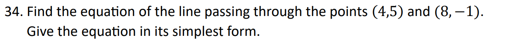

`r hide("Get a hint")`

Start by using a formula to find the *gradient* between the points.

`r unhide()`

`r hide("Check the answer")`

$y=-\frac{3}{2}x+11$ or $2y=-3x+22$

`r unhide()`

`r hide("Solution - check your notes first, if stuck!")`


`r unhide()`

<hr>

## Straight Lines

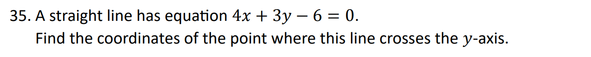

`r hide("Get a hint")`

First rearrange the equation to make $y$ the subject: $y=\dots$

`r unhide()`

`r hide("Check the answer")`

$(0,2)$

`r unhide()`

`r hide("Solution - check your notes first, if stuck!")`

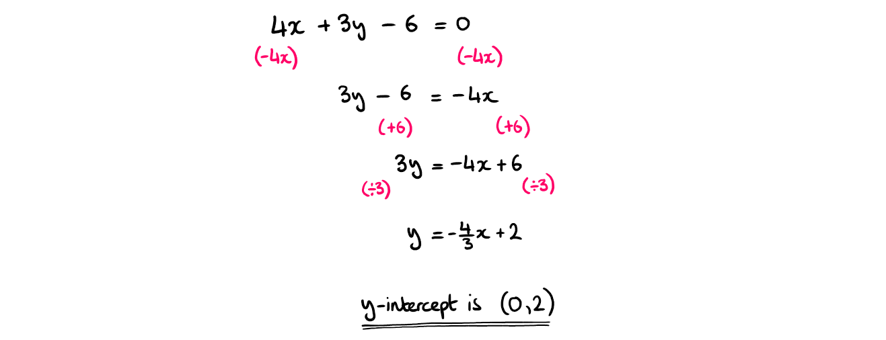

`r unhide()`

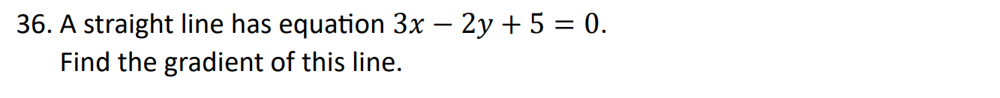

`r hide("Get a hint")`

First rearrange the equation to make $y$ the subject: $y=\dots$

`r unhide()`

`r hide("Check the answer")`

$m=\frac{3}{2}$

`r unhide()`

`r hide("Solution - check your notes first, if stuck!")`


`r unhide()`

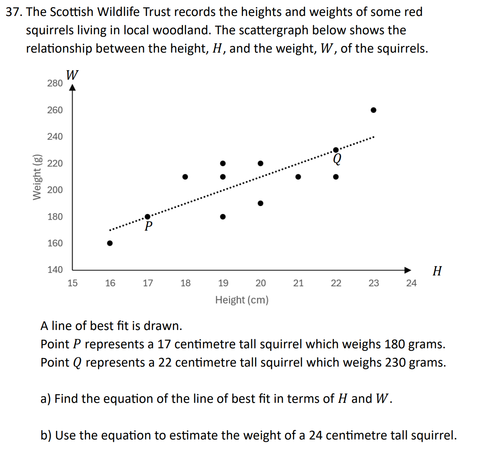

`r hide("Get a hint")`

Start by finding two data points which lie *directly on the line of best fit*, and write down their coordinates.

`r unhide()`

`r hide("Check the answer")`

Equation: $W=10H+10$

Weight: $250\text{ grams}$

`r unhide()`

`r hide("Solution - check your notes first, if stuck!")`

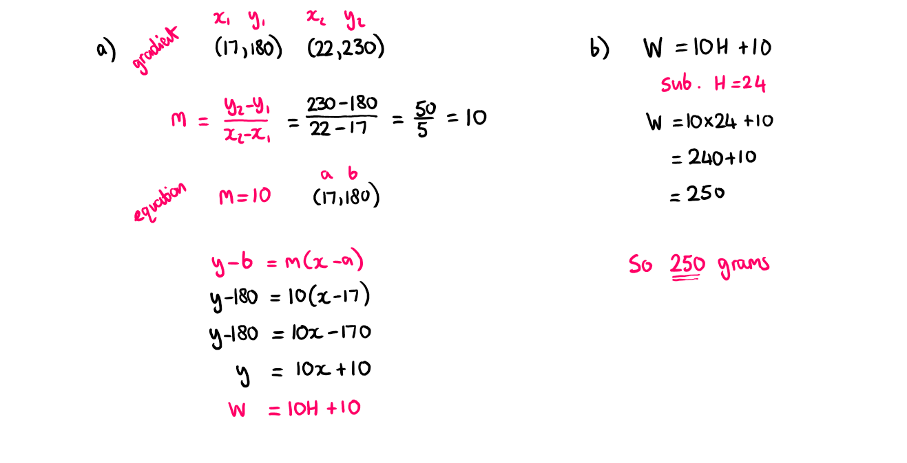

`r unhide()`

<hr>

## Functions

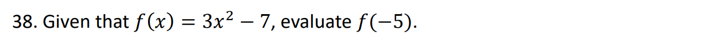

`r hide("Get a hint")`

Use brackets when *substituting* values into functions.

`r unhide()`

`r hide("Check the answer")`

$68$

`r unhide()`

`r hide("Solution - check your notes first, if stuck!")`

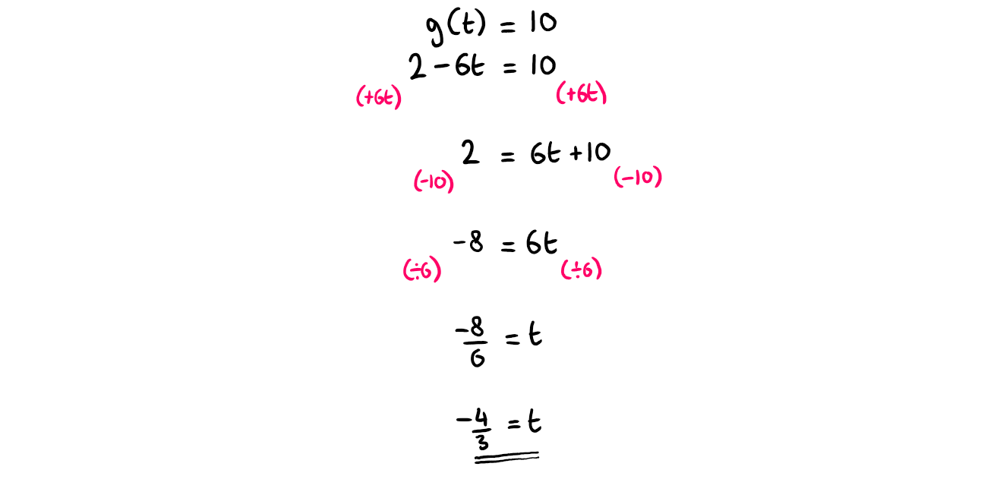

`r unhide()`


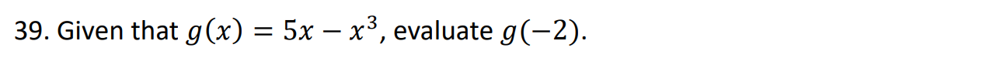

`r hide("Get a hint")`

Take care with *negatives*.

`r unhide()`

`r hide("Check the answer")`

$-2$

`r unhide()`

`r hide("Solution - check your notes first, if stuck!")`


`r unhide()`

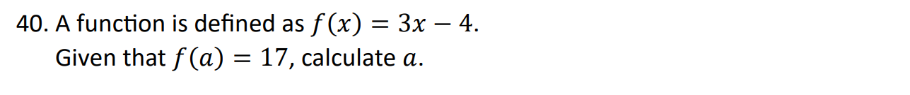

`r hide("Get a hint")`

The questions is *not* asking for 17 to be substituted *into* the function in place of $x$.

`r unhide()`

`r hide("Check the answer")`

$a=7$

`r unhide()`

`r hide("Solution - check your notes first, if stuck!")`


`r unhide()`

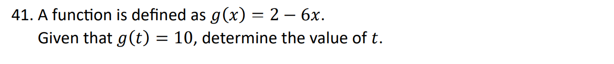

`r hide("Get a hint")`

You can always *check* your answer for $t$ is correct by substituting into *into* the function afterwards.

`r unhide()`

`r hide("Check the answer")`

$t=-\frac{4}{3}$

`r unhide()`

`r hide("Solution - check your notes first, if stuck!")`


`r unhide()`

<hr>

## Factorising

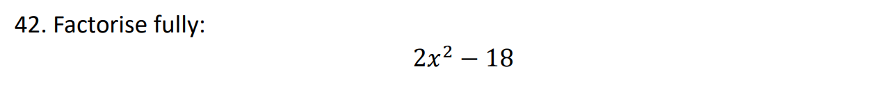

`r hide("Get a hint")`

There are three kinds of factorising to consider in turn: *common factor*, *difference of two squares* and *trinomials/double brackets*. Sometimes more than one kind is needed in a single factorising question.

`r unhide()`

`r hide("Check the answer")`

$2(x+3)(x-3)$

`r unhide()`

`r hide("Solution - check your notes first, if stuck!")`


`r unhide()`

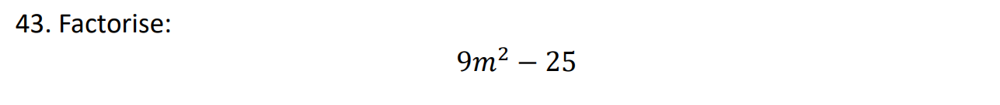

`r hide("Get a hint")`

$9m^2$ can be written as $(\dots)^2$?

`r unhide()`

`r hide("Check the answer")`

$(3m+5)(3m-5)$

`r unhide()`

`r hide("Solution - check your notes first, if stuck!")`


`r unhide()`

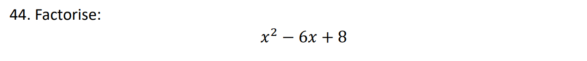

`r hide("Get a hint")`

*"Think of two numbers that multiple to give... and add to give..."*

`r unhide()`

`r hide("Check the answer")`

$(x-4)(x-2)$

`r unhide()`

`r hide("Solution - check your notes first, if stuck!")`

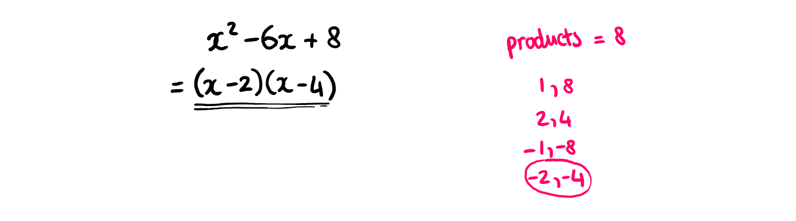

`r unhide()`

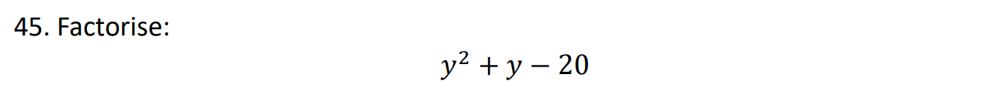

`r hide("Get a hint")`

It can help to write out all of the possible pairs of whole numbers that *multiply to give -20*.

`r unhide()`

`r hide("Check the answer")`

$(y+5)(y-4)$

`r unhide()`

`r hide("Solution - check your notes first, if stuck!")`

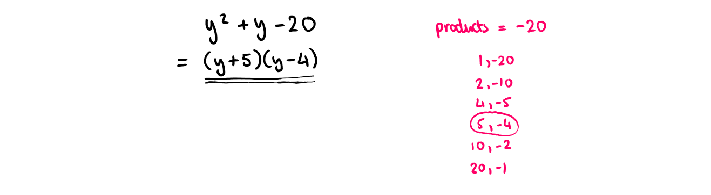

`r unhide()`

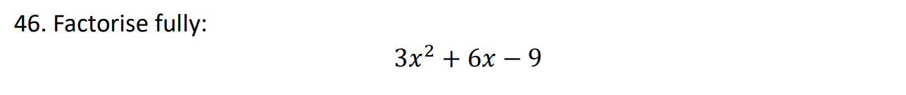

`r hide("Get a hint")`

Always look to take a *common factor* first. However, there may still be *more to do* afterwards...

`r unhide()`

`r hide("Check the answer")`

$3(x+3)(x-1)$

`r unhide()`

`r hide("Solution - check your notes first, if stuck!")`


`r unhide()`

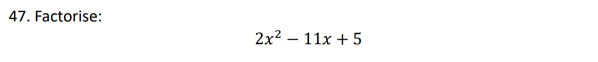

`r hide("Get a hint")`

One approach is to find a pair of numbers that multiply to give 5, but that add to give -11 *when one of them is multiplied by 2 first.*

`r unhide()`

`r hide("Check the answer")`

$(2x-1)(x-5)$

`r unhide()`

`r hide("Solution - check your notes first, if stuck!")`


`r unhide()`

<hr>

## Quadratics

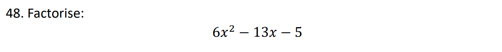

`r hide("Get a hint")`

Trying to find numbers for a solution of the form $(6x...)(x...)$ is a good place to start, but it won't work.

When that fails, try looking for a solution of the form $(3x...)(2x...)$. This means we need numbers which **multiply** to give $-5$, which also add to give $-13$ when *one of them is tripled* and *one of them is doubled*.

`r unhide()`

`r hide("Check the answer")`

$(3x+2)(x-5)$

`r unhide()`

`r hide("Solution - check your notes first, if stuck!")`


`r unhide()`

<hr>

## Statistics

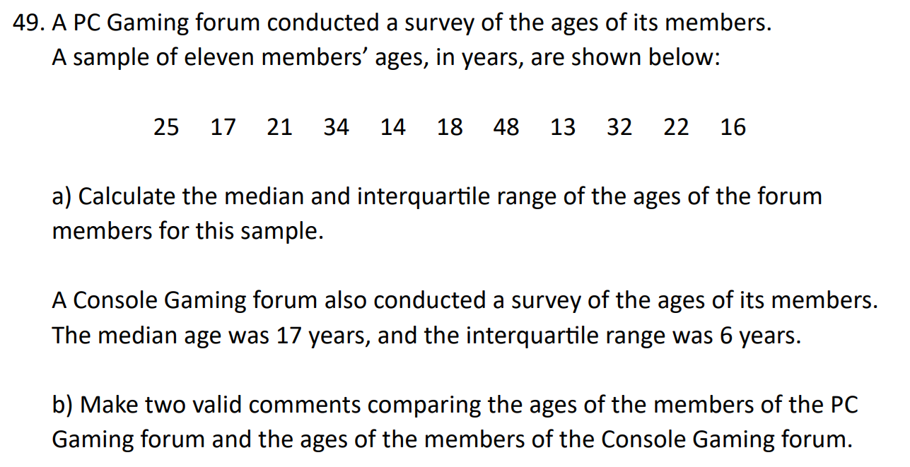

`r hide("Get a hint")`

Start by putting the numbers *in order*...

`r unhide()`

`r hide("Check the answer")`

a) Median = 21, interquartile range = 16.
b) Compare your comments to those in the solution, or ask your teacher to check them.

`r unhide()`

`r hide("Solution - check your notes first, if stuck!")`

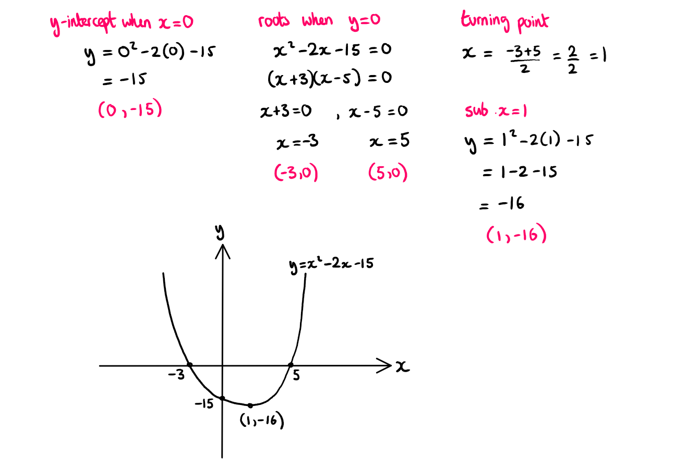

`r unhide()`

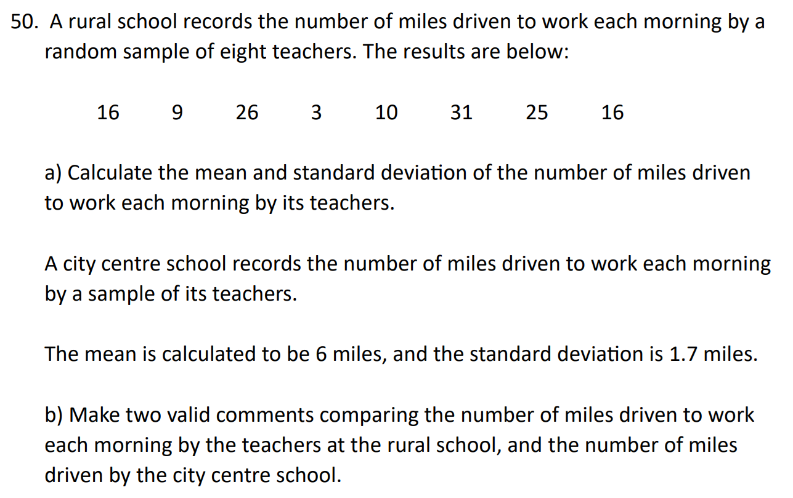

`r hide("Get a hint")`

There are *two formulae* on the formula sheet for standard deviation. Check your notes to see *which one* your teacher taught you how to use.

`r unhide()`

`r hide("Check the answer")`

a) Mean = 17, standard deviation = 9.7.
b) Compare your comments to those in the solution, or ask your teacher to check them.

`r unhide()`

`r hide("Solution - check your notes first, if stuck!")`

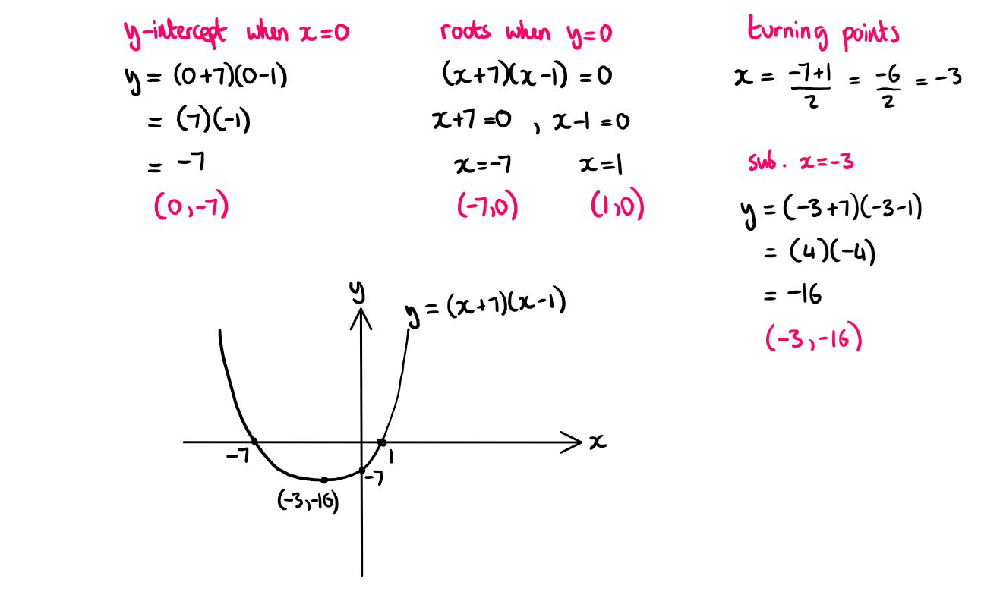

`r unhide()`

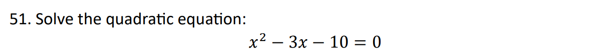

`r hide("Get a hint")`

To solve a quadratic equation, you will usually want to *factorise* first.

`r unhide()`

`r hide("Check the answer")`

$x=-2,x=5$

`r unhide()`

`r hide("Solution - check your notes first, if stuck!")`


`r unhide()`

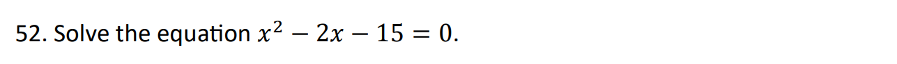

`r hide("Get a hint")`

First factorise the left hand side.

`r unhide()`

`r hide("Check the answer")`

$x=-3,x=5$

`r unhide()`

`r hide("Solution - check your notes first, if stuck!")`

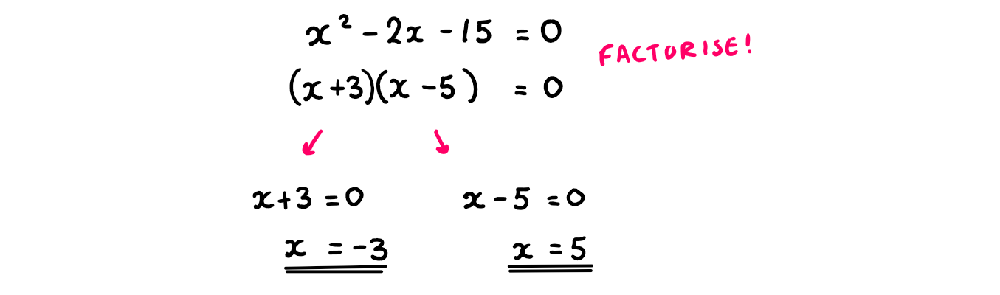

`r unhide()`

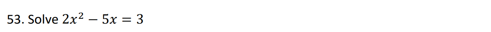

`r hide("Get a hint")`

First rearrange the quadratic equation to the form $...=0$.

`r unhide()`

`r hide("Check the answer")`

$x=-\frac{1}{2},x=3$

`r unhide()`

`r hide("Solution - check your notes first, if stuck!")`

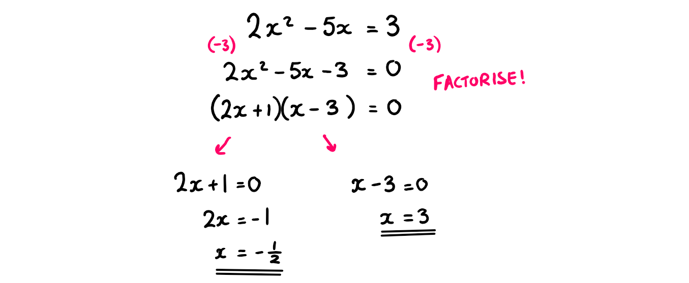

`r unhide()`

<hr>

## Arcs and Sectors

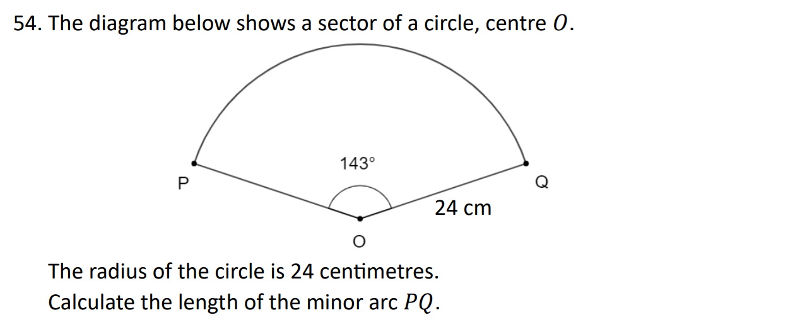

`r hide("Get a hint")`

An arc is a *fraction of a circumference*.

`r unhide()`

`r hide("Check the answer")`

$59.9\text{ cm}$

`r unhide()`

`r hide("Solution - check your notes first, if stuck!")`


`r unhide()`

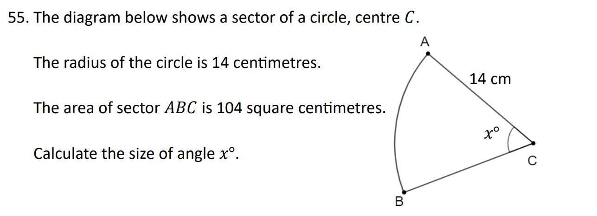

`r hide("Get a hint")`

This is another example of substituting into a formula then *rearranging*.

`r unhide()`

`r hide("Check the answer")`

$60.8^{\circ}$

`r unhide()`

`r hide("Solution - check your notes first, if stuck!")`


`r unhide()`

<hr>

## Changing the Subject


`r hide("Get a hint")`

Deal with $r$ being within a *fraction* first.

`r unhide()`

`r hide("Check the answer")`

$r=\dfrac{3P+k}{2}$

`r unhide()`

`r hide("Solution - check your notes first, if stuck!")`


`r unhide()`

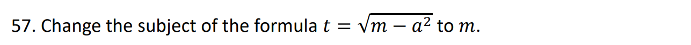

`r hide("Get a hint")`

Deal with $m$ being within a *square root* first.

`r unhide()`

`r hide("Check the answer")`

$m=t^2+a^2$

`r unhide()`

`r hide("Solution - check your notes first, if stuck!")`


`r unhide()`

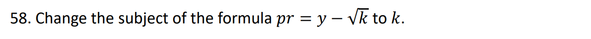

`r hide("Get a hint")`

As with the previous example, the letter is within a square root. But that doesn't mean you should deal with the square root *right away*.

`r unhide()`

`r hide("Check the answer")`

$k=(y-pr)^2$

`r unhide()`

`r hide("Solution - check your notes first, if stuck!")`

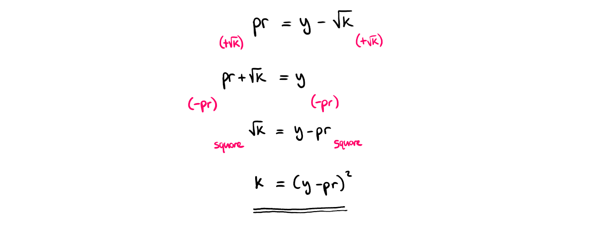

`r unhide()`

<hr>

## Surds

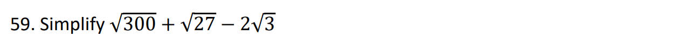

`r hide("Get a hint")`

Think of the *highest square factor* of each number within a root.

`r unhide()`

`r hide("Check the answer")`

$11\sqrt{3}$

`r unhide()`

`r hide("Solution - check your notes first, if stuck!")`


`r unhide()`

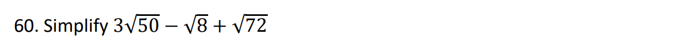

`r hide("Get a hint")`

Take care not to forget the 3 *in front of the first surd*.

`r unhide()`

`r hide("Check the answer")`

$19\sqrt{2}$

`r unhide()`

`r hide("Solution - check your notes first, if stuck!")`


`r unhide()`

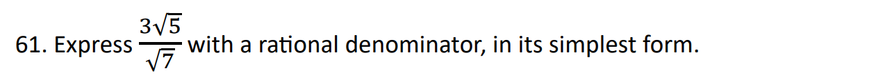

`r hide("Get a hint")`

*Multiply by* $\dfrac{?}{?}$...

`r unhide()`

`r hide("Check the answer")`

$\dfrac{3\sqrt{35}}{7}$

`r unhide()`

`r hide("Solution - check your notes first, if stuck!")`


`r unhide()`

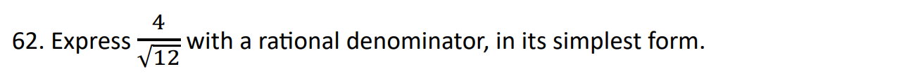

`r hide("Get a hint")`

Always check whether the *surd can be simplified*.

`r unhide()`

`r hide("Check the answer")`

$\dfrac{2\sqrt{3}}{3}$

`r unhide()`

`r hide("Solution - check your notes first, if stuck!")`


`r unhide()`

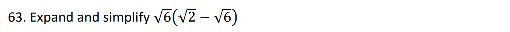

`r hide("Get a hint")`

Numerical terms can be collected together, and surds which are alike can be collected together. *It isn't always possible to collect things together...*

`r unhide()`

`r hide("Check the answer")`

$2\sqrt{3}-6$

`r unhide()`

`r hide("Solution - check your notes first, if stuck!")`


`r unhide()`

<hr>

## Indices

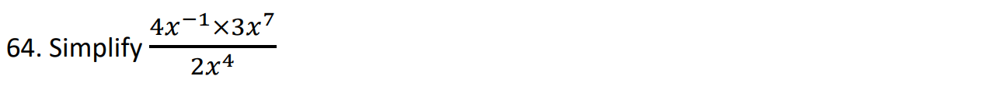

`r hide("Get a hint")`

Learn your *index laws* carefully.

`r unhide()`

`r hide("Check the answer")`

$6x^2$

`r unhide()`

`r hide("Solution - check your notes first, if stuck!")`


`r unhide()`


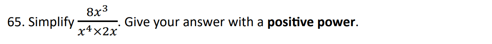

`r hide("Get a hint")`

Remember that a *negative power* means *division*.

`r unhide()`

`r hide("Check the answer")`

$\dfrac{4}{x^2}$

`r unhide()`

`r hide("Solution - check your notes first, if stuck!")`


`r unhide()`

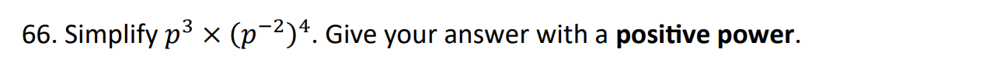

`r hide("Get a hint")`

The *order of operations* means apply the *power* (of a power) before the *multiplication* (of powers).

`r unhide()`

`r hide("Check the answer")`

$\dfrac{1}{p^5}$

`r unhide()`

`r hide("Solution - check your notes first, if stuck!")`


`r unhide()`


`r hide("Get a hint")`

Remember that both the $y$ *term* and the *fraction in front* are being *squared*.

`r unhide()`

`r hide("Check the answer")`

$\dfrac{9}{16}y^{10}$

`r unhide()`

`r hide("Solution - check your notes first, if stuck!")`


`r unhide()`

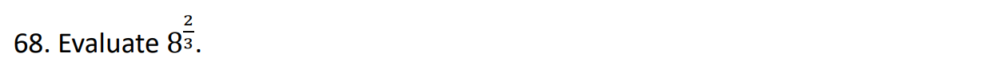

`r hide("Get a hint")`

The form $x^{\frac{a}{b}}$ can be rewritten as $\sqrt[b]{x}^a$.

`r unhide()`

`r hide("Check the answer")`

4

`r unhide()`

`r hide("Solution - check your notes first, if stuck!")`


`r unhide()`

<hr>

## Trig Graphs

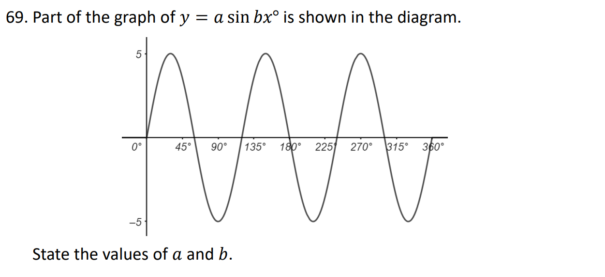

`r hide("Get a hint")`

One of the letters is the *amplitude*, the other is the *number of waves in 360 degrees*.

`r unhide()`

`r hide("Check the answer")`

$a=5,b=3$

`r unhide()`

`r hide("Solution - check your notes first, if stuck!")`

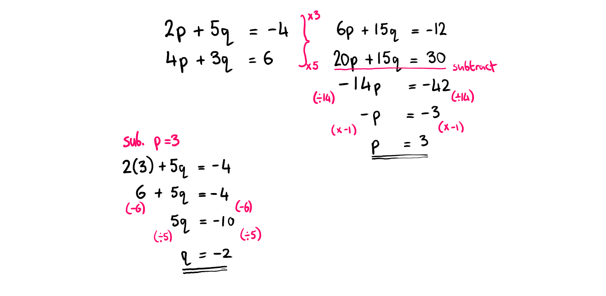

`r unhide()`

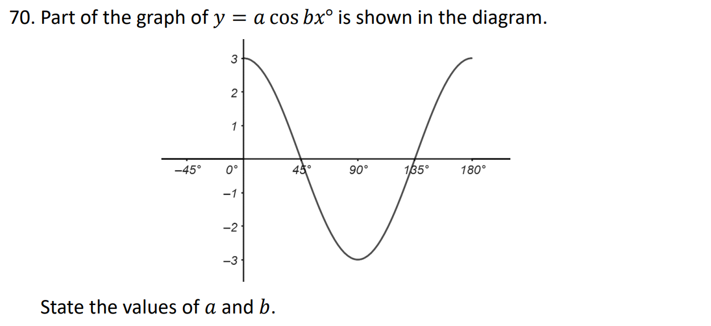

`r hide("Get a hint")`

The graph is only shown up to *180 degrees*...

`r unhide()`

`r hide("Check the answer")`

$a=3,b=2$

`r unhide()`

`r hide("Solution - check your notes first, if stuck!")`


`r unhide()`

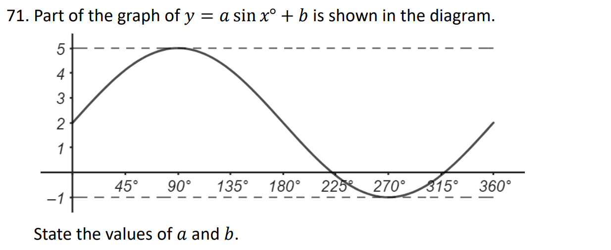

`r hide("Get a hint")`

The graphs has been *moved up*, compared to a $y=a\sin{x^\circ}$ graph.

`r unhide()`

`r hide("Check the answer")`

$a=3,b=2$

`r unhide()`

`r hide("Solution - check your notes first, if stuck!")`


`r unhide()`

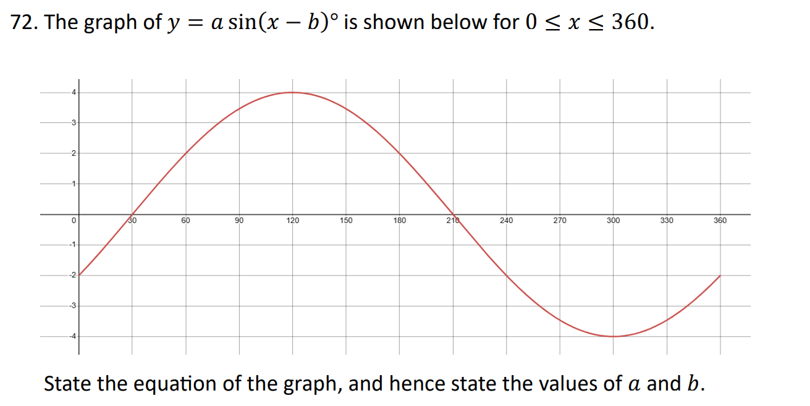

`r hide("Get a hint")`

For the value of $b$, look at how far the $\sin{x}$ wave has been shifted horizontally.

`r unhide()`

`r hide("Check the answer")`

$a=4,b=30$

`r unhide()`

`r hide("Solution - check your notes first, if stuck!")`

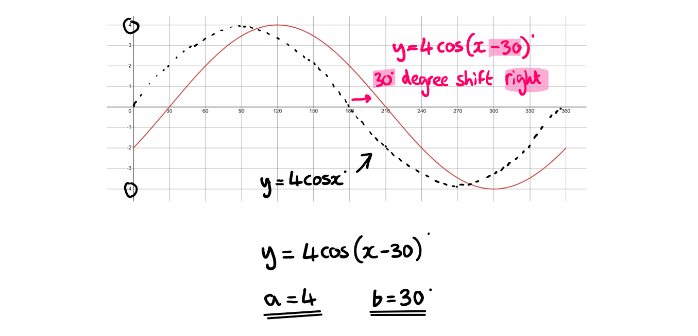

`r unhide()`

<hr>

## Simultaneous Equations

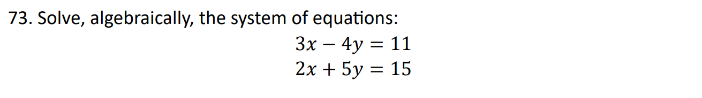

`r hide("Get a hint")`

The equations must be *scaled* first.

`r unhide()`

`r hide("Check the answer")`

$x=5,y=1$

`r unhide()`

`r hide("Solution - check your notes first, if stuck!")`

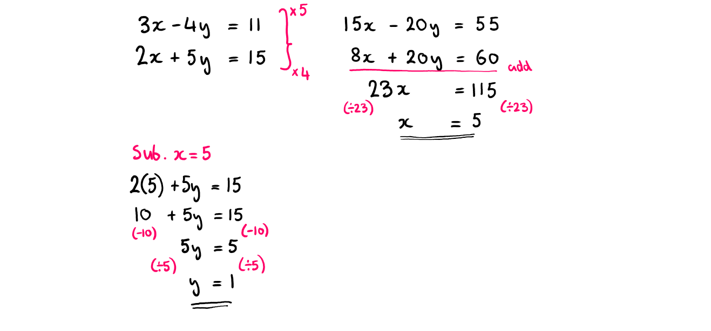

`r unhide()`

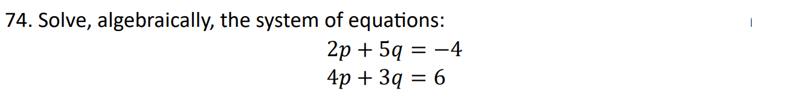

`r hide("Get a hint")`

Take care with *negatives*, as usual.

`r unhide()`

`r hide("Check the answer")`

$p=3,q=-2$

`r unhide()`

`r hide("Solution - check your notes first, if stuck!")`

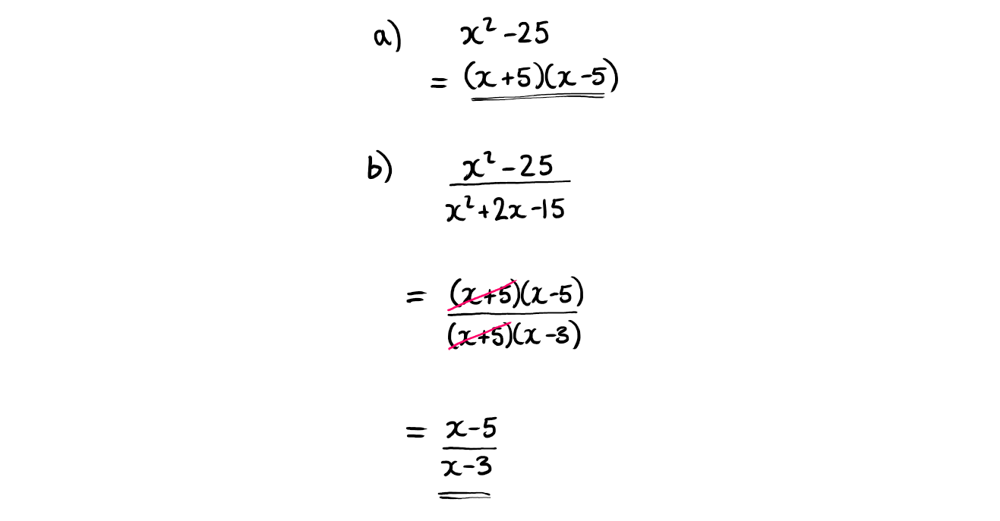

`r unhide()`

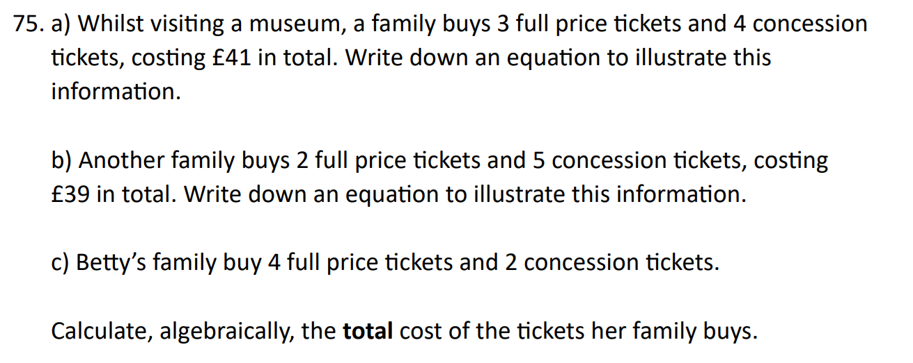

`r hide("Get a hint")`

First find the cost of **one** full price ticket and the price of **one** concession ticket, before finding the total for Betty's family.

`r unhide()`

`r hide("Check the answer")`

£38

`r unhide()`

`r hide("Solution - check your notes first, if stuck!")`

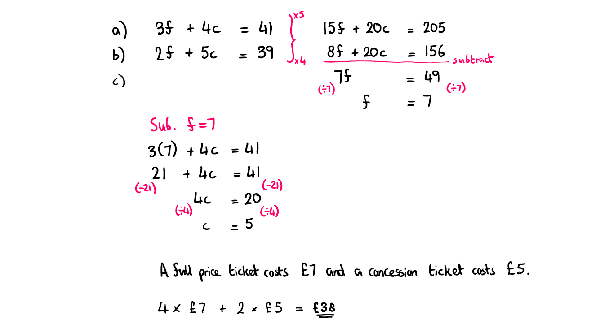

`r unhide()`

<hr>

## Area, Cosine and Sine Rules

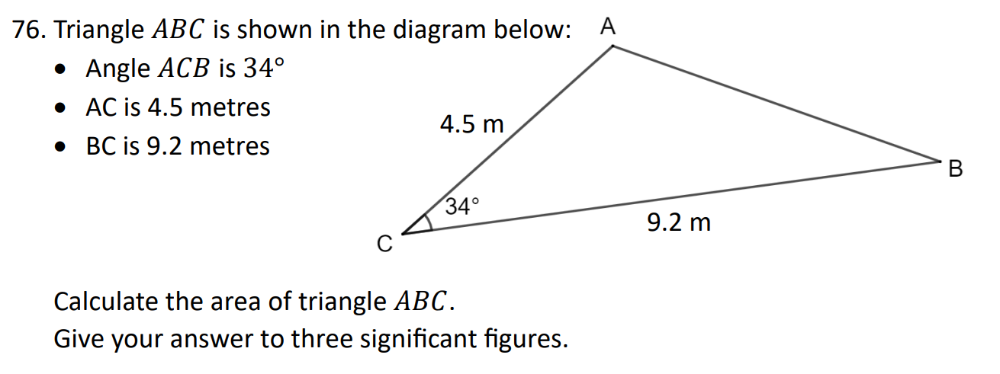

`r hide("Get a hint")`

The formula sheet gives a method for calculating the area of a triangle using two sides and the angle between them.

`r unhide()`

`r hide("Check the answer")`

$11.6\text{cm}^2$

`r unhide()`

`r hide("Solution - check your notes first, if stuck!")`


`r unhide()`

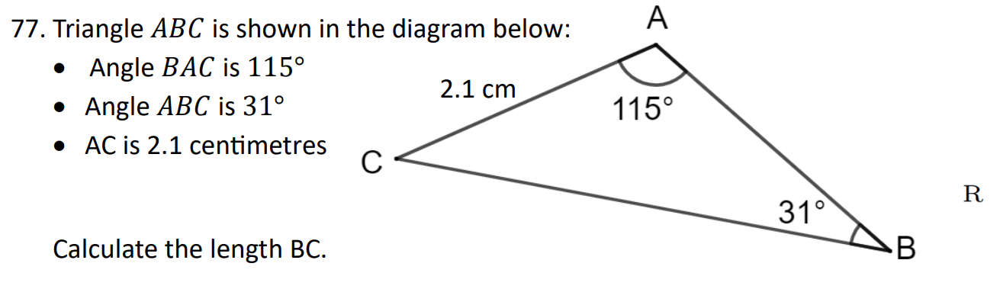

`r hide("Get a hint")`

Remember that the Sine Rule can be written in *two different ways*. Do you want *sides* or *angles* on top?

`r unhide()`

`r hide("Check the answer")`

$3.7 \text{ cm}$

`r unhide()`

`r hide("Solution - check your notes first, if stuck!")`

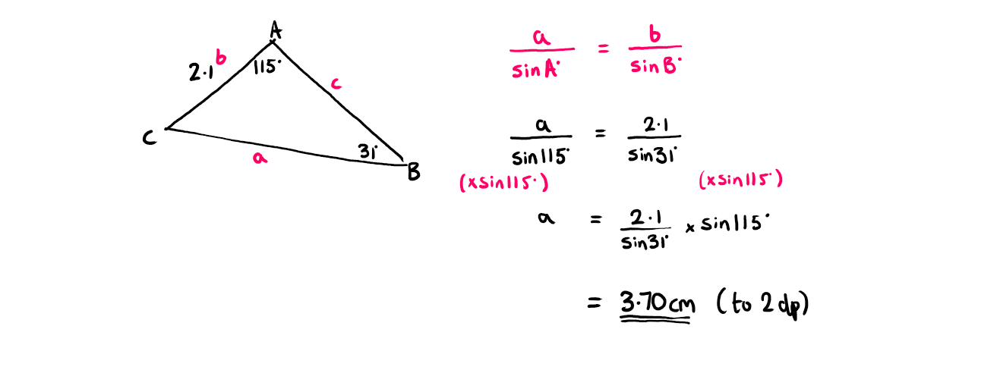

`r unhide()`

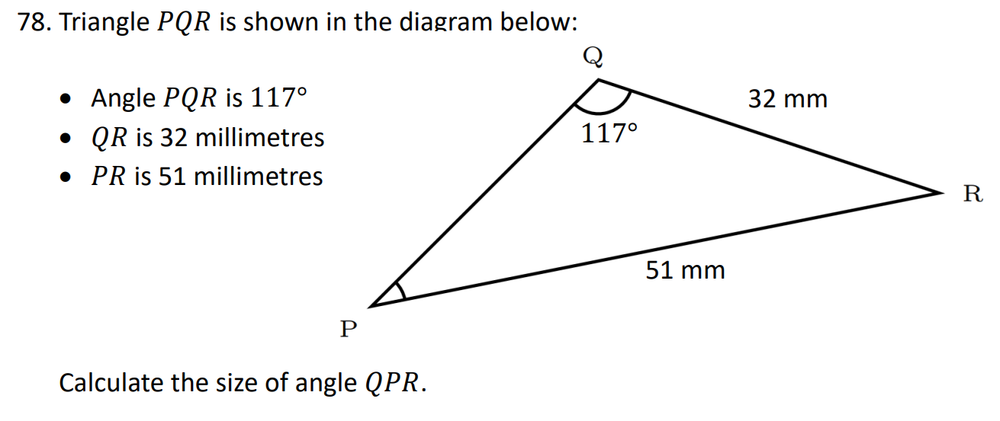

`r hide("Get a hint")`

Remember that the Sine Rule can be written in *two different ways*. Do you want *sides* or *angles* on top?

`r unhide()`

`r hide("Check the answer")`

$34.0^\circ$

`r unhide()`

`r hide("Solution - check your notes first, if stuck!")`

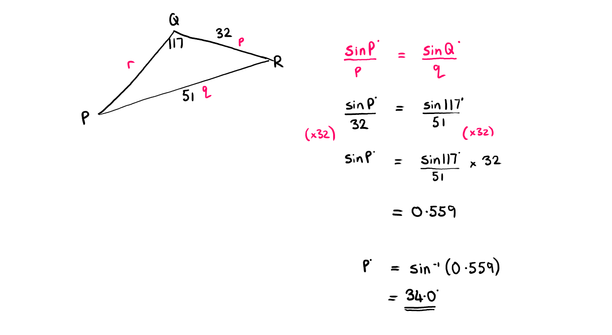

`r unhide()`

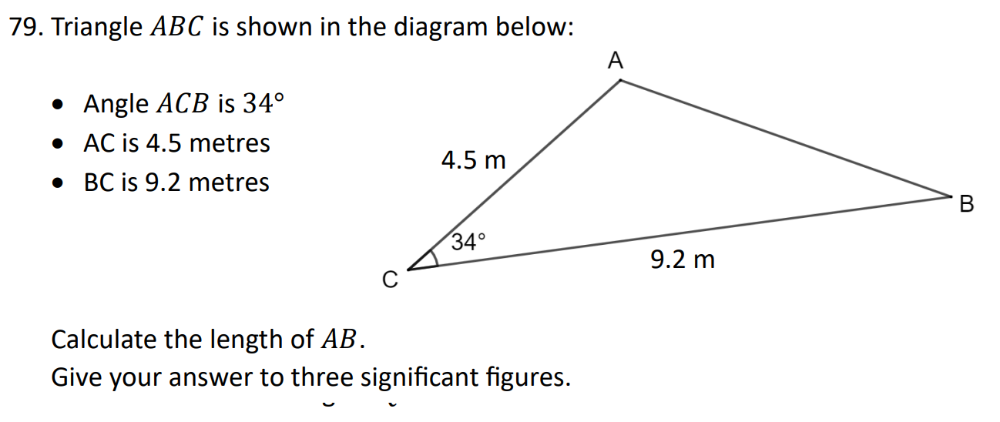

`r hide("Get a hint")`

Since we know two of the sides and are looking to find the third, this problem involved **all three sides** of a triangle which is not right-angled. The **Cosine Rule for a Side** is needed here, found on the formula sheet.

`r unhide()`

`r hide("Check the answer")`

6.02m

`r unhide()`

`r hide("Solution - check your notes first, if stuck!")`

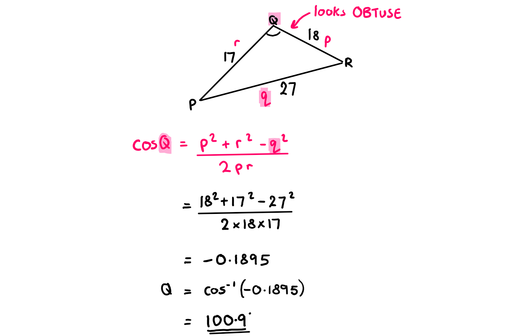

`r unhide()`

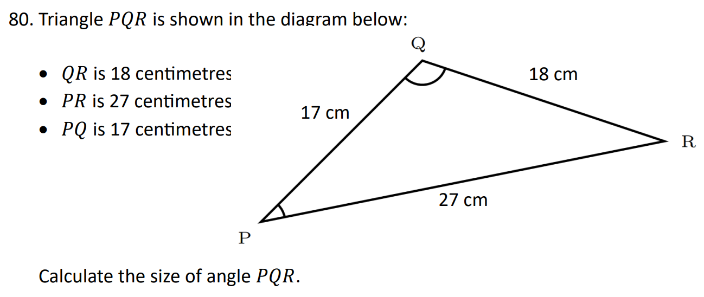

`r hide("Get a hint")`

This problem involves finding an angle in a non-right-angled triangle for which **all three sides** are known. The **Cosine Rule for an Angle** is needed here, found on the formula sheet.

`r unhide()`

`r hide("Check the answer")`

$100.9^{\circ}$

`r unhide()`

`r hide("Solution - check your notes first, if stuck!")`


`r unhide()`

<hr>

## Algebraic Fractions

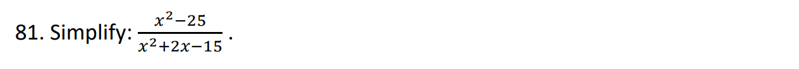

`r hide("Get a hint")`

In an exam question, it is likely that the numerator and denominator will have *something in common* after factorising.

`r unhide()`

`r hide("Check the answer")`

$\dfrac{x-5}{x-3}$

`r unhide()`

`r hide("Solution - check your notes first, if stuck!")`


`r unhide()`

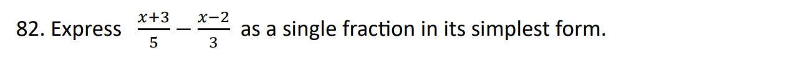

`r hide("Get a hint")`

First express both fractions with a *denominator of 15*.

`r unhide()`

`r hide("Check the answer")`

$\dfrac{-2x+19}{15}$

`r unhide()`

`r hide("Solution - check your notes first, if stuck!")`

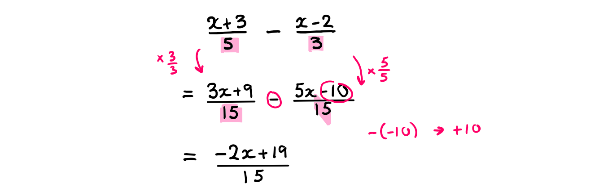

`r unhide()`

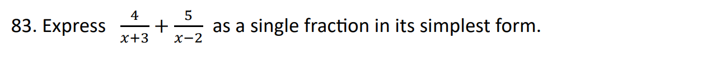

`r hide("Get a hint")`

First express both fractions with a *denominator* of $(x+3)(x-2)$.

`r unhide()`

`r hide("Check the answer")`

$\dfrac{9x+7}{(x+3)(x-2)}$

`r unhide()`

`r hide("Solution - check your notes first, if stuck!")`

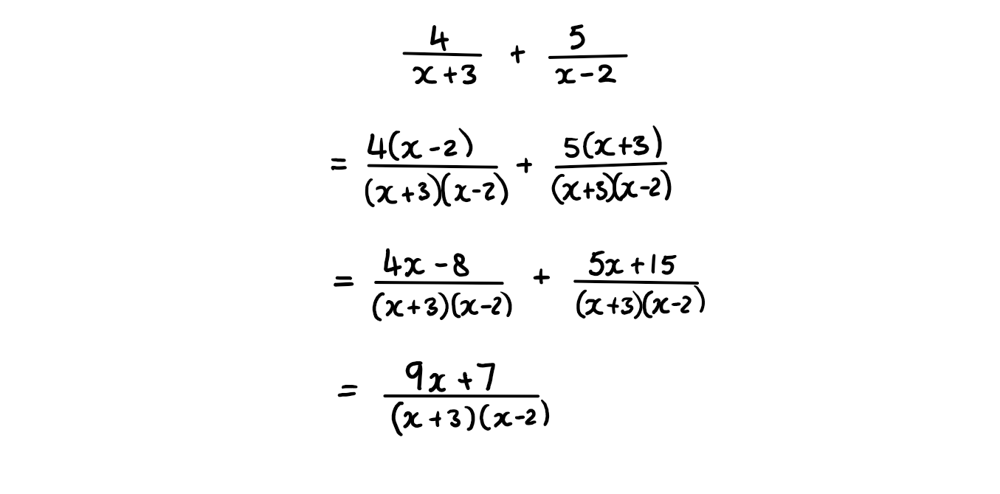

`r unhide()`

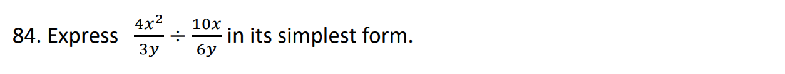

`r hide("Get a hint")`

Dividing by $\frac{a}{b}$ is the same thing as **multiplying** by $\frac{b}{a}$.

`r unhide()`

`r hide("Check the answer")`

$\dfrac{4x}{5}$

`r unhide()`

`r hide("Solution - check your notes first, if stuck!")`

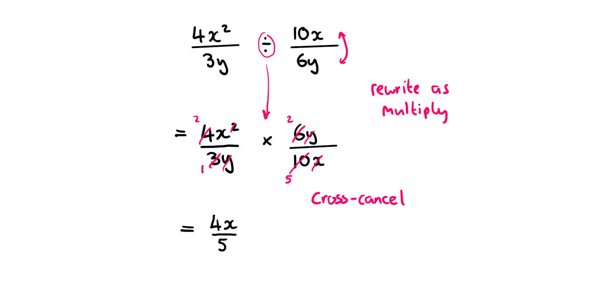

`r unhide()`
