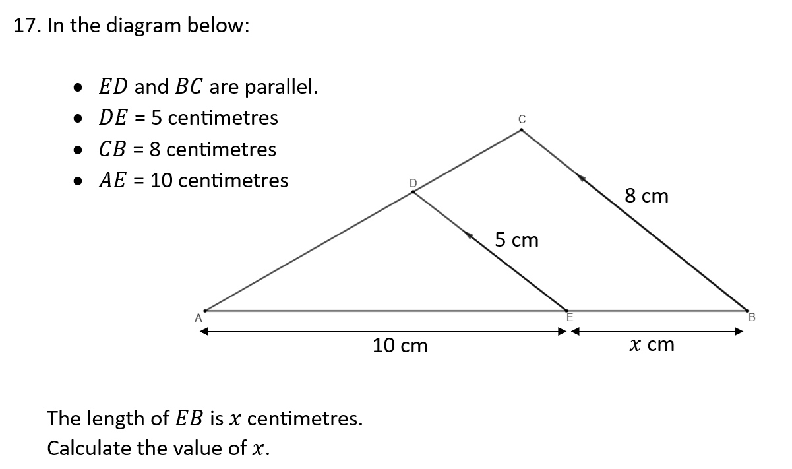

```{r setup, include = FALSE}
knitr::opts_chunk$set(echo = FALSE)
library(webexercises)
```


```{r, echo = FALSE, results='asis'}
# Uncomment to change widget colours:
#style_widgets(incorrect = "goldenrod", correct = "purple")
```

`r hide("N5 Formula Sheet")`


`r unhide()`

<hr>

## Volume


`r hide("Hint")`

The formula sheet shows how to calculate the volume of a sphere.

`r unhide()`

`r hide("Answer")`

$7400\text{ cm}^3$

`r unhide()`

`r hide("Solution")`


`r unhide()`


`r hide("Hint")`

What is the height of the cylinder itself, without the hemisphere on top?

`r unhide()`

`r hide("Answer")`

$3900\text{ cm}^3$

`r unhide()`

`r hide("Solution")`


`r unhide()`


`r hide("Hint")`

Substitute the values you know into the formula provided on the formula sheet.

`r unhide()`

`r hide("Answer")`

$10.0\text{ cm}$

`r unhide()`

`r hide("Solution")`


`r unhide()`

<hr>

## Equations and Inequations


`r hide("Hint")`

Be very careful if you find yourself dividing *by a negative number*. It is usually best to avoid it.

`r unhide()`

`r hide("Answer")`

$3>x$ or $x<3$

`r unhide()`

`r hide("Solution")`


`r unhide()`


`r hide("Hint")`

The bracket in the first line is being multiplied by *negative* 2.

`r unhide()`

`r hide("Answer")`

$x<\frac{3}{2}$ or $\frac{3}{2}>x$

`r unhide()`

`r hide("Solution")`


`r unhide()`


`r hide("Hint")`

*Multiplying* through carefully by the *denominator* will deal with the fraction.

`r unhide()`

`r hide("Answer")`

$x=\frac{13}{2}$

`r unhide()`

`r hide("Solution")`


`r unhide()`


`r hide("Hint")`

Multiplying by the denominator is a good strategy even when the denominator contains a letter.

`r unhide()`

`r hide("Answer")`

$x=3$

`r unhide()`

`r hide("Solution")`


`r unhide()`


`r hide("Hint")`

Find an expression for the *perimeter* of each shape first. You are told they have *equal* perimeter...

`r unhide()`

`r hide("Answer")`

$10\text{ cm}$

`r unhide()`

`r hide("Solution")`


`r unhide()`

<hr>

## Circle Geometry


`r hide("Hint")`

Look for right-angles, and isosceles triangles.

`r unhide()`

`r hide("Answer")`

$\angle ABD=61^{\circ}$

`r unhide()`

`r hide("Solution")`


`r unhide()`


`r hide("Hint")`

Look for right-angles, and isosceles triangles.

`r unhide()`

`r hide("Answer")`

$\angle PQR = 34^{\circ}$

`r unhide()`

`r hide("Solution")`


`r unhide()`

<hr>

## Scientific Notation


`r hide("Hint")`

Make sure you can enter numbers in scientific notation *into your calculator* to perform calculations.

`r unhide()`

`r hide("Answer")`

$8.72\times10^{10}\text{ miles}$

`r unhide()`

`r hide("Solution")`


`r unhide()`


`r hide("Hint")`

Make sure you can enter numbers in scientific notation into your calculator, and consider whether they should be put them in *brackets* when performing calculators. 

`r unhide()`

`r hide("Answer")`

$18$

`r unhide()`

`r hide("Solution")`


`r unhide()`

<hr>

## Expanding Brackets


`r hide("Hint")`

Take care with *negatives* when expanding brackets.

`r unhide()`

`r hide("Answer")`

$6x^2+5x-3$

`r unhide()`

`r hide("Solution")`


`r unhide()`


`r hide("Hint")`

Check the *six terms* obtained from expanding these brackets are correct carefully before you collect like terms.

`r unhide()`

`r hide("Answer")`

$x^3+2x^2-13x+10$

`r unhide()`

`r hide("Solution")`


`r unhide()`


`r hide("Hint")`

Take care with *multiplying a negative by a negative*.

`r unhide()`

`r hide("Answer")`

$2x^3-5x^2-13x+4$

`r unhide()`

`r hide("Solution")`


`r unhide()`


`r hide("Hint")`

Tackle the expansion of $(x-3)(x+1)$ then consider the "$-$" that lies in front of it.

`r unhide()`

`r hide("Answer")`

$-x+3$

`r unhide()`

`r hide("Solution")`


`r unhide()`

<hr>

## Similar Shapes



`r hide("Hint")`

Draw the *two triangles separately*.

`r unhide()`

`r hide("Answer")`

$x=6$

`r unhide()`

`r hide("Solution")`


`r unhide()`


`r hide("Hint")`

Obtain the LSF *first*, and then think about which scale factor is *needed*.

`r unhide()`

`r hide("Answer")`

$7500\text{ cm}^3$

`r unhide()`

`r hide("Solution")`


`r unhide()`

<hr>

## Percentages


`r hide("Hint")`

*"100\% + 2.5\%"*

`r unhide()`

`r hide("Answer")`

$£344.61$

`r unhide()`

`r hide("Solution")`


`r unhide()`


`r hide("Hint")`

What does *appreciate* mean?

`r unhide()`

`r hide("Answer")`

$£148 000$

`r unhide()`

`r hide("Solution")`


`r unhide()`


`r hide("Hint")`

What percentage *of their original pay* is £11.18?

`r unhide()`

`r hide("Answer")`

$£10.75$

`r unhide()`

`r hide("Solution")`


`r unhide()`


`r hide("Hint")`

Without a calculator, finding 1\% will be awkward. What *other percentage* could be reached, which would let you then find 100\% quickly?

`r unhide()`

`r hide("Answer")`

$32$

`r unhide()`

`r hide("Solution")`


`r unhide()`

<hr>

## Numerical Fractions


`r hide("Hint")`

When multiplying (or dividing) factions, the denominators *don't need to be the same*. However, you don't want either to be a *mixed fraction*.

`r unhide()`

`r hide("Answer")`

$\dfrac{26}{11}$ or $2\dfrac{4}{11}$

`r unhide()`

`r hide("Solution")`


`r unhide()`


`r hide("Hint")`

How can a division by a fraction be rewritten as a *multiplication*?

`r unhide()`

`r hide("Answer")`

$\dfrac{20}{9}$ or $2\dfrac{2}{9}$

`r unhide()`

`r hide("Solution")`


`r unhide()`


`r hide("Hint")`

When adding (or subtracting) fractions, the *denominators need to be equal*.

`r unhide()`

`r hide("Answer")`

$\dfrac{193}{30}$ or $6\dfrac{13}{30}$

`r unhide()`

`r hide("Solution")`


`r unhide()`


`r hide("Hint")`

"$\dfrac{3}{4}$ *of...*" is the same as "$\dfrac{3}{4}\times$..."

`r unhide()`

`r hide("Answer")`

$\dfrac{15}{8}$ or $1\dfrac{7}{8}$

`r unhide()`

`r hide("Solution")`


`r unhide()`

<hr>

## Pythagoras


`r hide("Hint")`

Isolate a *right-angled triangle* within the diagram to focus on.

`r unhide()`

`r hide("Answer")`

$6.56\text{ mm}$

`r unhide()`

`r hide("Solution")`


`r unhide()`


`r hide("Hint")`

Start by calculating the length of line *AC*, which lies *beneath* line AD.

`r unhide()`

`r hide("Answer")`

$8.37\text{ m}$

`r unhide()`

`r hide("Solution")`


`r unhide()`


`r hide("Hint")`

Since line JF lies East-West, the question is asking whether line FS makes a *right-angle* with JF.

`r unhide()`

`r hide("Answer")`

No, the Second Buoy is not directly South of the First Buoy (with justification).

`r unhide()`

`r hide("Solution")`


`r unhide()`

<hr>

## Straight Lines


`r hide("Hint")`

Start by using a formula to find the *gradient* between the points.

`r unhide()`

`r hide("Answer")`

$y=2x+8$

`r unhide()`

`r hide("Solution")`


`r unhide()`


`r hide("Hint")`

Start by using a formula to find the *gradient* between the points.

`r unhide()`

`r hide("Answer")`

$y=-\frac{3}{2}x+11$ or $2y=-3x+22$

`r unhide()`

`r hide("Solution")`


`r unhide()`


`r hide("Hint")`

First rearrange the equation to make $y$ the subject: $y=\dots$

`r unhide()`

`r hide("Answer")`

$(0,2)$

`r unhide()`

`r hide("Solution")`


`r unhide()`


`r hide("Hint")`

First rearrange the equation to make $y$ the subject: $y=\dots$

`r unhide()`

`r hide("Answer")`

$m=\frac{3}{2}$

`r unhide()`

`r hide("Solution")`


`r unhide()`


`r hide("Hint")`

Start by finding two data points which lie *directly on the line of best fit*, and write down their coordinates.

`r unhide()`

`r hide("Answer")`

Equation: $W=10H+10$

Weight: $250\text{ grams}$

`r unhide()`

`r hide("Solution")`


`r unhide()`

<hr>

## Functions


`r hide("Hint")`

Use brackets when *substituting* values into functions.

`r unhide()`

`r hide("Answer")`

$68$

`r unhide()`

`r hide("Solution")`


`r unhide()`


`r hide("Hint")`

Take care with *negatives*.

`r unhide()`

`r hide("Answer")`

$-2$

`r unhide()`

`r hide("Solution")`


`r unhide()`


`r hide("Hint")`

The questions is *not* asking for 17 to be substituted *into* the function in place of $x$.

`r unhide()`

`r hide("Answer")`

$a=7$

`r unhide()`

`r hide("Solution")`


`r unhide()`


`r hide("Hint")`

You can always *check* your answer for $t$ is correct by substituting into *into* the function afterwards.

`r unhide()`

`r hide("Answer")`

$t=-\frac{4}{3}$

`r unhide()`

`r hide("Solution")`


`r unhide()`

<hr>

## Factorising


`r hide("Hint")`

There are three kinds of factorising to consider in turn: *common factor*, *difference of two squares* and *trinomials/double brackets*. Sometimes more than one kind is needed in a single factorising question.

`r unhide()`

`r hide("Answer")`

$2(x+3)(x-3)$

`r unhide()`

`r hide("Solution")`


`r unhide()`


`r hide("Hint")`

$9m^2$ can be written as $(\dots)^2$?

`r unhide()`

`r hide("Answer")`

$(3m+5)(3m-5)$

`r unhide()`

`r hide("Solution")`


`r unhide()`


`r hide("Hint")`

*"Think of two numbers that multiple to give... and add to give..."*

`r unhide()`

`r hide("Answer")`

$(x-4)(x-2)$

`r unhide()`

`r hide("Solution")`


`r unhide()`


`r hide("Hint")`

It can help to write out all of the possible pairs of whole numbers that *multiply to give -20*.

`r unhide()`

`r hide("Answer")`

$(y+5)(y-4)$

`r unhide()`

`r hide("Solution")`


`r unhide()`


`r hide("Hint")`

Always look to take a *common factor* first. However, there may still be *more to do* afterwards...

`r unhide()`

`r hide("Answer")`

$3(x+3)(x-1)$

`r unhide()`

`r hide("Solution")`


`r unhide()`


`r hide("Hint")`

One approach is to find a pair of numbers that multiply to give 5, but that add to give -11 *when one of them is multiplied by 2 first.*

`r unhide()`

`r hide("Answer")`

$(2x-1)(x-5)$

`r unhide()`

`r hide("Solution")`


`r unhide()`


`r hide("Hint")`

Once you think you have the correct answer, you can always multiply your brackets out again to *check you get back to the original expression*.

`r unhide()`

`r hide("Answer")`

$(3x-1)(x+2)$

`r unhide()`

`r hide("Solution")`


`r unhide()`

<hr>

## Statistics


`r hide("Hint")`

Start by putting the numbers *in order*...

`r unhide()`

`r hide("Answer")`

a) Median = 21, interquartile range = 16.
b) Compare your comments to those in the solution, or ask your teacher to check them.

`r unhide()`

`r hide("Solution")`


`r unhide()`


`r hide("Hint")`

There are *two formulae* on the formula sheet for standard deviation. Check your notes to see *which one* your teacher taught you how to use.

`r unhide()`

`r hide("Answer")`

a) Mean = 17, standard deviation = 9.7.
b) Compare your comments to those in the solution, or ask your teacher to check them.

`r unhide()`

`r hide("Solution")`


`r unhide()`

<hr>

## Quadratics


`r hide("Hint")`

To solve a quadratic equation, you will usually want to *factorise* first.

`r unhide()`

`r hide("Answer")`

$x=-2,x=5$

`r unhide()`

`r hide("Solution")`


`r unhide()`


`r hide("Hint")`

"$y$-*intercepts when* $x=0$..." 
"*Roots when* $y=0$..."
"*The* $x$-*coordinate of the turning point lies in the middle of the roots... *"

`r unhide()`

`r hide("Answer")`

$y$-intercept at $(0,-15)$
Roots at $(5,0)$ and $(-3,0)$
Minimum turning point at $(1,-16)$

`r unhide()`

`r hide("Solution")`


`r unhide()`


`r hide("Hint")`

Make sure you label all your coordinates *on the sketch*. If any numbers don't make sense, check to see if you have done something wrong.

`r unhide()`

`r hide("Answer")`

$y$-intercept at $(0,-7)$
Roots at $(1,0)$ and $(-7,0)$
Minimum turning point at $(-3,-16)$

`r unhide()`

`r hide("Solution")`


`r unhide()`

<hr>

## Arcs and Sectors


`r hide("Hint")`

An arc is a *fraction of a circumference*.

`r unhide()`

`r hide("Answer")`

$59.9\text{ cm}$

`r unhide()`

`r hide("Solution")`


`r unhide()`


`r hide("Hint")`

This is another example of substituting into a formula then *rearranging*.

`r unhide()`

`r hide("Answer")`

$60.8^{\circ}$

`r unhide()`

`r hide("Solution")`


`r unhide()`

<hr>

## Changing the Subject


`r hide("Hint")`

Deal with $r$ being within a *fraction* first.

`r unhide()`

`r hide("Answer")`

$r=\dfrac{3P+k}{2}$

`r unhide()`

`r hide("Solution")`


`r unhide()`


`r hide("Hint")`

Deal with $m$ being within a *square root* first.

`r unhide()`

`r hide("Answer")`

$m=t^2+a^2$

`r unhide()`

`r hide("Solution")`


`r unhide()`


`r hide("Hint")`

As with the previous example, the letter is within a square root. But that doesn't mean you should deal with the square root *right away*.

`r unhide()`

`r hide("Answer")`

$k=(y-pr)^2$

`r unhide()`

`r hide("Solution")`


`r unhide()`

<hr>

## Surds


`r hide("Hint")`

Think of the *highest square factor* of each number within a root.

`r unhide()`

`r hide("Answer")`

$11\sqrt{3}$

`r unhide()`

`r hide("Solution")`


`r unhide()`


`r hide("Hint")`

Take care not to forget the 3 *in front of the first surd*.

`r unhide()`

`r hide("Answer")`

$19\sqrt{2}$

`r unhide()`

`r hide("Solution")`


`r unhide()`


`r hide("Hint")`

*Multiply by* $\dfrac{?}{?}$...

`r unhide()`

`r hide("Answer")`

$\dfrac{3\sqrt{35}}{7}$

`r unhide()`

`r hide("Solution")`


`r unhide()`


`r hide("Hint")`

Always check whether the *surd can be simplified*.

`r unhide()`

`r hide("Answer")`

$\dfrac{2\sqrt{3}}{3}$

`r unhide()`

`r hide("Solution")`


`r unhide()`


`r hide("Hint")`

Numerical terms can be collected together, and surds which are alike can be collected together. *It isn't always possible to collect things together...*

`r unhide()`

`r hide("Answer")`

$2\sqrt{3}-6$

`r unhide()`

`r hide("Solution")`


`r unhide()`

<hr>

## Indices


`r hide("Hint")`

Learn your *index laws* carefully.

`r unhide()`

`r hide("Answer")`

$6x^2$

`r unhide()`

`r hide("Solution")`


`r unhide()`


`r hide("Hint")`

Remember that a *negative power* means *division*.

`r unhide()`

`r hide("Answer")`

$\dfrac{4}{x^2}$

`r unhide()`

`r hide("Solution")`


`r unhide()`


`r hide("Hint")`

The *order of operations* means apply the *power* (of a power) before the *multiplication* (of powers).

`r unhide()`

`r hide("Answer")`

$\dfrac{1}{p^5}$

`r unhide()`

`r hide("Solution")`


`r unhide()`


`r hide("Hint")`

Remember that both the $y$ *term* and the *fraction in front* are being *squared*.

`r unhide()`

`r hide("Answer")`

$\dfrac{9}{16}y^{10}$

`r unhide()`

`r hide("Solution")`


`r unhide()`

<hr>

## Trig Graphs


`r hide("Hint")`

One of the letters is the *amplitude*, the other is the *number of waves in 360 degrees*.

`r unhide()`

`r hide("Answer")`

$a=5,b=3$

`r unhide()`

`r hide("Solution")`


`r unhide()`


`r hide("Hint")`

The graph is only shown up to *180 degrees*...

`r unhide()`

`r hide("Answer")`

$a=3,b=2$

`r unhide()`

`r hide("Solution")`


`r unhide()`


`r hide("Hint")`

The graphs has been *moved up*, compared to a $y=a\sin{x^\circ}$ graph.

`r unhide()`

`r hide("Answer")`

$a=3,b=2$

`r unhide()`

`r hide("Solution")`


`r unhide()`

<hr>

## Simultaneous Equations


`r hide("Hint")`

The equations must be *scaled* first.

`r unhide()`

`r hide("Answer")`

$x=5,y=1$

`r unhide()`

`r hide("Solution")`


`r unhide()`


`r hide("Hint")`

Take care with *negatives*, as usual.

`r unhide()`

`r hide("Answer")`

$p=3,q=-2$

`r unhide()`

`r hide("Solution")`


`r unhide()`


`r hide("Hint")`

*Communicate* your answer fully at the end.

`r unhide()`

`r hide("Answer")`

A full price ticket costs £7.
A concession ticket costs £5.

`r unhide()`

`r hide("Solution")`


`r unhide()`

<hr>

## Area and Sine Rules


`r hide("Hint")`

Make your you give a *complete* answer, including *units*.

`r unhide()`

`r hide("Answer")`

$11.6\text{ m}^2$

`r unhide()`

`r hide("Solution")`


`r unhide()`


`r hide("Hint")`

Remember that the Sine Rule can be written in *two different ways*. Do you want *sides* or *angles* on top?

`r unhide()`

`r hide("Answer")`

$3.7 \text{ cm}$

`r unhide()`

`r hide("Solution")`


`r unhide()`


`r hide("Hint")`

Remember that the Sine Rule can be written in *two different ways*. Do you want *sides* or *angles* on top?

`r unhide()`

`r hide("Answer")`

$34.0^\circ$

`r unhide()`

`r hide("Solution")`


`r unhide()`

<hr>

## Algebraic Fractions


`r hide("Hint")`

In an SQA exam question, it is likely that the numerator and denominator will have *something in common* after factorising.

`r unhide()`

`r hide("Answer")`

$\dfrac{x-5}{x-3}$

`r unhide()`

`r hide("Solution")`


`r unhide()`


`r hide("Hint")`

To simplify an algebraic fraction like this, you should first *factorise*.

`r unhide()`

`r hide("Answer")`

$\dfrac{x-5}{3x}$

`r unhide()`

`r hide("Solution")`


`r unhide()`


`r hide("Hint")`

To simplify an algebraic fraction like this, you should first *factorise*.

`r unhide()`

`r hide("Answer")`

$\dfrac{x+10}{x-2}$

`r unhide()`

`r hide("Solution")`


`r unhide()`
