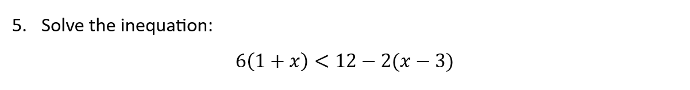
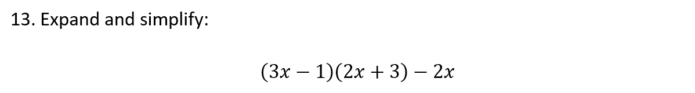
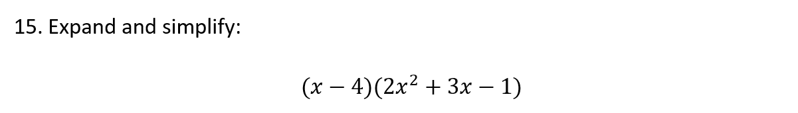
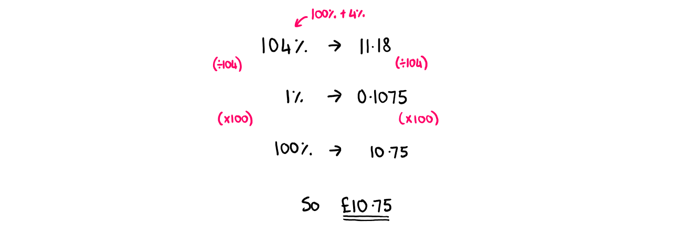
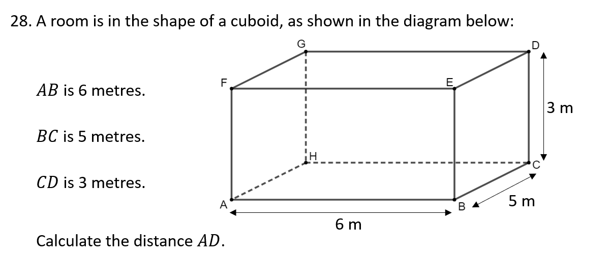
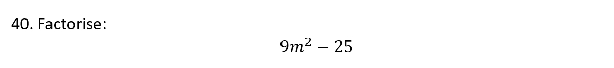
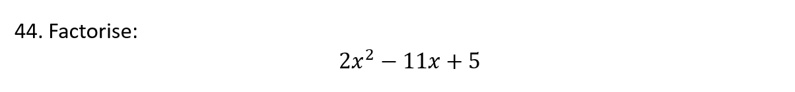
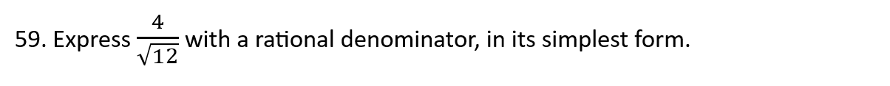
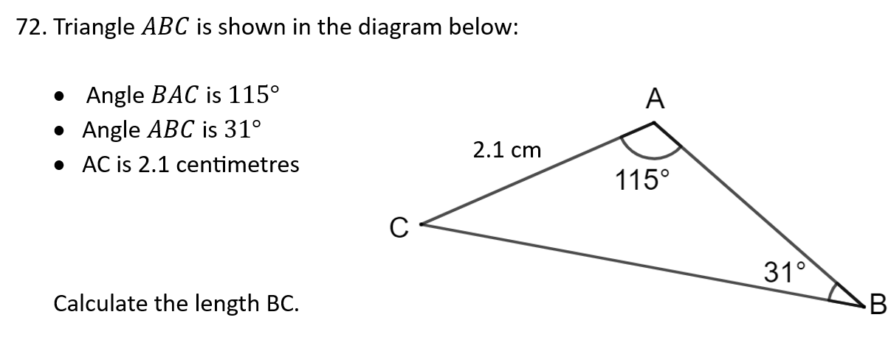

```{r setup, include = FALSE}
knitr::opts_chunk$set(echo = FALSE)
library(webexercises)
```


```{r, echo = FALSE, results='asis'}
# Uncomment to change widget colours:
#style_widgets(incorrect = "goldenrod", correct = "purple")
```

`r hide("N5 Formula Sheet")`


`r unhide()`

<hr>

## Volume


`r hide("Hint")`

The formula sheet shows how to calculate the volume of a sphere.

`r unhide()`

`r hide("Answer")`

$7400\text{ cm}^3$

`r unhide()`

`r hide("Solution")`


`r unhide()`


`r hide("Hint")`

What is the height of the cylinder itself, without the hemisphere on top?

`r unhide()`

`r hide("Answer")`

$3900\text{ cm}^3$

`r unhide()`

`r hide("Solution")`


`r unhide()`


`r hide("Hint")`

How can we deal with the fraction, $\frac{1}{3}$?

`r unhide()`

`r hide("Answer")`

$10.0\text{ cm}$

`r unhide()`

`r hide("Solution")`


`r unhide()`

<hr>

## Equations and Inequations


`r hide("Hint")`

Hint goes here.

`r unhide()`

`r hide("Answer")`

$Answer$

`r unhide()`

`r hide("Solution")`


`r unhide()`



`r hide("Hint")`

Hint goes here.

`r unhide()`

`r hide("Answer")`

$Answer$

`r unhide()`

`r hide("Solution")`


`r unhide()`


`r hide("Hint")`

Hint goes here.

`r unhide()`

`r hide("Answer")`

$Answer$

`r unhide()`

`r hide("Solution")`


`r unhide()`


`r hide("Hint")`

Hint goes here.

`r unhide()`

`r hide("Answer")`

$Answer$

`r unhide()`

`r hide("Solution")`


`r unhide()`


`r hide("Hint")`

Hint goes here.

`r unhide()`

`r hide("Answer")`

$Answer$

`r unhide()`

`r hide("Solution")`


`r unhide()`

<hr>

## Circle Geometry


`r hide("Hint")`

Hint goes here.

`r unhide()`

`r hide("Answer")`

$Answer$

`r unhide()`

`r hide("Solution")`


`r unhide()`


`r hide("Hint")`

Hint goes here.

`r unhide()`

`r hide("Answer")`

$Answer$

`r unhide()`

`r hide("Solution")`


`r unhide()`

<hr>

## Scientific Notation


`r hide("Hint")`

Hint goes here.

`r unhide()`

`r hide("Answer")`

$Answer$

`r unhide()`

`r hide("Solution")`


`r unhide()`


`r hide("Hint")`

Hint goes here.

`r unhide()`

`r hide("Answer")`

$Answer$

`r unhide()`

`r hide("Solution")`


`r unhide()`

<hr>

## Expanding Brackets



`r hide("Hint")`

Hint goes here.

`r unhide()`

`r hide("Answer")`

$Answer$

`r unhide()`

`r hide("Solution")`


`r unhide()`


`r hide("Hint")`

Hint goes here.

`r unhide()`

`r hide("Answer")`

$Answer$

`r unhide()`

`r hide("Solution")`


`r unhide()`



`r hide("Hint")`

Hint goes here.

`r unhide()`

`r hide("Answer")`

$Answer$

`r unhide()`

`r hide("Solution")`


`r unhide()`


`r hide("Hint")`

Hint goes here.

`r unhide()`

`r hide("Answer")`

$Answer$

`r unhide()`

`r hide("Solution")`


`r unhide()`

<hr>

## Similar Shapes


`r hide("Hint")`

Hint goes here.

`r unhide()`

`r hide("Answer")`

$Answer$

`r unhide()`

`r hide("Solution")`


`r unhide()`


`r hide("Hint")`

Hint goes here.

`r unhide()`

`r hide("Answer")`

$Answer$

`r unhide()`

`r hide("Solution")`


`r unhide()`

<hr>

## Percentages


`r hide("Hint")`

Hint goes here.

`r unhide()`

`r hide("Answer")`

$Answer$

`r unhide()`

`r hide("Solution")`


`r unhide()`


`r hide("Hint")`

Hint goes here.

`r unhide()`

`r hide("Answer")`

$Answer$

`r unhide()`

`r hide("Solution")`


`r unhide()`


`r hide("Hint")`

Hint goes here.

`r unhide()`

`r hide("Answer")`

$Answer$

`r unhide()`

`r hide("Solution")`



`r unhide()`


`r hide("Hint")`

Hint goes here.

`r unhide()`

`r hide("Answer")`

$Answer$

`r unhide()`

`r hide("Solution")`


`r unhide()`

<hr>

## Numerical Fractions


`r hide("Hint")`

Hint goes here.

`r unhide()`

`r hide("Answer")`

$Answer$

`r unhide()`

`r hide("Solution")`


`r unhide()`


`r hide("Hint")`

Hint goes here.

`r unhide()`

`r hide("Answer")`

$Answer$

`r unhide()`

`r hide("Solution")`


`r unhide()`


`r hide("Hint")`

Hint goes here.

`r unhide()`

`r hide("Answer")`

$Answer$

`r unhide()`

`r hide("Solution")`


`r unhide()`


`r hide("Hint")`

Hint goes here.

`r unhide()`

`r hide("Answer")`

$Answer$

`r unhide()`

`r hide("Solution")`


`r unhide()`

<hr>

## Pythagoras


`r hide("Hint")`

Hint goes here.

`r unhide()`

`r hide("Answer")`

$Answer$

`r unhide()`

`r hide("Solution")`


`r unhide()`



`r hide("Hint")`

Hint goes here.

`r unhide()`

`r hide("Answer")`

$Answer$

`r unhide()`

`r hide("Solution")`


`r unhide()`


`r hide("Hint")`

Hint goes here.

`r unhide()`

`r hide("Answer")`

$Answer$

`r unhide()`

`r hide("Solution")`


`r unhide()`

<hr>

## Straight Lines


`r hide("Hint")`

Hint goes here.

`r unhide()`

`r hide("Answer")`

$Answer$

`r unhide()`

`r hide("Solution")`


`r unhide()`


`r hide("Hint")`

Hint goes here.

`r unhide()`

`r hide("Answer")`

$Answer$

`r unhide()`

`r hide("Solution")`


`r unhide()`


`r hide("Hint")`

Hint goes here.

`r unhide()`

`r hide("Answer")`

$Answer$

`r unhide()`

`r hide("Solution")`


`r unhide()`


`r hide("Hint")`

Hint goes here.

`r unhide()`

`r hide("Answer")`

$Answer$

`r unhide()`

`r hide("Solution")`


`r unhide()`


`r hide("Hint")`

Hint goes here.

`r unhide()`

`r hide("Answer")`

$Answer$

`r unhide()`

`r hide("Solution")`


`r unhide()`

<hr>

## Functions


`r hide("Hint")`

Hint goes here.

`r unhide()`

`r hide("Answer")`

$Answer$

`r unhide()`

`r hide("Solution")`


`r unhide()`


`r hide("Hint")`

Hint goes here.

`r unhide()`

`r hide("Answer")`

$Answer$

`r unhide()`

`r hide("Solution")`


`r unhide()`


`r hide("Hint")`

Hint goes here.

`r unhide()`

`r hide("Answer")`

$Answer$

`r unhide()`

`r hide("Solution")`


`r unhide()`


`r hide("Hint")`

Hint goes here.

`r unhide()`

`r hide("Answer")`

$Answer$

`r unhide()`

`r hide("Solution")`


`r unhide()`

<hr>

## Factorising


`r hide("Hint")`

Hint goes here.

`r unhide()`

`r hide("Answer")`

$Answer$

`r unhide()`

`r hide("Solution")`


`r unhide()`



`r hide("Hint")`

Hint goes here.

`r unhide()`

`r hide("Answer")`

$Answer$

`r unhide()`

`r hide("Solution")`


`r unhide()`


`r hide("Hint")`

Hint goes here.

`r unhide()`

`r hide("Answer")`

$Answer$

`r unhide()`

`r hide("Solution")`


`r unhide()`


`r hide("Hint")`

Hint goes here.

`r unhide()`

`r hide("Answer")`

$Answer$

`r unhide()`

`r hide("Solution")`


`r unhide()`


`r hide("Hint")`

Hint goes here.

`r unhide()`

`r hide("Answer")`

$Answer$

`r unhide()`

`r hide("Solution")`


`r unhide()`



`r hide("Hint")`

Hint goes here.

`r unhide()`

`r hide("Answer")`

$Answer$

`r unhide()`

`r hide("Solution")`


`r unhide()`


`r hide("Hint")`

Hint goes here.

`r unhide()`

`r hide("Answer")`

$Answer$

`r unhide()`

`r hide("Solution")`


`r unhide()`

<hr>

## Statistics


`r hide("Hint")`

Hint goes here.

`r unhide()`

`r hide("Answer")`

$Answer$

`r unhide()`

`r hide("Solution")`


`r unhide()`


`r hide("Hint")`

Hint goes here.

`r unhide()`

`r hide("Answer")`

$Answer$

`r unhide()`

`r hide("Solution")`


`r unhide()`

<hr>

## Quadratics


`r hide("Hint")`

Hint goes here.

`r unhide()`

`r hide("Answer")`

$Answer$

`r unhide()`

`r hide("Solution")`


`r unhide()`


`r hide("Hint")`

Hint goes here.

`r unhide()`

`r hide("Answer")`

$Answer$

`r unhide()`

`r hide("Solution")`


`r unhide()`


`r hide("Hint")`

Hint goes here.

`r unhide()`

`r hide("Answer")`

$Answer$

`r unhide()`

`r hide("Solution")`


`r unhide()`

<hr>

## Arcs and Sectors


`r hide("Hint")`

Hint goes here.

`r unhide()`

`r hide("Answer")`

$Answer$

`r unhide()`

`r hide("Solution")`


`r unhide()`


`r hide("Hint")`

Hint goes here.

`r unhide()`

`r hide("Answer")`

$Answer$

`r unhide()`

`r hide("Solution")`


`r unhide()`

<hr>

## Changing the Subject


`r hide("Hint")`

Hint goes here.

`r unhide()`

`r hide("Answer")`

$Answer$

`r unhide()`

`r hide("Solution")`


`r unhide()`


`r hide("Hint")`

Hint goes here.

`r unhide()`

`r hide("Answer")`

$Answer$

`r unhide()`

`r hide("Solution")`


`r unhide()`


`r hide("Hint")`

Hint goes here.

`r unhide()`

`r hide("Answer")`

$Answer$

`r unhide()`

`r hide("Solution")`


`r unhide()`

<hr>

## Surds


`r hide("Hint")`

Hint goes here.

`r unhide()`

`r hide("Answer")`

$Answer$

`r unhide()`

`r hide("Solution")`


`r unhide()`


`r hide("Hint")`

Hint goes here.

`r unhide()`

`r hide("Answer")`

$Answer$

`r unhide()`

`r hide("Solution")`


`r unhide()`


`r hide("Hint")`

Hint goes here.

`r unhide()`

`r hide("Answer")`

$Answer$

`r unhide()`

`r hide("Solution")`


`r unhide()`



`r hide("Hint")`

Hint goes here.

`r unhide()`

`r hide("Answer")`

$Answer$

`r unhide()`

`r hide("Solution")`


`r unhide()`


`r hide("Hint")`

Hint goes here.

`r unhide()`

`r hide("Answer")`

$Answer$

`r unhide()`

`r hide("Solution")`


`r unhide()`

<hr>

## Indices


`r hide("Hint")`

Hint goes here.

`r unhide()`

`r hide("Answer")`

$Answer$

`r unhide()`

`r hide("Solution")`


`r unhide()`


`r hide("Hint")`

Hint goes here.

`r unhide()`

`r hide("Answer")`

$Answer$

`r unhide()`

`r hide("Solution")`


`r unhide()`


`r hide("Hint")`

Hint goes here.

`r unhide()`

`r hide("Answer")`

$Answer$

`r unhide()`

`r hide("Solution")`


`r unhide()`


`r hide("Hint")`

Hint goes here.

`r unhide()`

`r hide("Answer")`

$Answer$

`r unhide()`

`r hide("Solution")`


`r unhide()`

<hr>

## Trig Graphs


`r hide("Hint")`

Hint goes here.

`r unhide()`

`r hide("Answer")`

$Answer$

`r unhide()`

`r hide("Solution")`


`r unhide()`


`r hide("Hint")`

Hint goes here.

`r unhide()`

`r hide("Answer")`

$Answer$

`r unhide()`

`r hide("Solution")`


`r unhide()`


`r hide("Hint")`

Hint goes here.

`r unhide()`

`r hide("Answer")`

$Answer$

`r unhide()`

`r hide("Solution")`


`r unhide()`

<hr>

## Simultaneous Equations


`r hide("Hint")`

Hint goes here.

`r unhide()`

`r hide("Answer")`

$Answer$

`r unhide()`

`r hide("Solution")`


`r unhide()`


`r hide("Hint")`

Hint goes here.

`r unhide()`

`r hide("Answer")`

$Answer$

`r unhide()`

`r hide("Solution")`


`r unhide()`


`r hide("Hint")`

Hint goes here.

`r unhide()`

`r hide("Answer")`

$Answer$

`r unhide()`

`r hide("Solution")`


`r unhide()`

<hr>

## Area and Sine Rules


`r hide("Hint")`

Hint goes here.

`r unhide()`

`r hide("Answer")`

$Answer$

`r unhide()`

`r hide("Solution")`


`r unhide()`



`r hide("Hint")`

Hint goes here.

`r unhide()`

`r hide("Answer")`

$Answer$

`r unhide()`

`r hide("Solution")`


`r unhide()`


`r hide("Hint")`

Hint goes here.

`r unhide()`

`r hide("Answer")`

$Answer$

`r unhide()`

`r hide("Solution")`


`r unhide()`

<hr>

## Algebraic Fractions


`r hide("Hint")`

Hint goes here.

`r unhide()`

`r hide("Answer")`

$Answer$

`r unhide()`

`r hide("Solution")`


`r unhide()`


`r hide("Hint")`

Hint goes here.

`r unhide()`

`r hide("Answer")`

$Answer$

`r unhide()`

`r hide("Solution")`


`r unhide()`


`r hide("Hint")`

Hint goes here.

`r unhide()`

`r hide("Answer")`

$Answer$

`r unhide()`

`r hide("Solution")`


`r unhide()`


**NOTE: To use the widgets in the compiled HTML file, you need to have a JavaScript-enabled browser.**

## Fill-In-The-Blanks (`fitb()`)

Create fill-in-the-blank questions using `fitb()`, providing the answer as the first argument.

- 2 + 2 is `r fitb(4)`

You can also create these questions dynamically, using variables from your R session.

```{r}
x <- sample(2:8, 1)
```

- The square root of `r x^2` is: `r fitb(x)`

The blanks are case-sensitive; if you don't care about case, use the argument `ignore_case = TRUE`.

- What is the letter after D? `r fitb("E", ignore_case = TRUE)`

If you want to ignore differences in whitespace use, use the argument `ignore_ws = TRUE` (which is the default) and include spaces in your answer anywhere they could be acceptable.

- How do you load the tidyverse package? `r fitb(c("library( tidyverse )", "library( \"tidyverse\" )", "library( 'tidyverse' )"), ignore_ws = TRUE, width = "20")`

You can set more than one possible correct answer by setting the answers as a vector.

- Type a vowel: `r fitb(c("A", "E", "I", "O" , "U"), ignore_case = TRUE)`

You can use regular expressions to test answers against more complex rules.

- Type any 3 letters: `r fitb("^[a-zA-Z]{3}$", width = 3, regex = TRUE)`

## Multiple Choice (`mcq()`)

- "Never gonna give you up, never gonna: `r mcq(c("let you go", "turn you down", "run away", answer = "let you down"))`"
- "I `r mcq(c(answer = "bless the rains", "guess it rains", "sense the rain"))` down in Africa" -Toto

## True or False (`torf()`)

- True or False? You can permute values in a vector using `sample()`. `r torf(TRUE)`

## Longer MCQs (`longmcq()`)

When your answers are very long, sometimes a drop-down select box gets formatted oddly. You can use `longmcq()` to deal with this. Since the answers are long, It's probably best to set up the options inside an R chunk with `echo=FALSE`. 

**What is a p-value?**

```{r}
opts_p <- c(
   "the probability that the null hypothesis is true",
   answer = "the probability of the observed, or more extreme, data, under the assumption that the null-hypothesis is true",
   "the probability of making an error in your conclusion"
)
```

`r longmcq(opts_p)`

**What is true about a 95% confidence interval of the mean?**

```{r}
# use sample() to randomise the order
opts_ci <- sample(c(
  answer = "if you repeated the process many times, 95% of intervals calculated in this way contain the true mean",
  "there is a 95% probability that the true mean lies within this range",
  "95% of the data fall within this range"
))
```

`r longmcq(opts_ci)`

## Checked sections

Create sections with the class `webex-check` to add a button that hides feedback until it is pressed. Add the class `webex-box` to draw a box around the section (or use your own styles).

::: {.webex-check .webex-box}

I am going to learn a lot: `r torf(TRUE)`

```{r, results='asis'}
opts <- c(
   "the probability that the null hypothesis is true",
   answer = "the probability of the observed, or more extreme, data, under the assumption that the null-hypothesis is true",
   "the probability of making an error in your conclusion"
)

cat("What is a p-value?", longmcq(opts))
```

:::

## Hidden solutions and hints

You can fence off a solution area that will be hidden behind a button using `hide()` before the solution and `unhide()` after, each as inline R code.  Pass the text you want to appear on the button to the `hide()` function.

If the solution is an RMarkdown code chunk, instead of using `hide()` and `unhide()`, simply set the `webex.hide` chunk option to TRUE, or set it to the string you wish to display on the button.

**Recreate the scatterplot below, using the built-in `cars` dataset.**

```{r}
with(cars, plot(speed, dist))
```


`r hide("I need a hint")`

See the documentation for `plot()` (`?plot`)

`r unhide()`


<!-- note: you could also just set webex.hide to TRUE -->

```{r, echo = TRUE, eval = FALSE, webex.hide="Click here to see the solution"}
plot(cars$speed, cars$dist)
```

