```{r setup, include = FALSE}
knitr::opts_chunk$set(echo = FALSE)
library(webexercises)
```


```{r, echo = FALSE, results='asis'}
# Uncomment to change widget colours:
#style_widgets(incorrect = "goldenrod", correct = "purple")
```

`r hide("N5 Formula Sheet")`


`r unhide()`

<hr>

## The Cosine Rule


`r hide("Hint")`

The formula sheet gives both forms of the Cosine Rule.

Which form is best suited for finding the *length of a missing side*?

Pay attention to where *angle* $A$ fits into the formula when calculating *side* $a$.

`r unhide()`

`r hide("Answer")`

$32.45$ cm

`r unhide()`

`r hide("Solution")`


`r unhide()`

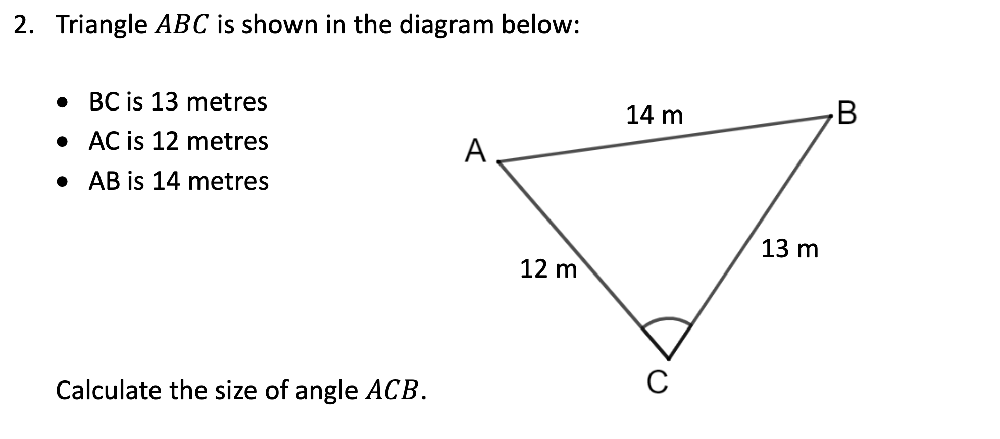

`r hide("Hint")`

The formula sheet gives both forms of the Cosine Rule.

Which form is best suited for finding the *size of a missing angle*?

Pay attention to where *side* $a$ fits into the formula when calculating *angle* $A$.

`r unhide()`

`r hide("Answer")`

$68.0^{\circ}$

`r unhide()`

`r hide("Solution")`


`r unhide()`

<hr>

## Algebraic Fractions

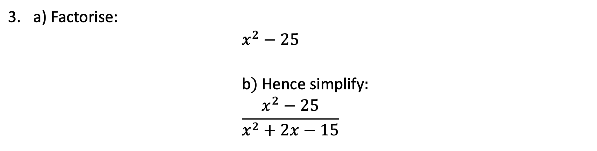

`r hide("Hint")`

*Simplfying* algebraic fractions should begin by *factorising*.

In an exam question, expect both the numerator and denominator to share the *same factor*

`r unhide()`

`r hide("Answer")`

$\dfrac{x-5}{x-3}$

`r unhide()`

`r hide("Solution")`


`r unhide()`


`r hide("Hint")`

To add or subtract fractions, the *denominators should be the same*.

`r unhide()`

`r hide("Answer")`

$\dfrac{13x+7}{15}$

`r unhide()`

`r hide("Solution")`


`r unhide()`


`r hide("Hint")`

The lowest common multiple of $x+3$ and $x-2$ is $(x+3)(x-2)$.

Start by rewriting each fraction with $(x+3)(x-2)$ as the denominator, adjusting the numerators appropriately.

`r unhide()`

`r hide("Answer")`

$\dfrac{7x+11}{(x+3)(x-2)}$

`r unhide()`

`r hide("Solution")`


`r unhide()`


`r hide("Hint")`

The lowest common multiple of $3x$ and $x^2$ is $3x^2$.

`r unhide()`

`r hide("Answer")`

$\dfrac{5x-6}{3x^2}$

`r unhide()`

`r hide("Solution")`


`r unhide()`


`r hide("Hint")`

Approach algebraic fractions in a similar manner to numerical fractions.

What is the approach for *divisions*?

Then use *cross-cancelling* to simplify.

`r unhide()`

`r hide("Answer")`

$\dfrac{k}{6p}$

`r unhide()`

`r hide("Solution")`


`r unhide()`

<hr>

## Trig Equations


`r hide("Hint")`

First rearrange the equation to the form $\sin{x^{\circ}}=\dots$

Remember to use the $ASTC$ diagram to find *two solutions*.

`r unhide()`

`r hide("Answer")`

$x=53.1,126.9$

`r unhide()`

`r hide("Solution")`


`r unhide()`


`r hide("Hint")`

First rearrange the equation to the form $\tan{x^{\circ}}=\dots$

Remember to use the $ASTC$ diagram to find *two solutions*.

`r unhide()`

`r hide("Answer")`

$x=77.5,257.5$

`r unhide()`

`r hide("Solution")`


`r unhide()`


`r hide("Hint")`

First rearrange the equation to the form $\cos{x^{\circ}}=\dots$

Remember to use the $ASTC$ diagram to find *two solutions*.

Which two quadrants apply when $\cos$ is *negative*?

`r unhide()`

`r hide("Answer")`

$x=104.5,255.5$

`r unhide()`

`r hide("Solution")`


`r unhide()`


`r hide("Hint")`

First rearrange the equation to the form $\sin{x^{\circ}}=\dots$

Remember to use the $ASTC$ diagram to find *two solutions*.

Which two quadrants apply when $\sin$ is *negative*?

`r unhide()`

`r hide("Answer")`

$x=221.8,318.2$

`r unhide()`

`r hide("Solution")`


`r unhide()`

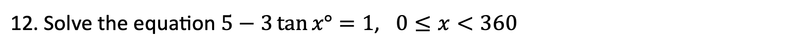

`r hide("Hint")`

First rearrange the equation to the form $\tan{x^{\circ}}=\dots$

Remember to use the $ASTC$ diagram to find *two solutions*.

`r unhide()`

`r hide("Answer")`

$x=53.1,233.1$

`r unhide()`

`r hide("Solution")`


`r unhide()`

<hr>

## Quadratics II


`r hide("Hint")`

A number of approaches to *completing the square* question this are possible.

Check your notes and examples to see which method your teacher has taught.

`r unhide()`

`r hide("Answer")`

$(x+6)^2-2$

`r unhide()`

`r hide("Solution")`


`r unhide()`


`r hide("Hint")`

A number of approaches to *completing the square* question this are possible.

Check your notes and examples to see which method your teacher has taught.

`r unhide()`

`r hide("Answer")`

$(x-4)^2+5$

`r unhide()`

`r hide("Solution")`


`r unhide()`


`r hide("Hint")`

The turning point for $y=(x-a)^2+b$ is $(a,b)$.

`r unhide()`

`r hide("Answer")`

$(-5,3)$

`r unhide()`

`r hide("Solution")`


`r unhide()`

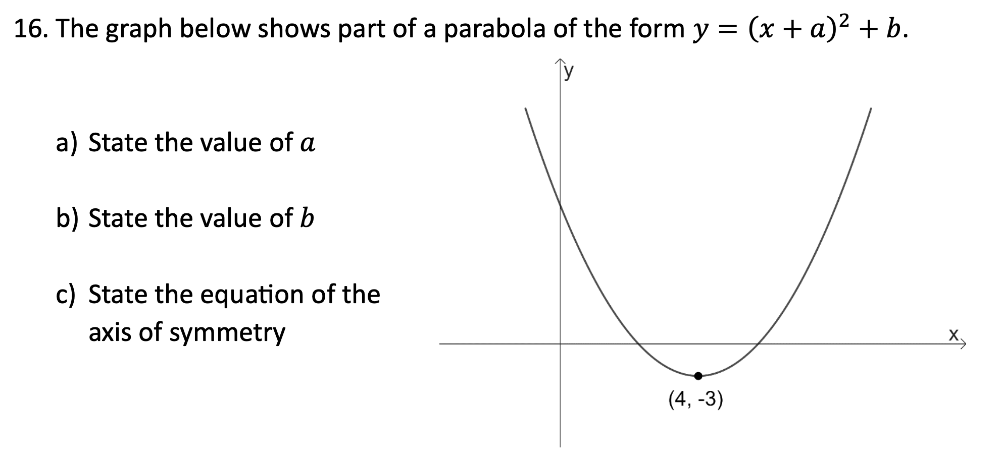

`r hide("Hint")`

Start by writing the equation of the parabola using $(4,-3)$.

Compare this question to the previous one.

For part (c), any parabola with a turning point at $(a,b)$ has a vertical line (axis) of symmetry with the equation $x=a$.

`r unhide()`

`r hide("Answer")`

$a=-4$, $b=-3$ and axis of symmetry has equation $x=4$.

`r unhide()`

`r hide("Solution")`


`r unhide()`


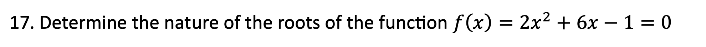

`r hide("Hint")`

To *determine the nature of the roots*, use the *discriminant*, $b^2-4ac$.

Begin by stating the values of $a$, $b$ and $c$.

Compare the result to *zero* to make a conclusion about the *roots*.

Pay *close attention* to the words which must be used in the answer.

`r unhide()`

`r hide("Answer")`

$44>0$ so **real, distinct roots**.

`r unhide()`

`r hide("Solution")`


`r unhide()`


`r hide("Hint")`

Note that each of the three possible conclusions must include reference to **real roots*.

`r unhide()`

`r hide("Answer")`

$-16<0$ so **no real roots**.

`r unhide()`

`r hide("Solution")`


`r unhide()`

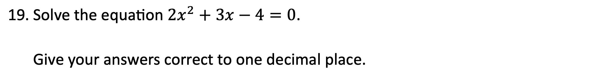

`r hide("Hint")`

The *quadratic formula* is provided on the formula sheet.

Begin by stating the values of $a$, $b$ and $c$.

`r unhide()`

`r hide("Answer")`

$x=0.9,x=-2.4$

`r unhide()`

`r hide("Solution")`


`r unhide()`

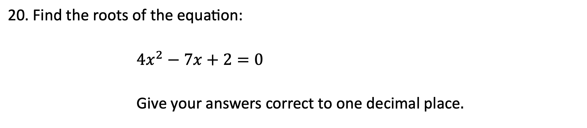

`r hide("Hint")`

Take care to substitute *negative values* in *brackets*.

If you are asked to solve a quadratic equation in an exam and get a *math error* in your calculator, check your working carefully, expecially for any *negative values*.

`r unhide()`

`r hide("Answer")`

$x=1.4,x=0.4$

`r unhide()`

`r hide("Solution")`


`r unhide()`

<hr>

## Vectors


`r hide("Hint")`

*Substitute* and evaluate. Remember that vectors are *not* fractions, so there should be no concerns with the "bottom numbers" being different.

`r unhide()`

`r hide("Answer")`

$\begin{pmatrix}19\\0\end{pmatrix}$

`r unhide()`

`r hide("Solution")`


`r unhide()`

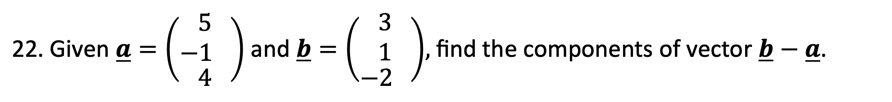

`r hide("Hint")`

Take care with *negatives*.

`r unhide()`

`r hide("Answer")`

$\begin{pmatrix}-2\\\phantom{-}2\\-6\end{pmatrix}$

`r unhide()`

`r hide("Solution")`


`r unhide()`


`r hide("Hint")`

Finding the *magnitude* of $\mathbf{u}=\begin{pmatrix}x\\y\end{pmatrix}$ requires the formula:

$|\mathbf{u}|=\sqrt{x^2+y^2}$

`r unhide()`

`r hide("Answer")`

$10$

`r unhide()`

`r hide("Solution")`


`r unhide()`


`r hide("Hint")`

Finding the *magnitude* of $\mathbf{u}=\begin{pmatrix}x\\y\\z\end{pmatrix}$ requires the formula:

$|\mathbf{u}|=\sqrt{x^2+y^2+z^2}$

`r unhide()`

`r hide("Answer")`

$\sqrt{35}$

`r unhide()`

`r hide("Solution")`


`r unhide()`

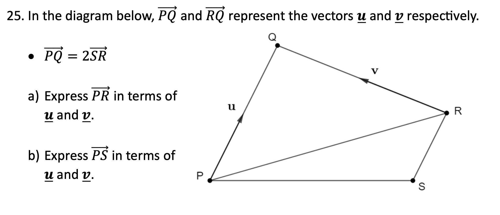

`r hide("Hint")`

For (a), start by expressing the journey from P to R as a *point-to-point* journey:

$\overrightarrow{PR}=\overrightarrow{PQ}+\overrightarrow{QR}$

Then substitude the vectors required.

For (b), *use the answer from part (a)*.

What is vector $\overrightarrow{RS}$ equal to?

`r unhide()`

`r hide("Answer")`

(a) $\mathbf{u-v}$

(b) $\frac{1}{2}\mathbf{u-v}$

`r unhide()`

`r hide("Solution")`


`r unhide()`

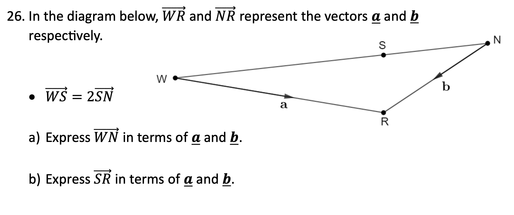

`r hide("Hint")`

Use the steps outlined in the previous question.

`r unhide()`

`r hide("Answer")`

(a) $\mathbf{a-b}$

(b) $\frac{1}{3}\mathbf{a}+\frac{2}{3}\mathbf{b}$

`r unhide()`

`r hide("Solution")`


`r unhide()`

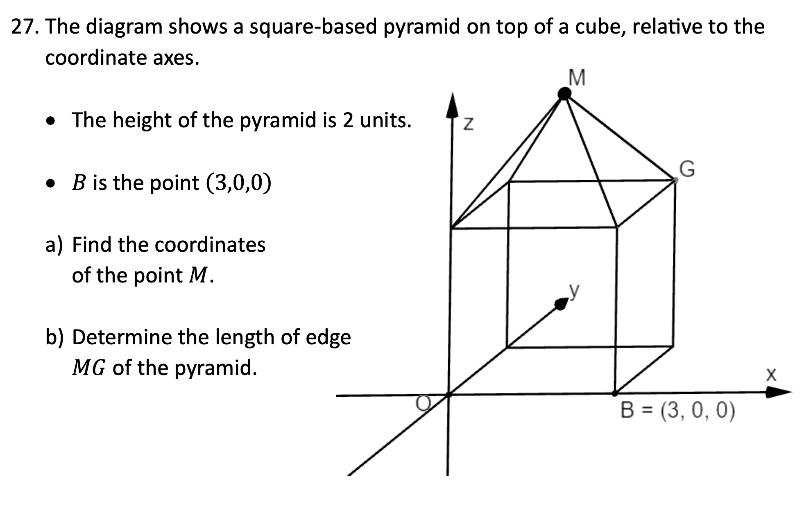

`r hide("Hint")`

For (a), think about the $x$, $y$ and $z$ coordinates one-by-one.

Note that M is above the *centre* of the pyramid.

For (b), start by finding a vector to describe the journey from $M$ to $G$.

The *length* of a vector is given by its *magnitude*.

`r unhide()`

`r hide("Answer")`

(a) M$(1.5,1.5,5)$

(b) $2.92$ units

`r unhide()`

`r hide("Solution")`


`r unhide()`

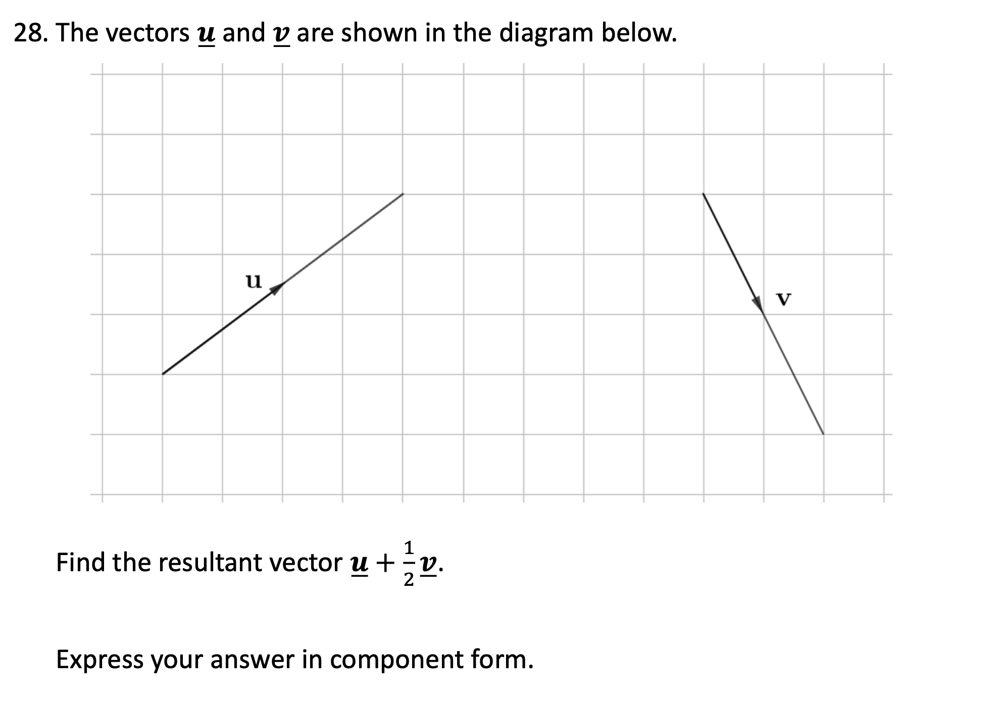

`r hide("Hint")`

Start by writing down each vector in *component form*.

`r unhide()`

`r hide("Answer")`

$\begin{pmatrix}5\\1\end{pmatrix}$

`r unhide()`

`r hide("Solution")`


`r unhide()`

