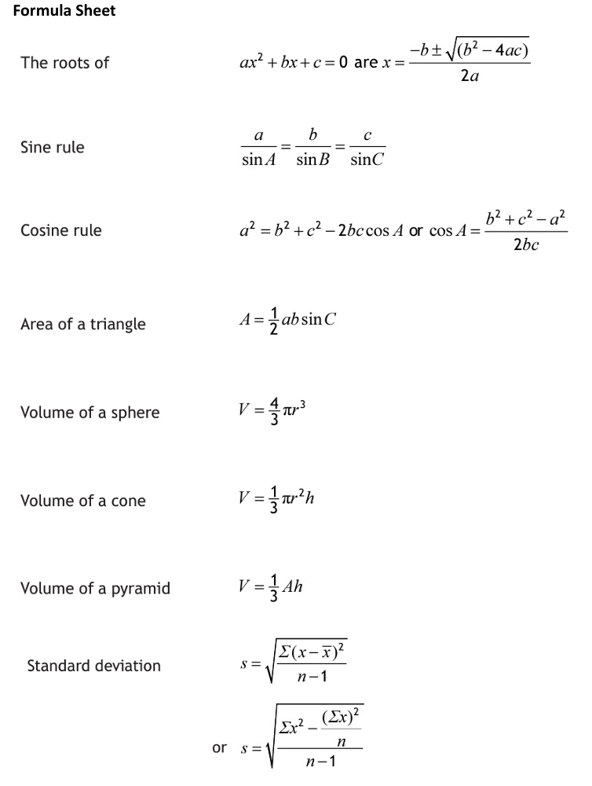

```{r setup, include = FALSE}
knitr::opts_chunk$set(echo = FALSE)
library(webexercises)
```


```{r, echo = FALSE, results='asis'}
# Uncomment to change widget colours:
#style_widgets(incorrect = "goldenrod", correct = "purple")
```

`r hide("N5 Formula Sheet")`



`r unhide()`

<hr>

## The Cosine Rule


`r hide("Hint")`

Hint will appear here.

`r unhide()`

`r hide("Answer")`

Answer will appear here.

`r unhide()`

`r hide("Solution")`


`r unhide()`


`r hide("Hint")`

Hint will appear here.

`r unhide()`

`r hide("Answer")`

Answer will appear here.

`r unhide()`

`r hide("Solution")`


`r unhide()`

<hr>

## Algebraic Fractions


`r hide("Hint")`

Hint will appear here.

`r unhide()`

`r hide("Answer")`

Answer will appear here.

`r unhide()`

`r hide("Solution")`


`r unhide()`


`r hide("Hint")`

Hint will appear here.

`r unhide()`

`r hide("Answer")`

Answer will appear here.

`r unhide()`

`r hide("Solution")`


`r unhide()`


`r hide("Hint")`

Hint will appear here.

`r unhide()`

`r hide("Answer")`

Answer will appear here.

`r unhide()`

`r hide("Solution")`


`r unhide()`


`r hide("Hint")`

Hint will appear here.

`r unhide()`

`r hide("Answer")`

Answer will appear here.

`r unhide()`

`r hide("Solution")`


`r unhide()`


`r hide("Hint")`

Hint will appear here.

`r unhide()`

`r hide("Answer")`

Answer will appear here.

`r unhide()`

`r hide("Solution")`


`r unhide()`

<hr>

## Trig Equations


`r hide("Hint")`

Hint will appear here.

`r unhide()`

`r hide("Answer")`

Answer will appear here.

`r unhide()`

`r hide("Solution")`


`r unhide()`


`r hide("Hint")`

Hint will appear here.

`r unhide()`

`r hide("Answer")`

Answer will appear here.

`r unhide()`

`r hide("Solution")`


`r unhide()`


`r hide("Hint")`

Hint will appear here.

`r unhide()`

`r hide("Answer")`

Answer will appear here.

`r unhide()`

`r hide("Solution")`


`r unhide()`


`r hide("Hint")`

Hint will appear here.

`r unhide()`

`r hide("Answer")`

Answer will appear here.

`r unhide()`

`r hide("Solution")`


`r unhide()`


`r hide("Hint")`

Hint will appear here.

`r unhide()`

`r hide("Answer")`

Answer will appear here.

`r unhide()`

`r hide("Solution")`


`r unhide()`

<hr>

## Quadratics II


`r hide("Hint")`

Hint will appear here.

`r unhide()`

`r hide("Answer")`

Answer will appear here.

`r unhide()`

`r hide("Solution")`


`r unhide()`


`r hide("Hint")`

Hint will appear here.

`r unhide()`

`r hide("Answer")`

Answer will appear here.

`r unhide()`

`r hide("Solution")`


`r unhide()`


`r hide("Hint")`

Hint will appear here.

`r unhide()`

`r hide("Answer")`

Answer will appear here.

`r unhide()`

`r hide("Solution")`


`r unhide()`


`r hide("Hint")`

Hint will appear here.

`r unhide()`

`r hide("Answer")`

Answer will appear here.

`r unhide()`

`r hide("Solution")`


`r unhide()`


`r hide("Hint")`

Hint will appear here.

`r unhide()`

`r hide("Answer")`

Answer will appear here.

`r unhide()`

`r hide("Solution")`


`r unhide()`


`r hide("Hint")`

Hint will appear here.

`r unhide()`

`r hide("Answer")`

Answer will appear here.

`r unhide()`

`r hide("Solution")`


`r unhide()`


`r hide("Hint")`

Hint will appear here.

`r unhide()`

`r hide("Answer")`

Answer will appear here.

`r unhide()`

`r hide("Solution")`


`r unhide()`


`r hide("Hint")`

Hint will appear here.

`r unhide()`

`r hide("Answer")`

Answer will appear here.

`r unhide()`

`r hide("Solution")`


`r unhide()`

<hr>

## Vectors


`r hide("Hint")`

Hint will appear here.

`r unhide()`

`r hide("Answer")`

Answer will appear here.

`r unhide()`

`r hide("Solution")`


`r unhide()`


`r hide("Hint")`

Hint will appear here.

`r unhide()`

`r hide("Answer")`

Answer will appear here.

`r unhide()`

`r hide("Solution")`


`r unhide()`


`r hide("Hint")`

Hint will appear here.

`r unhide()`

`r hide("Answer")`

Answer will appear here.

`r unhide()`

`r hide("Solution")`


`r unhide()`


`r hide("Hint")`

Hint will appear here.

`r unhide()`

`r hide("Answer")`

Answer will appear here.

`r unhide()`

`r hide("Solution")`


`r unhide()`


`r hide("Hint")`

Hint will appear here.

`r unhide()`

`r hide("Answer")`

Hint will appear here.

`r unhide()`

`r hide("Solution")`


`r unhide()`


`r hide("Hint")`

Hint will appear here.

`r unhide()`

`r hide("Answer")`

Answer will appear here.

`r unhide()`

`r hide("Solution")`


`r unhide()`


`r hide("Hint")`

Hint will appear here.

`r unhide()`

`r hide("Answer")`

Answer will appear here.

`r unhide()`

`r hide("Solution")`


`r unhide()`


`r hide("Hint")`

Hint will appear here.

`r unhide()`

`r hide("Answer")`

Answer will appear here.

`r unhide()`

`r hide("Solution")`


`r unhide()`

